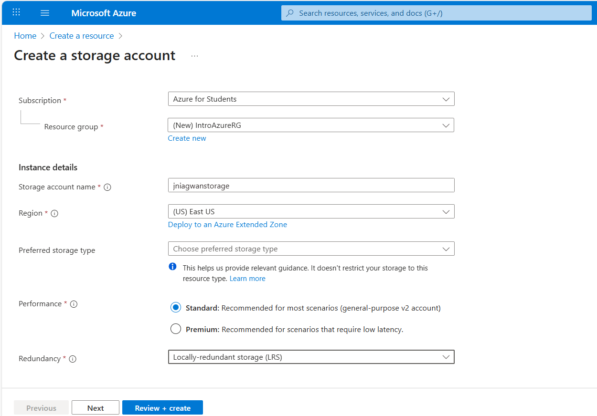
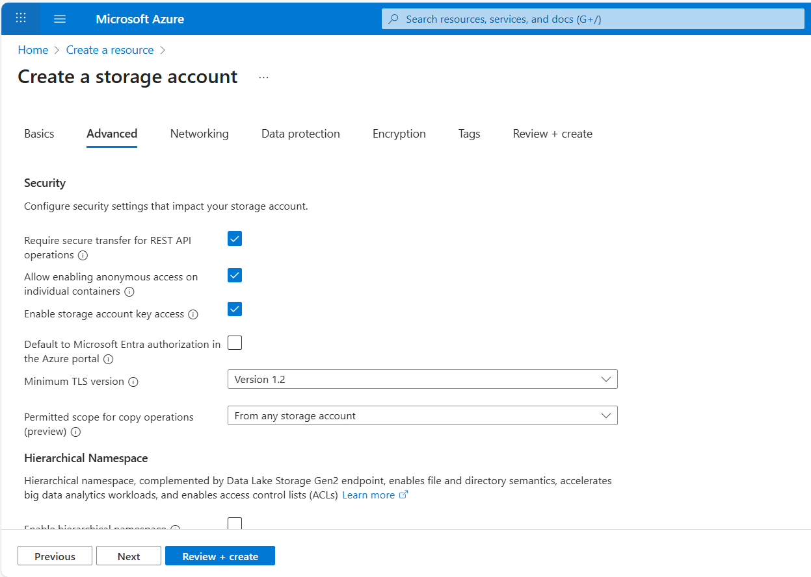
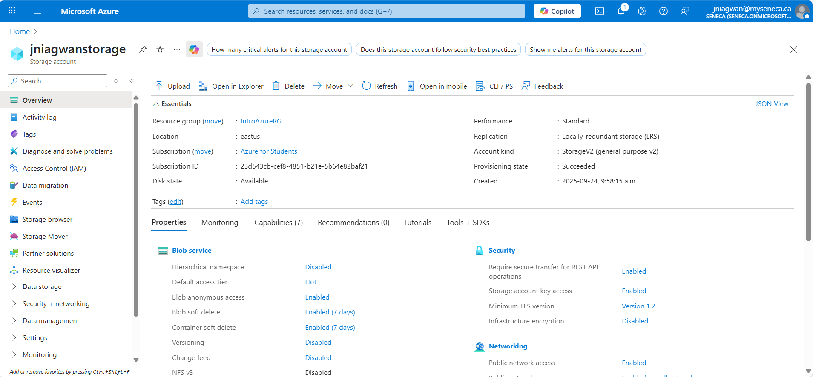
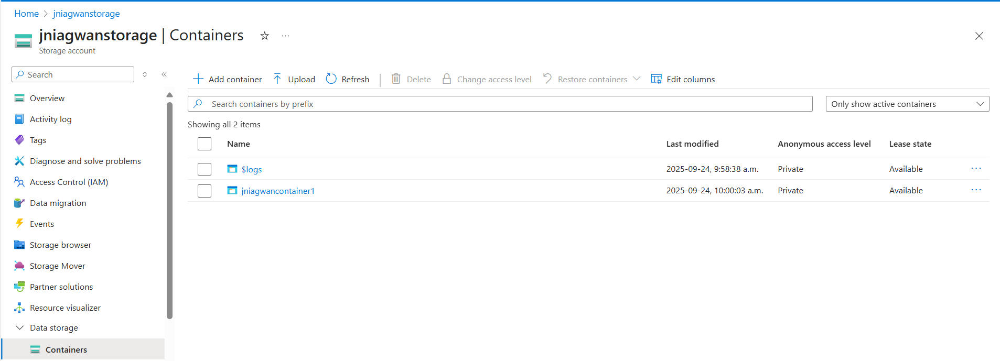
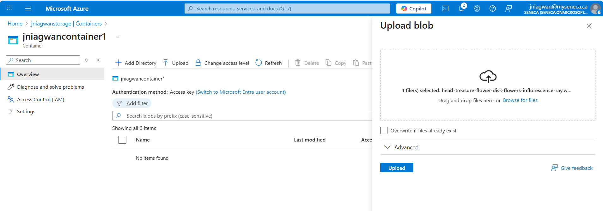
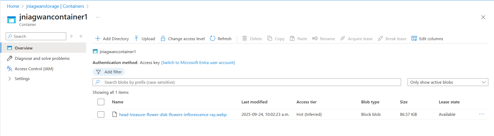
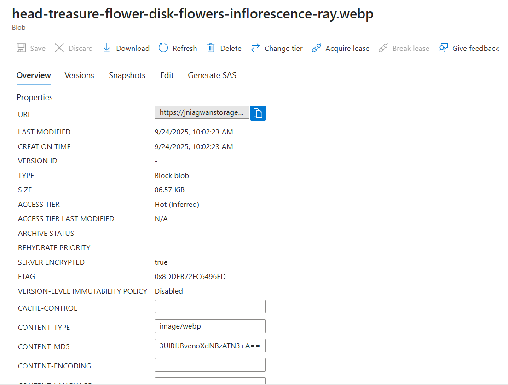
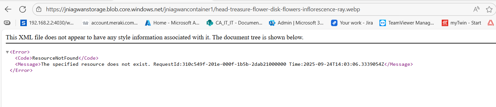
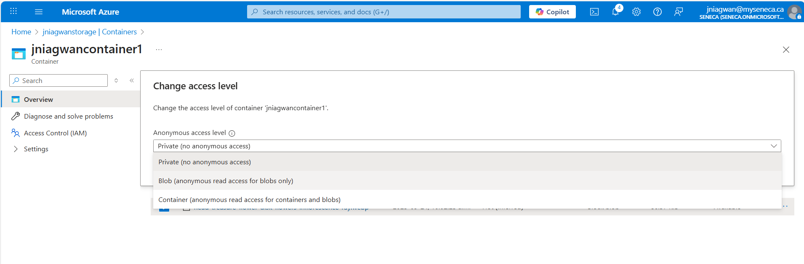
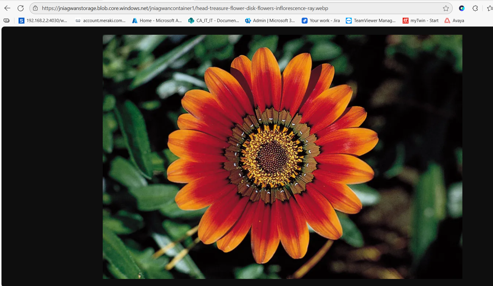

# Lab: Creating an Azure Storage Blob  

This lab demonstrates how to create and work with **Azure Blob Storage**.  
You’ll create a new **storage account**, add a **container**, upload a **blob** (file), and configure its **access level** for anonymous access.

---

## Objectives  

- Create a new Azure Storage Account  
- Create a Blob container inside the account  
- Upload a file (blob) to the container  
- Configure access levels and verify anonymous access  

---

## Prerequisites  

- An active Azure subscription  
- Access to the [Azure Portal](https://portal.azure.com/)  
- A VM or resource group already created (`IntroAzureRG`)  

---

## Steps Performed  

### 1. Create a Storage Account  

- Signed in to [Azure Portal](https://portal.azure.com/)  
- Selected **Create a resource ▸ Storage ▸ Storage account ▸ Create**  
- On the **Basics** tab:  

  | Setting        | Value                                       |
  | -------------- | ------------------------------------------- |
  | Subscription   | Selected subscription for the exercise      |
  | Resource group | **Create new** → `IntroAzureRG`              |
  | Storage name   | Unique name (e.g., `introazurergstorage`)    |
  | Region         | Default                                      |
  | Performance    | Standard                                    |
  | Redundancy     | Locally redundant storage (LRS)             |

- On the **Advanced** tab:  

  | Setting | Value |
  | ------- | ----- |
  | Allow enabling anonymous access on individual containers | ✅ Checked |

- Selected **Review** → **Create**.  
- Waited for deployment to complete, then clicked **Go to resource**.  

### 2. Create a Blob Container  

- Under **Data storage**, selected **Containers**.  
- Clicked **+ Container** and entered:  

  | Setting                | Value                         |
  | ---------------------- | ----------------------------- |
  | Name                   | Container name (e.g., `images`) |
  | Anonymous access level | Private (no anonymous access) |

- Selected **Create** to add the container.  

### 3. Upload a File (Blob)  

- Obtained or downloaded an image file (e.g., a flower).  
- Inside the new container, clicked **Upload**.  
- Browsed to the image file, selected it, and clicked **Upload**.  
- Verified the blob appeared in the container list.  

### 4. Test Access  

- Selected the uploaded blob and copied its **URL**.  
- Pasted the URL into a new browser tab.  
- Saw an error message (ResourceNotFound) due to private access.  

### 5. Change the Access Level  

- Back in the Azure Portal, selected **Change access level**.  
- Set **Anonymous access level** to **Blob (anonymous read access for blobs only)**.  
- Clicked **OK** to apply the change.  
- Refreshed the browser tab with the blob URL.  
- Confirmed the image loaded successfully from the public URL.  

---

## Skills Demonstrated  

- Creating a Storage Account in Azure  
- Creating and managing Blob Containers  
- Uploading files (blobs) to Azure Storage  
- Configuring container and blob access levels for anonymous/public access  

---

## Screenshots  

### Storage Account Creation  

### Container Creation  

### Uploaded Blob  

### Public Blob Access  

---

## Cleanup  

- In **Azure Portal**, go to **Resource groups**  
- Select `IntroAzureRG`  
- Click **Delete resource group** and type `IntroAzureRG` to confirm  

This removes the storage account and all associated resources to avoid ongoing charges.

---

## Author  

John Niagwan — IT Network Security Administrator  
