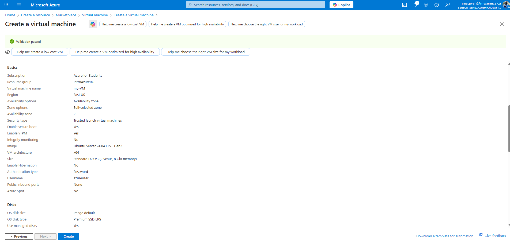
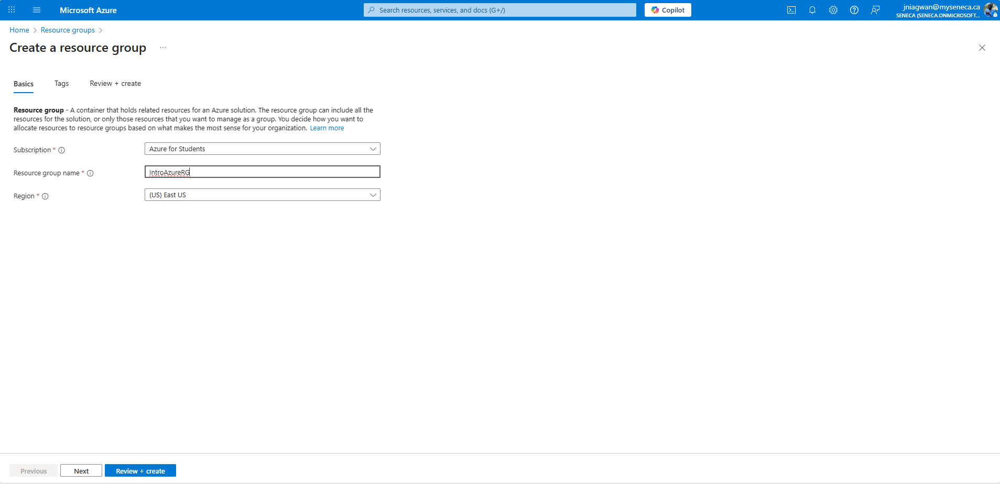
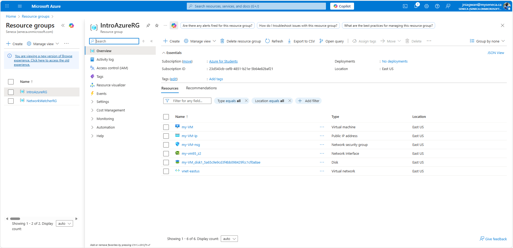

# Lab: Creating an Azure Virtual Machine and Resource Group

This lab demonstrates how to create and manage resources in Microsoft Azure using the Azure Portal.  
It highlights how resource groups automatically organize the assets you deploy.

---

## Objectives

- Sign in to the Azure Portal
- Create a resource group and virtual machine
- Observe how Azure automatically creates associated resources
- Clean up by deleting the resource group

---

## Prerequisites

- An active Azure subscription or Microsoft Learn sandbox access
- Basic familiarity with the Azure Portal

---

## Steps Performed

### 1. Create a Virtual Machine

- Signed in to [Azure Portal](https://portal.azure.com/)
- Selected **Create a resource ▸ Compute ▸ Virtual Machine ▸ Create**
- Created a new resource group: `IntroAzureRG`
- Configured VM name `my-VM` with default settings
- Set authentication to **Password** with username `azureuser`
- Disabled public inbound ports
- Reviewed and created the VM

### 2. Verify Resources

- Navigated to **Home ▸ Resource groups ▸ IntroAzureRG**
- Observed the virtual machine plus associated resources (network interface, disk, security group, etc.) automatically created by Azure

### 3. Clean Up

- Deleted the `IntroAzureRG` resource group to remove all created resources and avoid unnecessary costs

---

## Skills Demonstrated

- Azure Portal navigation
- Resource group and VM creation
- Understanding of how Azure groups and names related resources
- Clean-up and cost management best practices

---

## Screenshots

> You can drag and drop your images into the repo folder and reference them like this:

### VM Creation Screen

### Resource Group Overview

### VM Deployment Complete

---

## Author

John Niagwan — IT Network Security Administrator
