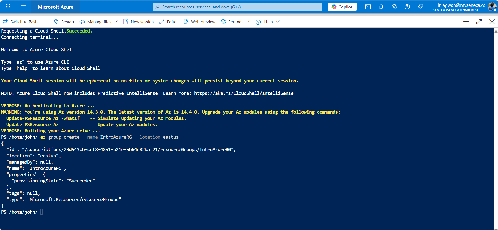
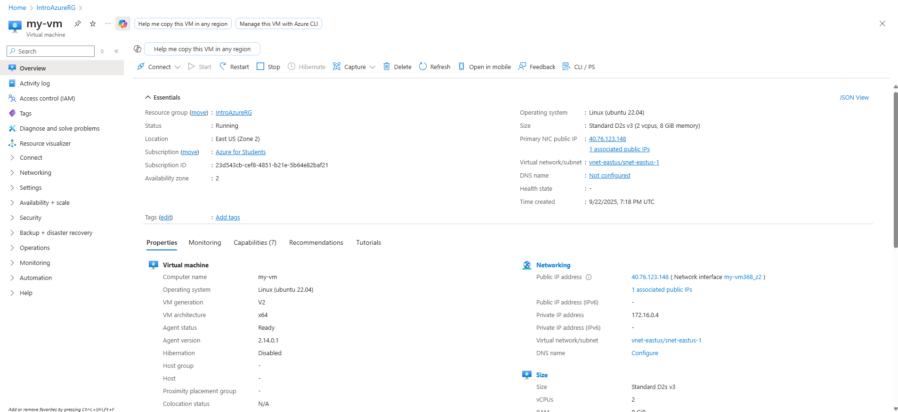
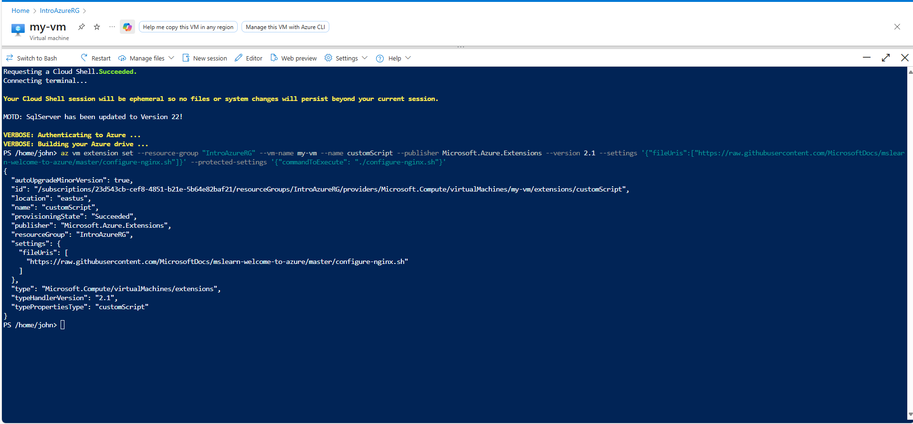
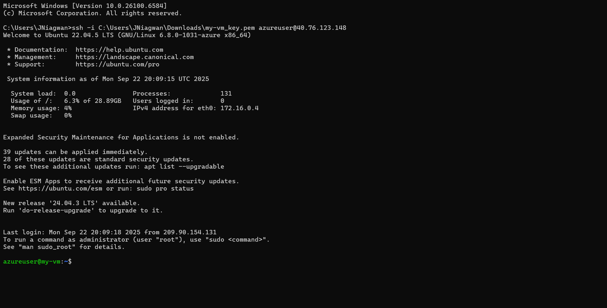

````markdown
# Lab: Creating an Azure Virtual Machine and Installing Nginx  

This lab demonstrates how to create and configure an Azure Virtual Machine (VM) using the **Azure CLI**.  
It highlights how resource groups organize deployed assets and how to install software on a VM with a Custom Script Extension.

---

## Objectives  

- Sign in to the Azure Portal and launch Cloud Shell  
- Create a resource group using the Azure CLI  
- Provision a Linux VM with Ubuntu 22.04  
- Install and configure Nginx using a Custom Script Extension  
- Verify the deployment and clean up resources  

---

## Prerequisites  

- An active Azure subscription or Microsoft Learn sandbox access  
- Basic familiarity with the Azure CLI  
- Access to the [Azure Portal](https://portal.azure.com/)  

---

## Steps Performed  

### 1. Create a Resource Group  

- Signed in to [Azure Portal](https://portal.azure.com/)  
- Opened **Cloud Shell** (Azure CLI)  
- Ran:  

  ```bash
  az group create --name IntroAzureRG --location eastus
````

* Verified that the `IntroAzureRG` resource group was created successfully

### 2. Create a Linux Virtual Machine

* Used Azure to provision a VM named `my-vm`:

* Waited for the VM deployment to complete

* Noted the VM’s public IP address for verification

### 3. Install Nginx Using a Custom Script Extension

* Configured Nginx on the VM using Microsoft’s Custom Script Extension:

  ```bash
  az vm extension set \
    --resource-group "IntroAzureRG" \
    --vm-name my-vm \
    --name customScript \
    --publisher Microsoft.Azure.Extensions \
    --version 2.1 \
    --settings '{"fileUris":["https://raw.githubusercontent.com/MicrosoftDocs/mslearn-welcome-to-azure/master/configure-nginx.sh"]}' \
    --protected-settings '{"commandToExecute": "./configure-nginx.sh"}'
  ```

* Verified that Nginx installed successfully by browsing to the VM’s public IP address

## Skills Demonstrated

* Using the Azure CLI within Cloud Shell
* Creating and managing Azure resource groups
* Provisioning a Linux VM
* Installing software via the Custom Script Extension

---

## Screenshots


### RG Creation in Cloud Shell



### VM Creation



### Install Nginx Welcome Page



### VM Login



---

## Author

John Niagwan — IT Network Security Administrator