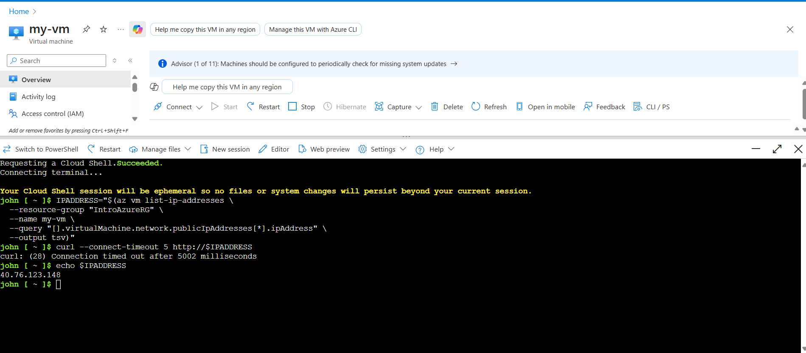
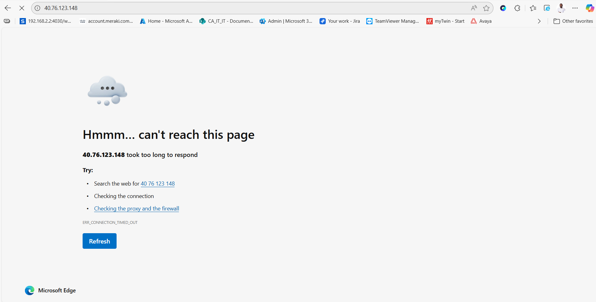
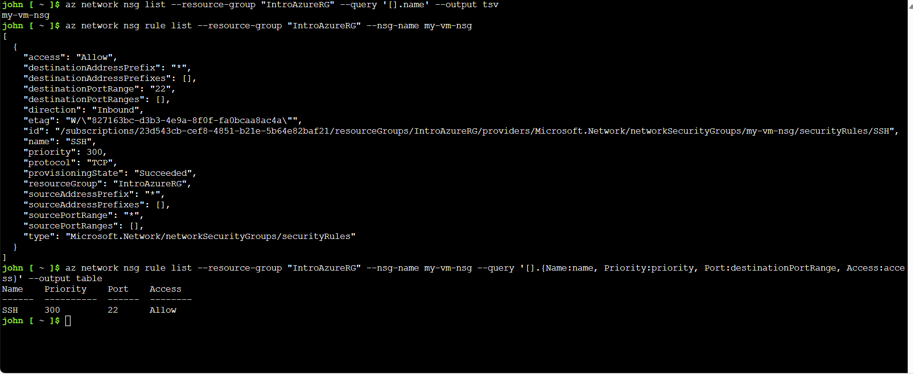
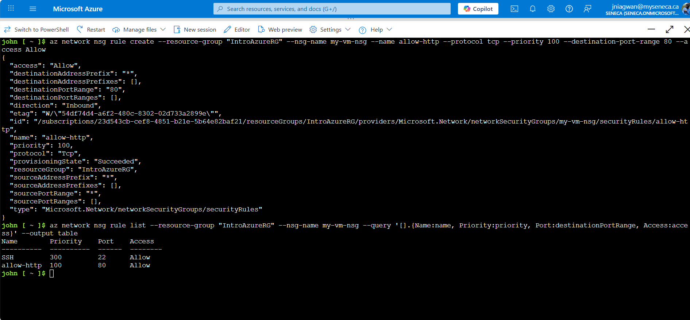
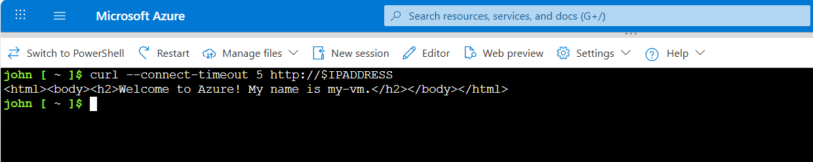
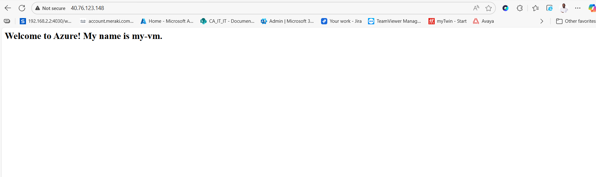
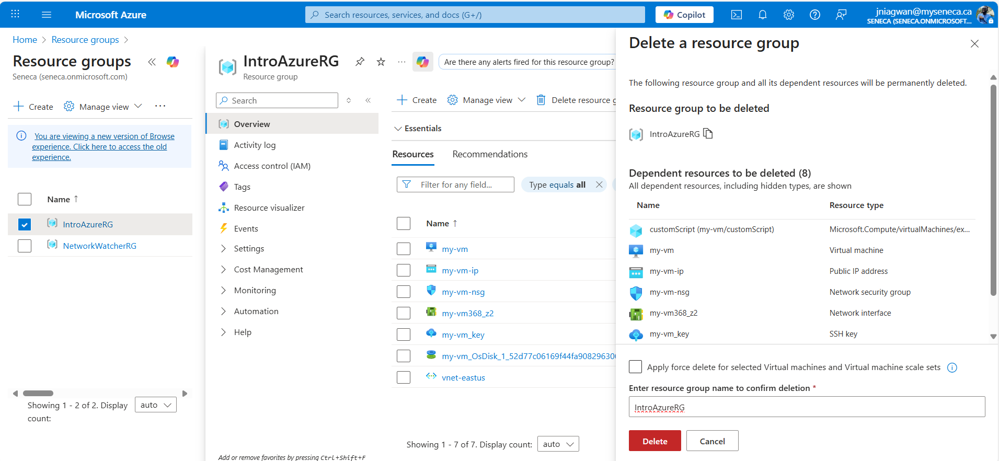

# Lab: Configuring Network Access to an Azure Virtual Machine  

This lab demonstrates how to configure **network access** to an existing Azure Virtual Machine (VM).  
It highlights how **Network Security Groups (NSGs)** control inbound and outbound traffic and how to open ports for web access.


---

## Objectives  

- Retrieve your VM’s public IP address  
- Verify that the web server isn’t accessible over HTTP  
- Review the VM’s existing Network Security Group rules  
- Create a new rule to allow inbound HTTP traffic on port 80  
- Confirm that the web server is now accessible  

---

## Prerequisites  

- An Azure VM (`my-vm`) created in resource group `IntroAzureRG`  
- Nginx installed (from the previous exercise)  
- [Azure Portal](https://portal.azure.com/) access with Cloud Shell in **Bash** mode  

---

## Steps Performed  

### 1. Retrieve Your VM’s IP Address  

- Ran the following command to store the VM’s public IP address in a Bash variable:

  ```bash
  IPADDRESS="$(az vm list-ip-addresses \
    --resource-group "IntroAzureRG" \
    --name my-vm \
    --query "[].virtualMachine.network.publicIpAddresses[*].ipAddress" \
    --output tsv)"

* Tested the connection to the web server:

  ```bash
  curl --connect-timeout 5 http://$IPADDRESS
  ```

* Observed the timeout error (connection not allowed yet).

* (Optional) Printed the IP address:

  ```bash
  echo $IPADDRESS
  ```

* Tried opening the IP address in a browser and saw the connection time out.

### 2. Review Existing Network Security Group Rules

* Listed NSGs associated with the VM:

  ```bash
  az network nsg list \
    --resource-group "IntroAzureRG" \
    --query '[].name' \
    --output tsv
  ```

* Found `my-vm-nsg`.

* Listed its rules in table format for easy reading:

  ```bash
  az network nsg rule list \
    --resource-group "IntroAzureRG" \
    --nsg-name my-vm-nsg \
    --query '[].{Name:name, Priority:priority, Port:destinationPortRange, Access:access}' \
    --output table
  ```

* Observed only the default SSH rule allowing port 22.

### 3. Create a Network Security Rule for HTTP

* Created a new rule to allow inbound HTTP (port 80):

  ```bash
  az network nsg rule create \
    --resource-group "IntroAzureRG" \
    --nsg-name my-vm-nsg \
    --name allow-http \
    --protocol tcp \
    --priority 100 \
    --destination-port-range 80 \
    --access Allow
  ```

* Verified the updated rules:

  ```bash
  az network nsg rule list \
    --resource-group "IntroAzureRG" \
    --nsg-name my-vm-nsg \
    --query '[].{Name:name, Priority:priority, Port:destinationPortRange, Access:access}' \
    --output table
  ```

* Saw both rules listed:

  ```
  Name               Priority  Port  Access
  -----------------  --------  ----  -------
  SSH  300      22    Allow
  allow-http         100       80    Allow
  ```

### 4. Test Web Server Access Again

* Retried the curl command:

  ```bash
  curl --connect-timeout 5 http://$IPADDRESS
  ```

* This time received the expected HTML response:

  ```html
  <html><body><h2>Welcome to Azure! My name is my-vm.</h2></body></html>
  ```

* Refreshed the browser tab pointing to the IP address and saw the Nginx welcome page.

---

## Skills Demonstrated

* Using Azure CLI in Bash to retrieve VM information
* Examining and interpreting NSG rules
* Creating a custom NSG rule to allow HTTP traffic
* Validating network access changes from the command line and a browser

---

## Screenshots

### Timeout Before Rule Creation





### NSG Rules Table





### Web Server Accessible






---

## Cleanup

* From **Azure Portal ▸ Resource groups**, select `IntroAzureRG`
* Click **Delete resource group**
* Type `IntroAzureRG` to confirm deletion

This removes the VM, NSG, and all related resources to avoid ongoing charges.


---

## Author

John Niagwan — IT Network Security Administrator
