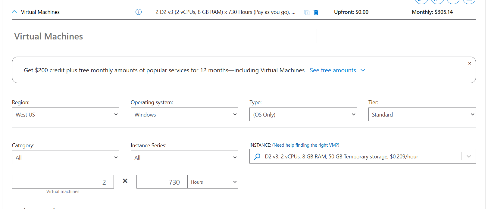
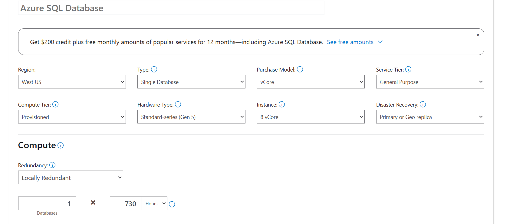
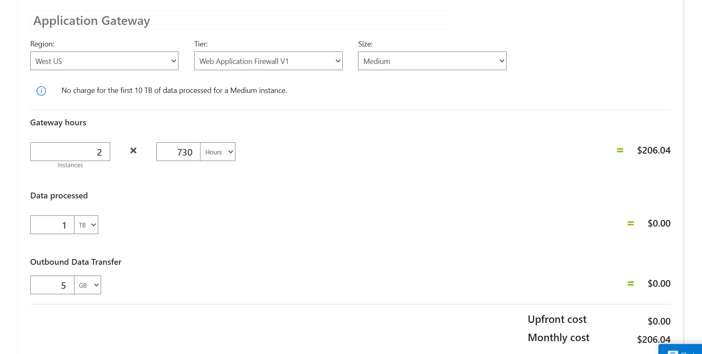
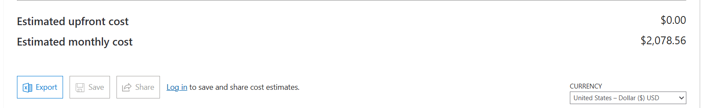

# Azure Pricing Calculator Exercise

This exercise demonstrates how to estimate the cost of migrating a small internal web application from an on-premises data center to Microsoft Azure using the **Azure Pricing Calculator**.

## 📚 Overview

The application is an internal ASP.NET web app that provides product inventory and pricing information. It currently runs on two Windows virtual machines and connects to a SQL Server database. The migration plan uses Azure services to replicate this setup.

## 📝 Requirements

- Two Windows virtual machines (VMs) running 24/7 (730 hours/month)
- Azure Application Gateway for load balancing
- Azure SQL Database for inventory and pricing data
- ~1 TB of data processed per month
- ≤32 GB database storage
- Region: West US

## ⚙️ Azure Services Selected

| Category  | Service                | Configuration Highlights                                                |
|-----------|------------------------|-------------------------------------------------------------------------|
| **Compute** | Virtual Machines        | 2 × D2 v3 Standard (Windows, OS Only, 730 hrs/month)                     |
| **Networking** | Application Gateway      | Web Application Firewall tier, Medium size, 2 × 730 hrs, 1 TB data processed |
| **Database** | Azure SQL Database       | Single Database, RA-GRS backup storage, vCore model, General Purpose tier, Gen 5, 8 vCores |

## 🖥️ Steps Performed

1. Navigated to [Azure Pricing Calculator](https://azure.microsoft.com/pricing/calculator/).
2. Added **Virtual Machines**, **Azure SQL Database**, and **Application Gateway** to the estimate.
3. Configured each service to match the requirements above.
4. Reviewed the estimated monthly cost at the bottom of the calculator.
5. Exported and/or shared the estimate with the team for planning.

## 📊 Outcome

- **Estimated Monthly Cost:** _(insert cost here after running the calculator)_
- Gained familiarity with selecting and configuring Azure services in the Pricing Calculator.
- Learned how to export, save, and share estimates for project planning.

## 🖼️ Screenshots

- **Pricing Calculator – Virtual Machines**  
  

- **Pricing Calculator – Azure SQL Database**  
  

- **Pricing Calculator – Application Gateway**  
  

- **Pricing Calculator – Total Estimate**  
  

## 📎 Resources

- [Azure Pricing Calculator](https://azure.microsoft.com/pricing/calculator/)
- [Azure Virtual Machines Documentation](https://learn.microsoft.com/azure/virtual-machines/)
- [Azure SQL Database Documentation](https://learn.microsoft.com/azure/azure-sql/database/)
- [Azure Application Gateway Documentation](https://learn.microsoft.com/azure/application-gateway/)

---

_This README documents my completion of the “Estimate workload costs by using the Pricing Calculator” exercise as part of my Azure learning journey._
