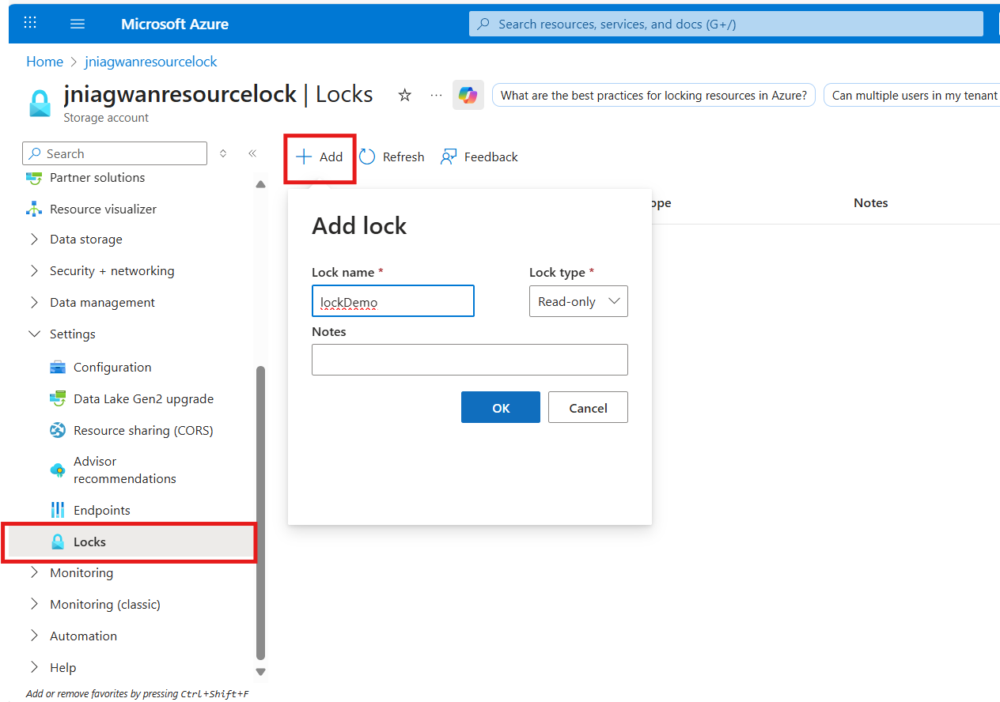
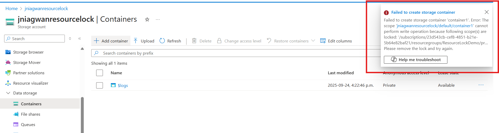
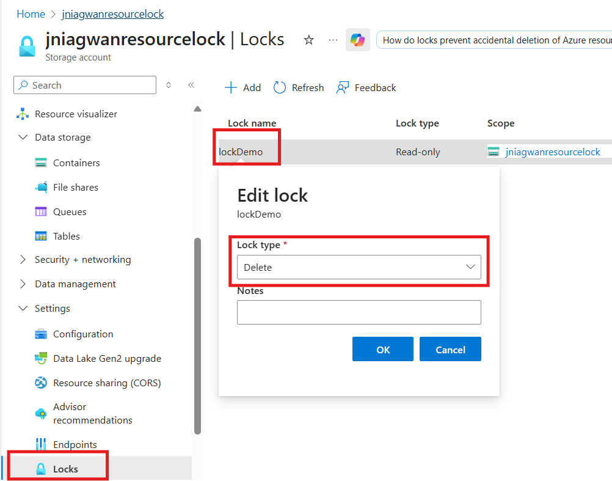
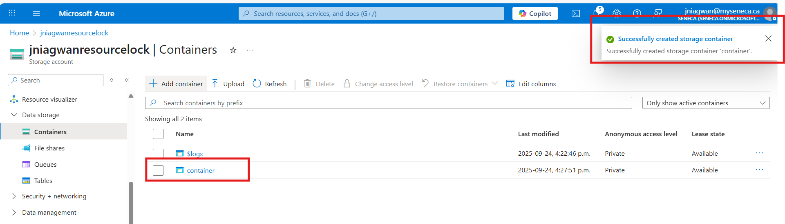
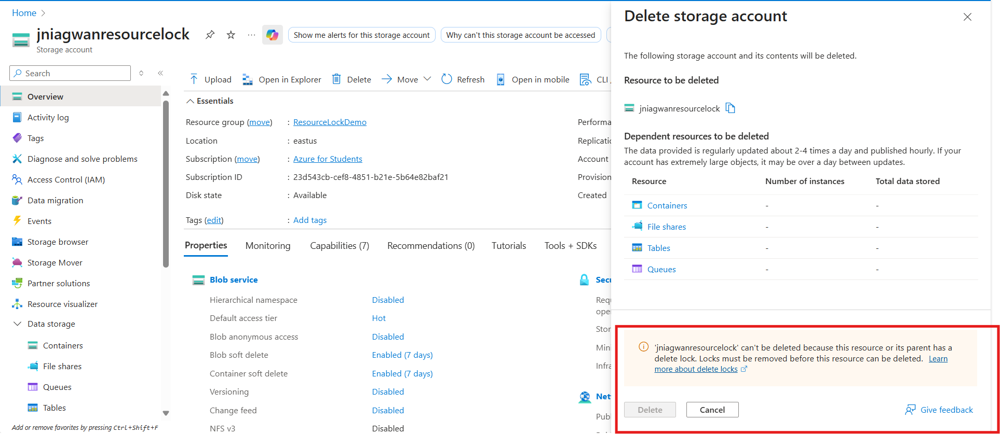
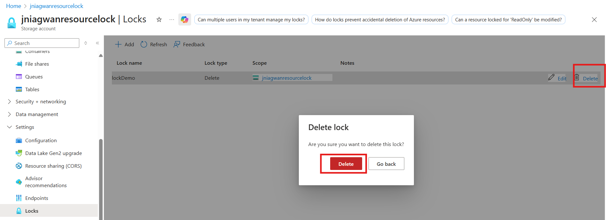
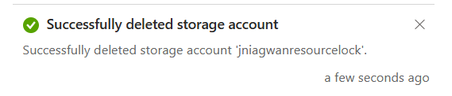

# Azure Exercise – Configure a Resource Lock  

This exercise demonstrates how to configure, update, and remove a resource lock on an Azure resource.  
Resource locks help prevent accidental changes or deletions of critical resources.  

---

## 🎯 Objectives  

- Create an Azure resource (storage account)  
- Apply a **read-only** resource lock  
- Observe the impact of the lock when trying to modify the resource  
- Change the lock to **delete** mode  
- Remove the lock and delete the resource  

---

## 📝 Prerequisites  

- An active Azure subscription or Microsoft Learn sandbox  
- Familiarity with the Azure Portal interface  

---

## ⚙️ Steps Performed  

### 1. Create a Storage Account  

- Signed in to [Azure Portal](https://portal.azure.com)  
- Selected **Create a resource ▸ Storage ▸ Storage account**  
- Created a new resource group and a unique storage account name  
- Kept defaults: Region (default), Performance (Standard), Redundancy (Locally redundant storage)  
- Selected **Review + Create ▸ Create** and waited for deployment  
- Selected **Go to resource**  

### 2. Apply a Read-only Resource Lock  

- In the storage account blade, navigated to **Settings ▸ Locks**  
- Selected **+ Add**  
- Entered a lock name and set **Lock type** to **Read-only**  
- Selected **OK**  

### 3. Attempt to Add a Container  

- In the storage account blade, navigated to **Data storage ▸ Containers**  
- Selected **+ Container**, entered a name, and tried to create  
- Received an **error**: “Failed to create storage container” because the read-only lock prevents create/update operations  

### 4. Modify the Resource Lock and Create a Container  

- Navigated back to **Settings ▸ Locks**  
- Selected the existing lock and changed **Lock type** to **Delete** (or removed it)  
- Returned to **Data storage ▸ Containers**  
- Selected **+ Container**, entered a name, and successfully created the container  

### 5. Attempt to Delete the Storage Account  

- Navigated to **Overview** of the storage account  
- Selected **Delete**  
- Received a notification that deletion is blocked due to the delete lock  

### 6. Remove the Delete Lock and Delete the Storage Account  

- Navigated to **Settings ▸ Locks** and removed the delete lock  
- Went back to **Home ▸ Storage accounts**, selected the storage account  
- Selected **Delete**, typed the storage account name to confirm  
- Successfully deleted the storage account  

---

## 🖼️ Screenshots 

- **Add Resource Lock**  
  

- **Failed to Create Container with Read-only Lock**  
  

- **Modify Lock Type**  
  

  

- **Delete Storage Account Error**  
  

- **Confirm Deletion After Lock Removal**  
  

  

---

## 🧠 Skills Demonstrated  

- Understanding of Azure resource locks and their effects  
- Applying and modifying read-only and delete locks  
- Preventing accidental changes and deletions of Azure resources  
- Cleaning up unused resources to avoid charges  

---

## 📎 Resources  

- [Azure Resource Locks Documentation](https://learn.microsoft.com/azure/azure-resource-manager/management/lock-resources)  
- [Azure Storage Accounts Documentation](https://learn.microsoft.com/azure/storage/common/storage-account-overview)  

---

_This README documents my completion of the “Configure a Resource Lock” exercise as part of my Azure learning journey._  
