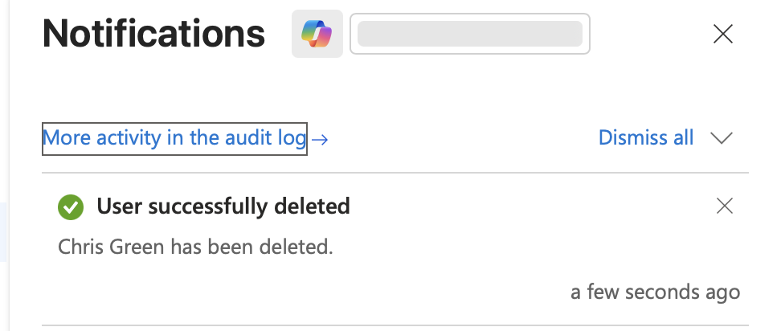

# Exercise: Restore or Remove Deleted Users

---

## 🧭 Overview

In this exercise, I practiced **removing and restoring user accounts** in **Microsoft Entra ID (formerly Azure Active Directory)**.  
This exercise demonstrates how Entra ID handles **soft deletion**, allowing administrators to restore users within a 30-day retention period.

---

## 🧰 Prerequisites

- Access to a **Microsoft Entra tenant** (trial or existing).  
- **User Administrator** or higher privileges.  
- A user account available for deletion (e.g., `Chris Green`).

---

## 🧑‍💼 Step 1: Remove a User from Microsoft Entra ID

1. In the **Microsoft Entra admin center**, navigate to:  
   **Identity → Users → All users**  
2. In the list of users, select the **check box** next to the user you want to delete (for example, **Chris Green**).  
   > 💡 Tip: Selecting the checkbox lets you manage multiple users simultaneously. Clicking directly on a username opens their individual details page instead.
3. With the user selected, click **Delete user** from the top menu.  
4. Review the confirmation dialog, then click **OK** to confirm the deletion.

✅ The user account is now removed and placed in the **Deleted users** section for up to **30 days** before permanent deletion.

---

### 🖼️ Screenshot: User Selected for Deletion  

---

## 🔄 Step 2: Restore a Deleted User

1. In the **Microsoft Entra admin center**, go to:  
   **Identity → Users → Deleted users**
2. Review the list of users that were deleted within the last 30 days.  
   These users can be **restored**.
3. Select the deleted user (e.g., **Chris Green**) from the list.  
4. From the menu, click **Restore user**.  
5. Review the confirmation dialog and click **OK**.  
6. Navigate back to **All users** and verify that the user has been successfully restored.

⚠️ **Important:**  
After 30 days, deleted users are **permanently removed** and cannot be restored.

---

### 🖼️ Screenshot: Deleted Users Page  

---

### 🖼️ Screenshot: Restored User Confirmation  

---

## 🧠 Key Takeaways

- **Microsoft Entra ID** supports *soft deletion* of user accounts, allowing restoration within 30 days.  
- Restoring users helps prevent accidental data or access loss.  
- After the 30-day window, deleted users are **permanently removed** and cannot be recovered.  
- This process is essential for compliance and continuity in enterprise environments.

---

## 🏁 Completion

✅ **Exercise Completed:** Restore or Remove Deleted Users  
🏅 **Achievement:** Demonstrated ability to manage the lifecycle of user accounts in Microsoft Entra ID — including deletion and recovery.