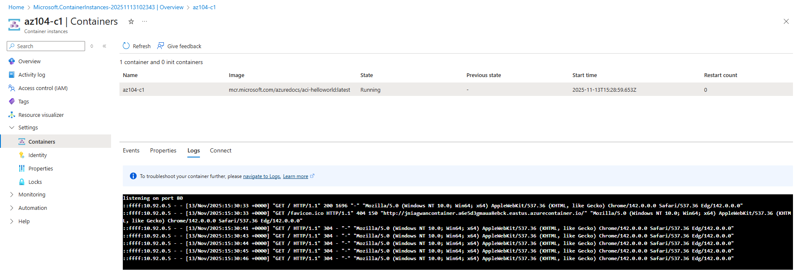

# Lab 09b - Implement Azure Container Instances

## 🧭 Lab Introduction
In this lab, you learn how to **implement and deploy Azure Container Instances (ACI)**.  
You’ll deploy a containerized web application using a public Docker image and test it directly from the Azure Portal.

> **Estimated time:** 15 minutes  
> **Region:** East US (you may select another if necessary)  
> **Prerequisite:** An active Azure subscription

---

## 🧩 Lab Scenario
Your organization currently runs a web application on an on-premises virtual machine.  
The goal is to move all applications to the cloud while minimizing server management overhead.  
To evaluate this, you will use **Azure Container Instances (ACI)** — a lightweight, serverless option to run Docker containers in Azure without managing VMs.

---

## 🏗️ Architecture Diagram

---

## 🧠 Job Skills
By completing this lab, you will demonstrate the ability to:

- Deploy a container instance from a Docker image  
- Configure networking for public access  
- Verify and monitor a container deployment  

---

## ⚙️ Task 1: Deploy an Azure Container Instance Using a Docker Image

In this task, you will create a simple web application container using a predefined Docker image.

1. Sign in to the [Azure portal](https://portal.azure.com).  
2. In the search bar, type **Container instances** and select it.  
3. Click **+ Create** to begin deployment.  
4. On the **Basics** tab, configure the following:

   | Setting | Value |
   |----------|--------|
   | **Subscription** | Your Azure subscription |
   | **Resource group** | `az104-rg9` (Create new if needed) |
   | **Container name** | `az104-c1` |
   | **Region** | East US |
   | **Image Source** | Quickstart images |
   | **Image** | `mcr.microsoft.com/azuredocs/aci-helloworld:latest (Linux)` |

5. Click **Next: Networking >** and configure:

   | Setting | Value |
   |----------|--------|
   | **DNS name label** | A unique value (e.g., `az104c1-demo`) |

   > The container will be publicly reachable at:  
   > `https://<dns-name-label>.<region>.azurecontainer.io`

6. Click **Next: Monitoring >** and uncheck **Enable container instance logs**.  
7. Click **Next: Advanced >** and review default settings.  
8. Click **Review + Create**, ensure validation passes, and select **Create**.  

> ⏳ Deployment takes approximately 2–3 minutes.  
> *(You can optionally view the source code for the sample app in the `/app` folder on the [GitHub repository](https://github.com/Azure-Samples/aci-helloworld)).*

---

## ✅ Task 2: Test and Verify Deployment of the Azure Container Instance

1. Once deployment completes, select **Go to resource**.  
2. On the **Overview** blade, confirm that **Status** = `Running`.  
3. Copy the **FQDN** value and open it in a new browser tab.  
   - Example: `https://az104c1-demo.eastus.azurecontainer.io`
4. Verify that the **Welcome to Azure Container Instance** page is displayed.  
5. Refresh the page several times to generate log entries.  
6. Return to the Azure portal:  
   - Under **Settings**, select **Containers** → **Logs**.  
   - Review the logs and confirm that they show HTTP GET requests.

  

---

## 🧾 Summary
In this lab, you:

- Deployed a Docker-based web app using **Azure Container Instances (ACI)**  
- Verified the deployment via its **FQDN**  
- Reviewed container logs to confirm activity  

This demonstrates how Azure enables **serverless containerized application hosting** without managing infrastructure.

---

## 🖼️ Screenshots Section

| Step | Description | Screenshot |
|------|--------------|-------------|
| 1 | Container Instance Overview | ☐ |
| 2 | Public Web App in Browser | ☐ |
| 3 | Container Logs | ☐ |

---

**✅ End of Lab 09b - Implement Azure Container Instances**
