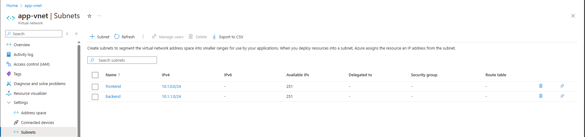
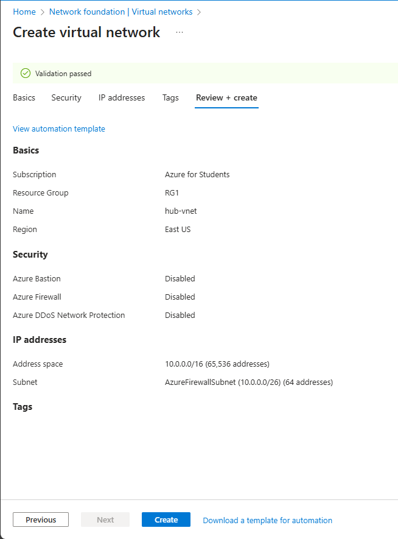
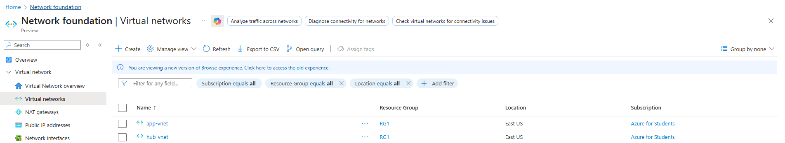
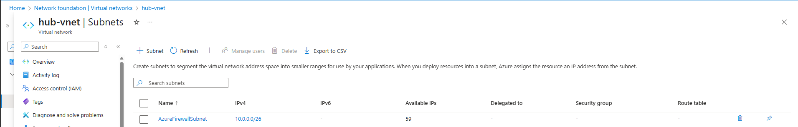
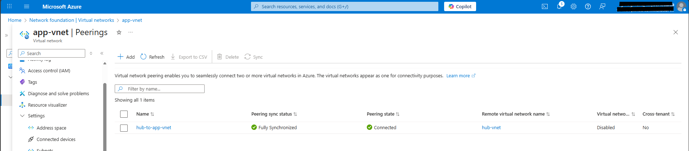

# Exercise 01: Create and Configure Virtual Networks

## 🧭 Scenario
Your organization is migrating a web-based application to Azure.  
Your first responsibility is to design and deploy the **virtual network architecture** that will host and secure the application.

You identify the following requirements:

- Two virtual networks are required: **app-vnet** and **hub-vnet**, forming a **hub-and-spoke** architecture.
- **app-vnet** will host the application and requires two subnets:
  - **frontend** (web servers)
  - **backend** (database servers)
- **hub-vnet** will host infrastructure services and requires a single subnet for the firewall.
- The two virtual networks must communicate **privately and securely** using **VNet peering**.
- Both VNets must be deployed in the **same region**.

---

## 🧠 Skilling Tasks
You will accomplish the following:

- Create a virtual network  
- Create subnets  
- Configure virtual network peering  

---

## 🏗️ Architecture Diagram  

---

## 📝 Exercise Instructions
> **Prerequisite:** Azure subscription with **Contributor** RBAC role  
> **Note:** When not specified, use default settings.

---

# 🔷 Task 1: Create Hub and Spoke Virtual Networks and Subnets

Azure Virtual Networks allow Azure resources to securely communicate with one another, the internet, and on-premises infrastructure.  
Each resource is deployed into a **subnet** within a virtual network.

---

## 1️⃣ Create *app-vnet* with Two Subnets

1. Sign in to the Azure Portal:  
   https://portal.azure.com
2. Search for **Virtual Networks**.
3. Select **+ Create**.
4. Configure the virtual network using the following settings:

### **app-vnet Configuration**

| Property | Value |
|---------|--------|
| Resource group | RG1 |
| Virtual network name | **app-vnet** |
| Region | East US |
| IPv4 address space | 10.1.0.0/16 |
| Subnet 1 name | **frontend** |
| Subnet 1 address range | 10.1.0.0/24 |
| Subnet 2 name | **backend** |
| Subnet 2 address range | 10.1.1.0/24 |

5. Select **Review + Create**, then **Create**.

---

## 2️⃣ Create *hub-vnet* with Firewall Subnet

Repeat the creation process using the following:

### **hub-vnet Configuration**

| Property | Value |
|---------|--------|
| Resource group | RG1 |
| Name | **hub-vnet** |
| Region | East US |
| IPv4 address space | 10.0.0.0/16 |
| Subnet name | **AzureFirewallSubnet** |
| Subnet address range | 10.0.0.0/26 |

---

## 3️⃣ Verify Deployments

1. In the Azure portal search bar, type **Virtual Networks**.
2. Confirm both VNets appear:
   - app-vnet  
   - hub-vnet  
3. Select each VNet and verify their subnets are correctly deployed.

  

---

# 🔷 Task 2: Configure Virtual Network Peering

VNet Peering allows seamless, private connectivity between two virtual networks.

---

## 1️⃣ Configure Peering From *app-vnet* to *hub-vnet*

1. Search for and open **app-vnet**.
2. In the left pane under **Settings**, select **Peerings**.
3. Click **+ Add**.

Configure the peering with:

| Property | Value |
|---------|--------|
| Remote peering link name | **app-vnet-to-hub** |
| Virtual network | hub-vnet |
| Local virtual network peering link name | **hub-to-app-vnet** |

Leave all other settings as defaults.  
Select **Add**.

---

## 2️⃣ Verify Peering Status

- After deployment, confirm the **Peering status** shows **Connected**.

---

# 🧾 Summary

In this exercise, you successfully:

- Created two virtual networks (hub and spoke)
- Configured subnets for application and infrastructure workloads
- Set up secure private communication using VNet peering

You now have the foundation for a scalable and secure hub-and-spoke Azure network topology.

---

✔ **End of Exercise 01 — Create and Configure Virtual Networks**
