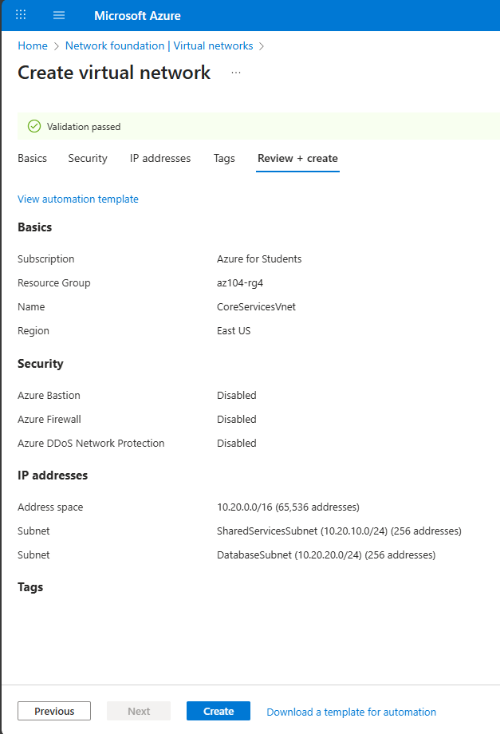
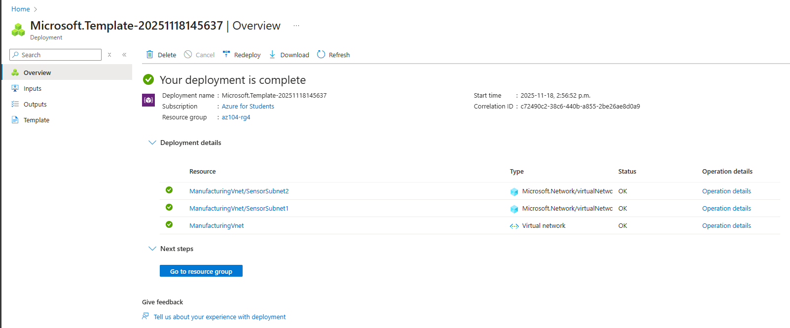
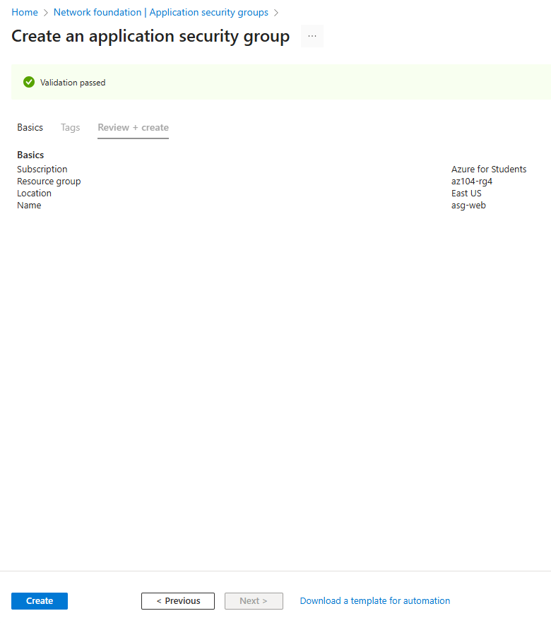
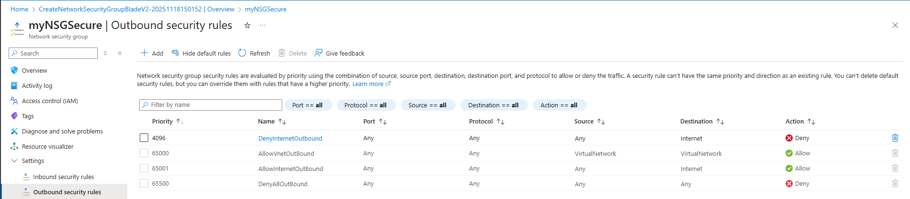
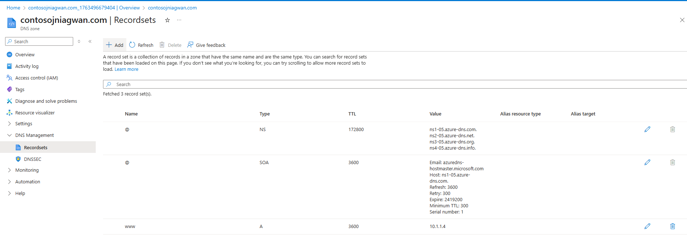
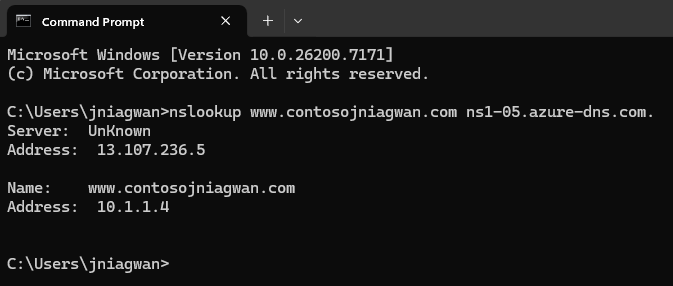
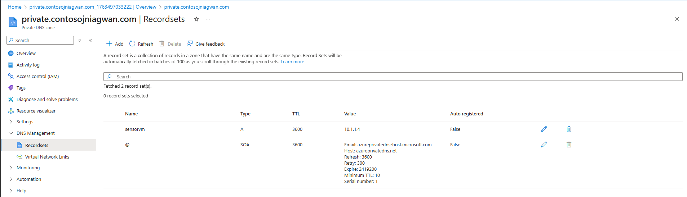

# **Lab 04 – Implement Virtual Networking**

## **Lab Introduction**

This lab is the first of three focused on Azure virtual networking. You will learn how to create virtual networks and subnets, protect networks using Network Security Groups (NSGs) and Application Security Groups (ASGs), and configure public and private DNS zones.

**Estimated Time:** 50 minutes
**Region Used:** East US
**Requirements:** Azure subscription (Contributor role)

---

# **Lab Scenario**

Your organization is planning growth and needs scalable virtual networks:

* **CoreServicesVnet**: Largest number of resources, requires a large address space.
* **ManufacturingVnet**: Supports manufacturing systems and IoT-scale devices.

Your job is to create these VNets and implement security + DNS.

---

# **Architecture Diagram**


---

# **Job Skills**

* Create virtual networks and subnets via the Azure Portal.
* Deploy virtual networks via ARM templates.
* Configure Application Security Groups and Network Security Groups.
* Configure public and private DNS zones.

---

---

# **Task 1: Create a Virtual Network with Subnets (Portal)**

### **Steps**

1. Sign in to Azure Portal → [https://portal.azure.com](https://portal.azure.com)
2. Search **Virtual Networks** → **Create**.
3. Complete **Basics**:

| Setting        | Value            |
| -------------- | ---------------- |
| Resource Group | az104-rg4        |
| VNet Name      | CoreServicesVnet |
| Region         | East US          |

4. Open **IP Addresses** tab:

   * Replace IPv4 address space with: `10.20.0.0/16`
5. Add Subnets:

| Subnet Name          | Starting Address | Size |
| -------------------- | ---------------- | ---- |
| SharedServicesSubnet | 10.20.10.0       | /24  |
| DatabaseSubnet       | 10.20.20.0       | /24  |

6. **Delete default subnet**.
7. Select **Review + create** → **Create**.
8. Open the resource → verify Address space & Subnets.

---

### **Export ARM Template**

1. In **Automation** → Select **Export template**.
2. Download ZIP → extract locally.
3. Ensure `template.json` and `parameters.json` exist.



---

# **Task 2: Create a VNet Using a Template**

You will modify the exported template to create **ManufacturingVnet**.

### **Modify template.json**

Perform the following replacements:

#### **For Virtual Network**

| Replace          | With              |
| ---------------- | ----------------- |
| CoreServicesVnet | ManufacturingVnet |
| 10.20.0.0        | 10.30.0.0         |

#### **For Subnets**

| Old Value            | New Value     |
| -------------------- | ------------- |
| SharedServicesSubnet | SensorSubnet1 |
| 10.20.10.0/24        | 10.30.20.0/24 |
| DatabaseSubnet       | SensorSubnet2 |
| 10.20.20.0/24        | 10.30.21.0/24 |

Save the file.

### **Modify parameters.json**

* Replace: **CoreServicesVnet → ManufacturingVnet**
* Save.

### **Deploy Template**

1. Search **Deploy a custom template**
2. Select **Build your own template in editor**
3. Load modified `template.json` → Save
4. Load modified `parameters.json`
5. Resource group: **az104-rg4**
6. Select **Review + create** → **Create**
7. Verify ManufacturingVnet deployment.



---

# **Task 3: Configure ASG and NSG**

## **Create Application Security Group**

1. Search: **Application security groups**
2. Select **Create**

| Setting | Value     |
| ------- | --------- |
| RG      | az104-rg4 |
| Name    | asg-web   |
| Region  | East US   |



---

## **Create Network Security Group**

1. Search **Network security groups** → **Create**

| Setting | Value       |
| ------- | ----------- |
| RG      | az104-rg4   |
| Name    | myNSGSecure |
| Region  | East US     |

2. After deployment → Go to resource
3. Settings → **Subnets** → **Associate**

| Setting         | Value                |
| --------------- | -------------------- |
| Virtual Network | CoreServicesVnet     |
| Subnet          | SharedServicesSubnet |

---

## **Add Inbound Rule Allowing ASG Traffic**

| Setting           | Value                      |
| ----------------- | -------------------------- |
| Source            | Application security group |
| Source ASG        | asg-web                    |
| Destination Ports | 80, 443                    |
| Protocol          | TCP                        |
| Action            | Allow                      |
| Priority          | 100                        |
| Name              | AllowASG                   |

---

## **Add Outbound Rule Denying Internet**

| Setting     | Value                |
| ----------- | -------------------- |
| Destination | Service tag          |
| Service Tag | Internet             |
| Action      | Deny                 |
| Priority    | 4096                 |
| Name        | DenyInternetOutbound |




---

# **Task 4: Configure Public and Private DNS Zones**

## **Public DNS Zone**

1. Search **DNS zones** → Create:

| Setting | Value       |
| ------- | ----------- |
| RG      | az104-rg4   |
| Name    | contoso.com |
| Region  | East US     |

2. Add Recordset:

| Property   | Value    |
| ---------- | -------- |
| Name       | www      |
| Type       | A        |
| TTL        | 1        |
| IP Address | 10.1.1.4 |

3. Test resolution:

```powershell
nslookup www.contoso.com <name-server>
```




---

## **Private DNS Zone**

1. Search **Private DNS zones** → Create:

| Setting | Value               |
| ------- | ------------------- |
| Name    | private.contoso.com |
| Region  | East US             |

2. Add Virtual Network Link:

| Setting         | Value              |
| --------------- | ------------------ |
| Link Name       | manufacturing-link |
| Virtual Network | ManufacturingVnet  |

3. Add Recordset:

| Setting | Value    |
| ------- | -------- |
| Name    | sensorvm |
| Type    | A        |
| IP      | 10.1.1.4 |



---

# **Lab Completed**

You have:

* Created two virtual networks (Portal + Template)
* Configured ASG + NSG with custom rules
* Implemented public and private DNS zones