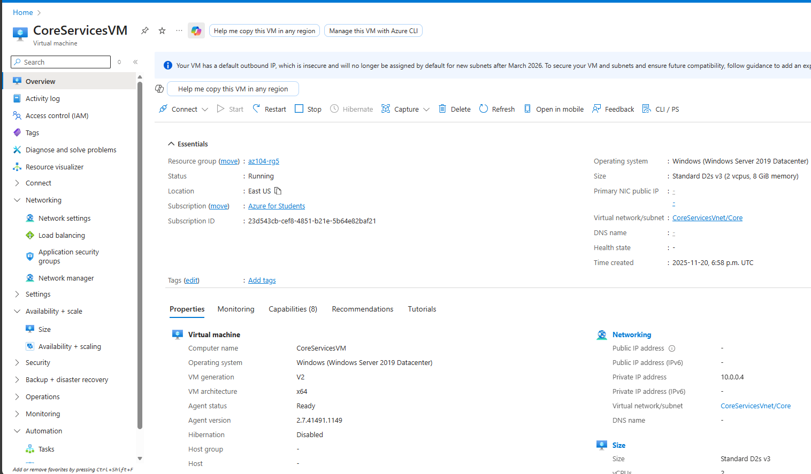
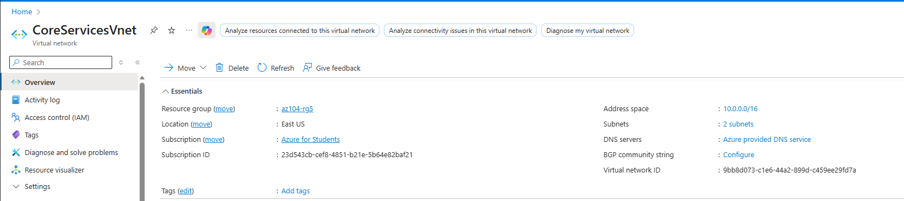
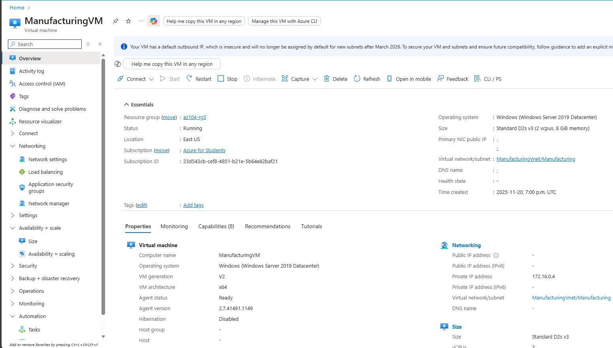
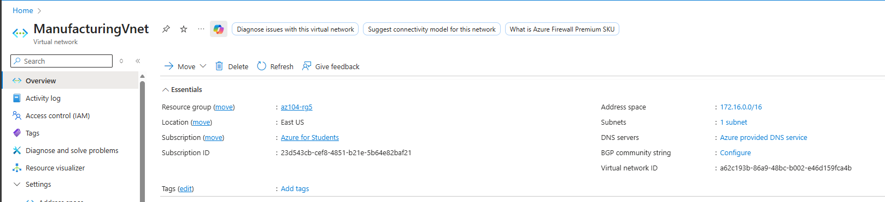
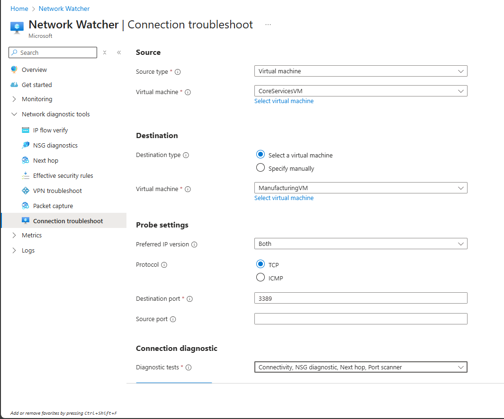
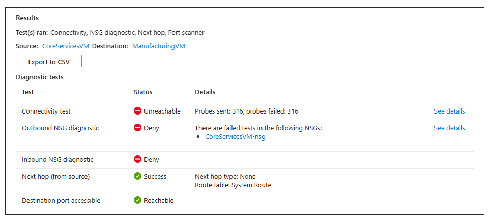
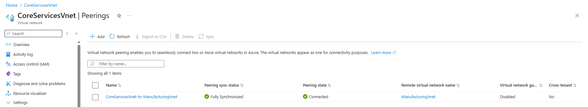
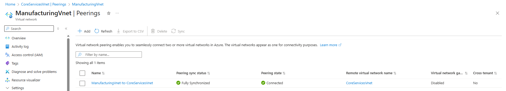
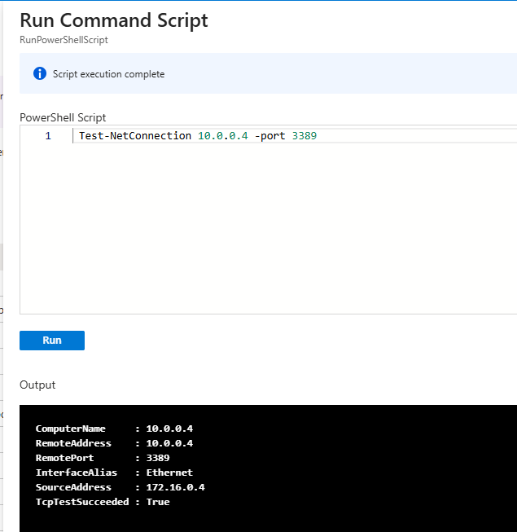

# Lab – Implement Communication Between Virtual Networks

## 📘 Lab Introduction
In this lab, you explore **communication options between virtual networks**.  
You will implement **virtual network peering**, test network connections, and create a **custom user-defined route (UDR)**.

This lab requires an Azure subscription. Your available features may vary based on subscription type.  
You may use a different region, but these steps assume **East US**.

**Estimated time:** 50 minutes

---

## 🧭 Lab Scenario
Your organization separates core IT services (DNS, security, management workloads) from other business operations such as manufacturing.  
However, applications in both areas must occasionally communicate securely and efficiently.

In this lab, you:

- Build VMs in **separate virtual networks**
- Test connectivity **before and after** peering
- Create **VNet peering** for cross-network communication
- Test connections using **Network Watcher** and **PowerShell**
- Configure a **custom route** to control traffic flow

This scenario models how enterprises separate production from development or isolate subsidiaries while still allowing selective communication.

---

## 🏗️ Architecture Diagram  


---

## 🛠️ Job Skills Practiced
- Create virtual networks and virtual machines  
- Use Network Watcher for network diagnostics  
- Configure VNet peering  
- Test TCP connections using PowerShell  
- Create user-defined routes (UDRs)  

---

# 🔷 Task 1: Create a Core Services Virtual Machine and Virtual Network

In this task, you create the **Core Services** virtual network and deploy a VM into it.

---

### 1️⃣ Create the VM

1. Sign in to the Azure portal:  
   https://portal.azure.com
2. Search for **Virtual Machines** and select **Create > Virtual machine**.
3. Fill out the **Basics** tab:

| Setting | Value |
|--------|--------|
| Subscription | Your subscription |
| Resource group | **az104-rg5** |
| VM name | **CoreServicesVM** |
| Region | East US |
| Availability options | No infrastructure redundancy |
| Security type | Standard |
| Image | Windows Server 2019 Datacenter – x64 Gen2 |
| Size | Standard_DS2_v3 |
| Username | localadmin |
| Password | (your secure password) |
| Public inbound ports | None |

4. Select **Next : Disks >** and accept defaults.
5. Select **Next : Networking >**.



---

### 2️⃣ Create CoreServicesVnet

1. On the Networking tab, choose **Create new** for the virtual network.
2. Use the following values:

| Setting | Value |
|--------|--------|
| VNet name | **CoreServicesVnet** |
| Address space | 10.0.0.0/16 |
| Subnet name | **Core** |
| Subnet address range | 10.0.0.0/24 |

3. Disable **Boot diagnostics** under the Monitoring tab.
4. Select **Review + create**, then **Create**.

You may continue without waiting for deployment completion.


---

# 🔷 Task 2: Create a Virtual Machine in a Different Virtual Network

Repeat the previous task for the manufacturing network.

---

### Create ManufacturingVM and ManufacturingVnet

1. In the portal, go to **Virtual Machines > Create > Virtual machine**.
2. Use these **Basics** values:

| Setting | Value |
|--------|--------|
| Resource group | **az104-rg5** |
| VM name | **ManufacturingVM** |
| Region | East US |
| Image | Windows Server 2019 Datacenter – x64 Gen2 |
| Size | Standard_DS2_v3 |
| Username | localadmin |
| Password | (your secure password) |
| Public inbound ports | None |

3. On the Networking tab, select **Create new** and configure:

| Setting | Value |
|--------|--------|
| Name | **ManufacturingVnet** |
| Address range | 172.16.0.0/16 |
| Subnet name | **Manufacturing** |
| Subnet address range | 172.16.0.0/24 |

4. Disable Boot Diagnostics.
5. Select **Review + create > Create**.


---

# 🔷 Task 3: Test Connection Between Virtual Machines Using Network Watcher

Before peering, the VMs cannot communicate.

1. In the portal, search for **Network Watcher**.
2. Open **Connection troubleshoot**.
3. Configure:

| Field | Value |
|-------|--------|
| Source type | Virtual machine |
| Source VM | CoreServicesVM |
| Destination type | Virtual machine |
| Destination VM | ManufacturingVM |
| Protocol | TCP |
| Destination port | 3389 |
| IP version | Both |



4. Select **Run diagnostic tests**.

Expected result: **Unreachable** (because networks are not yet peered).

---

# 🔷 Task 4: Configure Virtual Network Peering

### 1️⃣ Peer CoreServicesVnet → ManufacturingVnet

1. Open **CoreServicesVnet**.
2. Select **Peerings > + Add**.
3. Use:

| Parameter | Value |
|-----------|--------|
| Peering link name | ManufacturingVnet-to-CoreServicesVnet |
| Remote VNet | ManufacturingVnet |
| Allow access | Yes |
| Allow forwarded traffic | Yes |

4. Review and create.

---

### 2️⃣ Verify Peering Status

- Check that **Peering status = Connected** on both VNets.
- Refresh if needed.




---

# 🔷 Task 5: Use PowerShell to Test VM-to-VM Connectivity

Now that peering is enabled, the connection should succeed.


---

### 1️⃣ Find CoreServicesVM Private IP

1. Open **CoreServicesVM**.
2. Copy the **Private IP address**.

📸 **Screenshot Placeholder — VM Private IP**

---

### 2️⃣ Test the Connection from ManufacturingVM

1. Open **ManufacturingVM**.
2. Go to **Run command > RunPowerShellScript**.
3. Run:

```powershell
Test-NetConnection <CoreServicesVM-IP> -Port 3389
```
