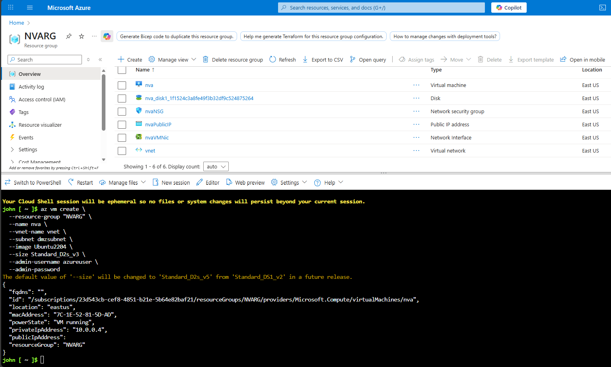
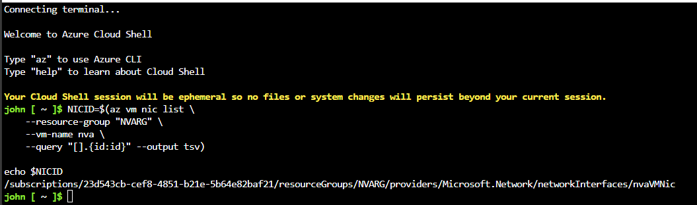
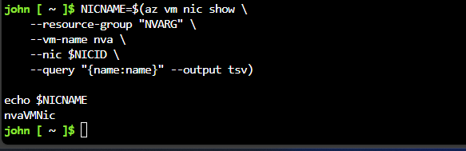
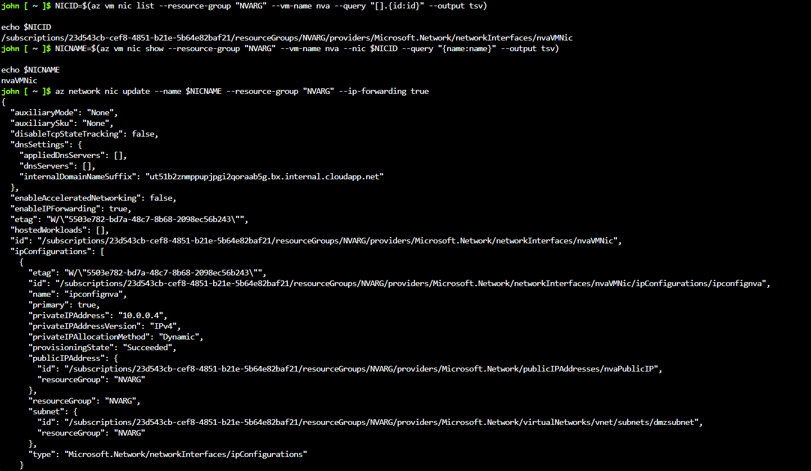
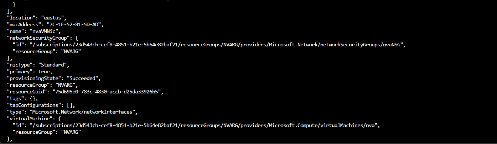
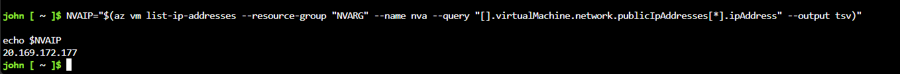
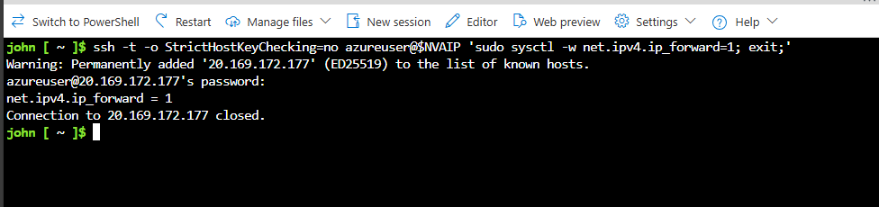

# **Exercise – Create a Network Virtual Appliance (NVA) and Virtual Machines**

## **Overview**

In this exercise, you will:

✔ Deploy a **Network Virtual Appliance (NVA)** into the **dmzsubnet**
✔ Enable **IP forwarding** on the NVA’s NIC
✔ Enable **IP forwarding within the appliance**
✔ Route traffic from the public subnet to the private subnet through the NVA

This setup is a common architecture for inspecting or filtering traffic between public-facing systems and internal workloads.

---

## **🧰 Prerequisites**

* Azure subscription
* A resource group (replace `"myResourceGroupName"` with your own)
* Existing:

  * Virtual Network (**vnet**)
  * Subnets: **dmzsubnet**, **publicsubnet**, **privatesubnet**

---

# **Task 1 — Deploy the Network Virtual Appliance (NVA)**

You will deploy an **Ubuntu 22.04 LTS VM** that acts as your NVA.

### **1. Deploy the VM**

```bash
az vm create \
    --resource-group "myResourceGroupName" \
    --name nva \
    --vnet-name vnet \
    --subnet dmzsubnet \
    --image Ubuntu2204 \
    --admin-username azureuser \
    --admin-password <password>
```

📸 **Screenshot Placeholder — VM Deployment Output**


---

# **Task 2 — Enable IP Forwarding on the NVA Network Interface**

Traffic routed to the NVA needs to be forwarded to the private subnet. For that, you must enable IP forwarding.

### **1. Retrieve the NIC ID**

```bash
NICID=$(az vm nic list \
    --resource-group "NVARG" \
    --vm-name nva \
    --query "[].{id:id}" --output tsv)

echo $NICID
```

📸 **Screenshot Placeholder — NIC ID Output**


---

### **2. Retrieve the NIC Name**

```bash
NICNAME=$(az vm nic show \
    --resource-group "NVARG" \
    --vm-name nva \
    --nic $NICID \
    --query "{name:name}" --output tsv)

echo $NICNAME
```

📸 **Screenshot Placeholder — NIC Name Output**


---

### **3. Enable IP Forwarding**

```bash
az network nic update --name $NICNAME \
    --resource-group "myResourceGroupName" \
    --ip-forwarding true
```

📸 **Screenshot Placeholder — IP Forwarding Enabled**



---

# **Task 3 — Enable IP Forwarding inside the Appliance**

Azure-level IP forwarding is not enough — the VM OS must also allow forwarding.

### **1. Get the Public IP of the NVA**

```bash
NVAIP="$(az vm list-ip-addresses \
    --resource-group "myResourceGroupName" \
    --name nva \
    --query "[].virtualMachine.network.publicIpAddresses[*].ipAddress" \
    --output tsv)"

echo $NVAIP
```

📸 **Screenshot Placeholder — VM Public IP**


---

### **2. SSH into the NVA and Enable IP Forwarding**

```bash
ssh -t -o StrictHostKeyChecking=no azureuser@$NVAIP 'sudo sysctl -w net.ipv4.ip_forward=1; exit;'
```

You will be prompted for your VM admin password.

📸 **Screenshot Placeholder — IP Forwarding Enabled in VM**


---

# **✔ Exercise Complete**

You successfully:

✅ Deployed an NVA
✅ Enabled Azure-side IP forwarding
✅ Enabled OS-level IP forwarding
✅ Prepared your environment for routing traffic from public to private subnets

Your next step will typically involve creating **Network Security Groups**, **firewall rules**, or **traffic inspection logic** depending on the appliance function.