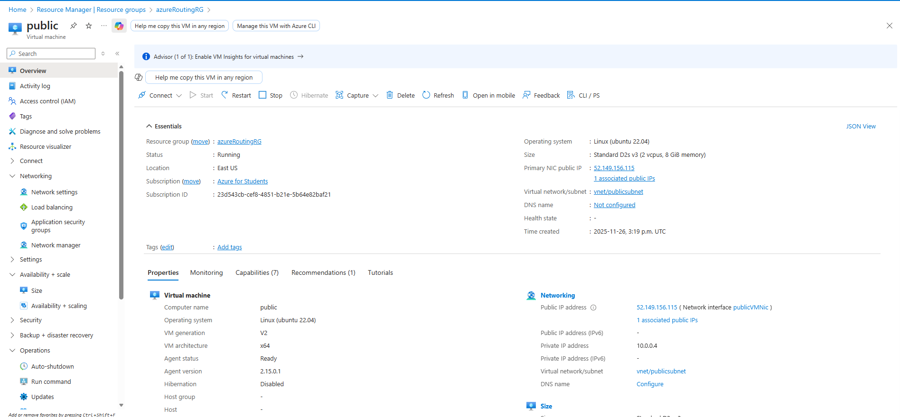
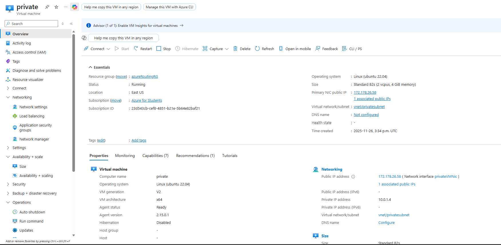
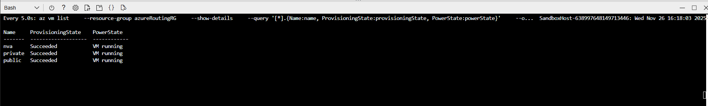
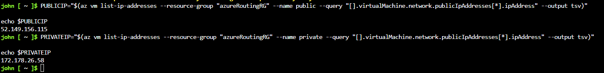
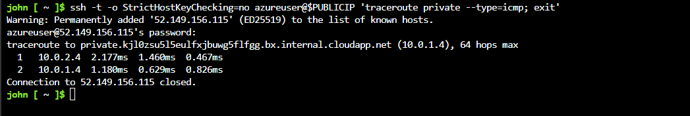
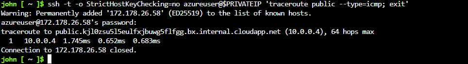

# **Exercise – Route Traffic Through the NVA**

**Duration: ~10 minutes**

In this exercise, you will route traffic through the **Network Virtual Appliance (NVA)** you previously deployed. You'll create **public** and **private** VMs, install `traceroute`, and verify routing paths.

---

## **📌 Overview**

You will:

* Deploy one VM to **publicsubnet**
* Deploy one VM to **privatesubnet**
* Install traceroute using cloud-init
* Validate routing:

  * **Public → Private = through NVA**
  * **Private → Public = direct**

---

## **🧰 Prerequisites**

* Azure subscription
* Existing:

  * **Virtual Network (vnet)**
  * **publicsubnet**, **privatesubnet**, **dmzsubnet**
  * **NVA deployed to dmzsubnet**
* Azure Cloud Shell


---

## **📂 Create `cloud-init.txt`**

Open Cloud Shell and create a file:

```
code cloud-init.txt
```

Paste:

```
#cloud-config
package_upgrade: true
packages:
   - inetutils-traceroute
```

Save using **Ctrl + S**, exit with **Ctrl + Q**.

---

## **🚀 Deploy Public VM**

```bash
az vm create \
    --resource-group "myResourceGroupName" \
    --name public \
    --vnet-name vnet \
    --subnet publicsubnet \
    --image Ubuntu2204 \
    --admin-username azureuser \
    --no-wait \
    --custom-data cloud-init.txt \
    --admin-password <password>
```



---

## **🚀 Deploy Private VM**

```bash
az vm create \
    --resource-group "myResourceGroupName" \
    --name private \
    --vnet-name vnet \
    --subnet privatesubnet \
    --image Ubuntu2204 \
    --admin-username azureuser \
    --no-wait \
    --custom-data cloud-init.txt \
    --admin-password <password>
```



---

## **📊 Monitor VM Deployment**

```bash
watch -d -n 5 "az vm list \
    --resource-group "myResourceGroupName" \
    --show-details \
    --query '[*].{Name:name, ProvisioningState:provisioningState, PowerState:powerState}' \
    --output table"
```

Stop with **Ctrl + C** when all VMs show:

* **ProvisioningState = Succeeded**
* **PowerState = VM running**



---

## **🌐 Get Public IPs**

### Public VM:

```bash
PUBLICIP="$(az vm list-ip-addresses \
    --resource-group "myResourceGroupName" \
    --name public \
    --query "[].virtualMachine.network.publicIpAddresses[*].ipAddress" \
    --output tsv)"

echo $PUBLICIP
```

### Private VM:

```bash
PRIVATEIP="$(az vm list-ip-addresses \
    --resource-group "myResourceGroupName" \
    --name private \
    --query "[].virtualMachine.network.publicIpAddresses[*].ipAddress" \
    --output tsv)"

echo $PRIVATEIP
```



---

# **🔍 Test Traffic Routing**

## **1️⃣ Trace Route — Public → Private (should pass through NVA)**

```bash
ssh -t -o StrictHostKeyChecking=no azureuser@$PUBLICIP 'traceroute private --type=icmp; exit'
```

Expected output:

```
traceroute to private (...10.0.1.4)
1   10.0.2.4   <-- NVA private IP
2   10.0.1.4   <-- Private VM
```

✔ Confirms **publicsubnet traffic → NVA → privatesubnet**




---

## **2️⃣ Trace Route — Private → Public (direct route)**

```bash
ssh -t -o StrictHostKeyChecking=no azureuser@$PRIVATEIP 'traceroute public --type=icmp; exit'
```

Expected output:

```
1   10.0.0.4  <-- Public VM directly
```

✔ Confirms **private → public traffic bypasses NVA** (default routing)



---

# **✅ Exercise Complete**

You have successfully:

* Deployed public and private VMs
* Installed traceroute via cloud-init
* Verified routing behavior:

  * Public → Private via **NVA**
  * Private → Public via **direct route**

Your environment now demonstrates **secure DMZ routing patterns** commonly used in enterprise networks.