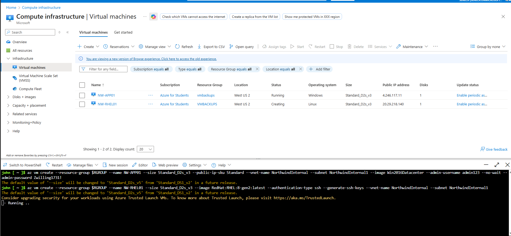
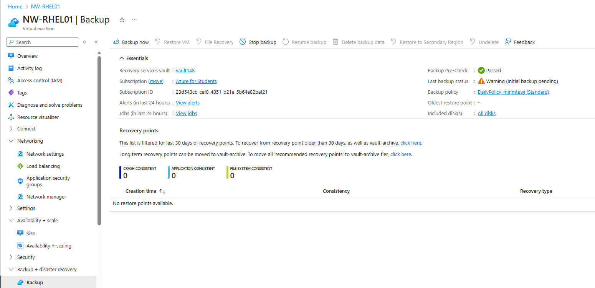
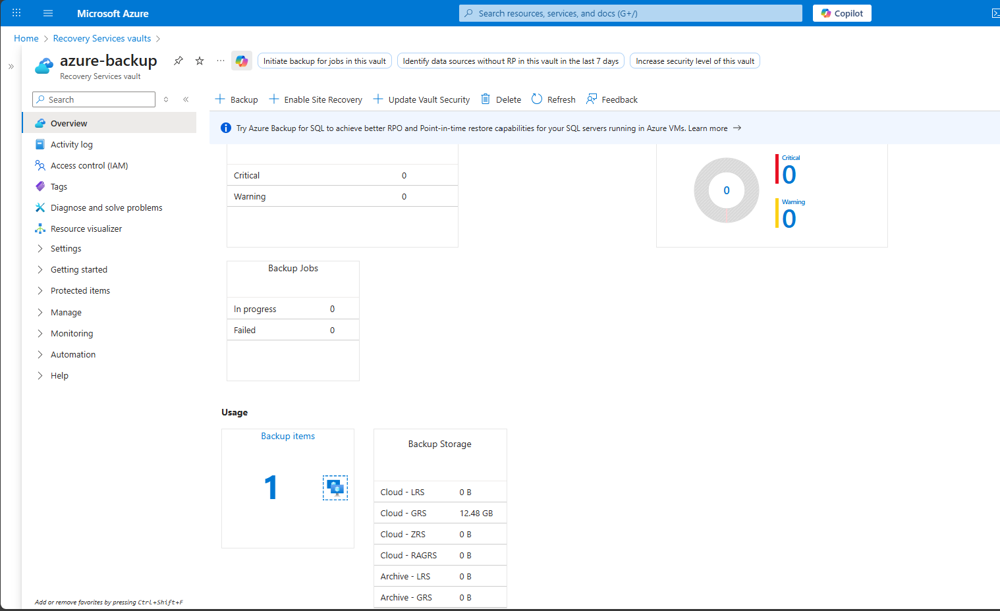

# **Exercise – Back Up an Azure Virtual Machine**

Azure Backup protects both Windows and Linux virtual machines (VMs).
In this exercise, you will:

✔ Create Azure VMs
✔ Configure Azure Backup
✔ Trigger an on-demand backup
✔ Verify backup jobs in the portal and via CLI

This exercise can be completed using:

* **Azure Portal**
* **Azure Cloud Shell / Azure CLI**

> **Note**
> If you don’t have an Azure subscription, read through to understand the workflow or create a free account.

---

# **1. Set Up the Environment**

### **1.1 Open Azure Cloud Shell**

In the Azure Portal, select the **Cloud Shell** icon.


---

### **1.2 Create Resource Group**

```bash
RGROUP=$(az group create --name vmbackups --location westus2 --output tsv --query name)
```

---

### **1.3 Create a Virtual Network & Subnet**

```bash
az network vnet create \
    --resource-group $RGROUP \
    --name NorthwindInternal \
    --address-prefixes 10.0.0.0/16 \
    --subnet-name NorthwindInternal1 \
    --subnet-prefixes 10.0.0.0/24
```

---

# **2. Create the Virtual Machines**

## **2.1 Create a Windows Server VM**

Replace `<password>` with a strong password.

```bash
az vm create \
    --resource-group $RGROUP \
    --name NW-APP01 \
    --size Standard_D2s_v3 \
    --public-ip-sku Standard \
    --vnet-name NorthwindInternal \
    --subnet NorthwindInternal1 \
    --image Win2016Datacenter \
    --admin-username admin123 \
    --no-wait \
    --admin-password <password>
```

---

## **2.2 Create a Linux VM (RHEL)**

```bash
az vm create \
    --resource-group $RGROUP \
    --name NW-RHEL01 \
    --size Standard_D2s_v3 \
    --image RedHat:RHEL:8-gen2:latest \
    --authentication-type ssh \
    --generate-ssh-keys \
    --vnet-name NorthwindInternal \
    --subnet NorthwindInternal1
```

> **If you get a securityType error**, run:

```bash
az feature register --name UseStandardSecurityType --namespace Microsoft.Compute
az feature show --name UseStandardSecurityType --namespace Microsoft.Compute
```

---

# **3. Enable Backup Using the Azure Portal**

### **3.1 Open Virtual Machines**

Search for **Virtual Machines**.



---

### **3.2 Select NW-RHEL01 → Capabilities → Backup**

Choose:

* **Backup vault**: `vaultXXXX`
* **Backup policy**: `DailyPolicy-xxxxx`


Click **Enable Backup**.

---

### **3.3 Trigger First Backup**

Go back to **NW-RHEL01 → Backup**
Click **Backup now → OK**



---

# **4. Enable Backup Using Azure CLI**

## **4.1 Create a Recovery Services Vault**

```bash
az backup vault create \
    --resource-group vmbackups \
    --location westus2 \
    --name azure-backup
```

---

## **4.2 Enable Backup for NW-APP01**

```bash
az backup protection enable-for-vm \
    --resource-group vmbackups \
    --vault-name azure-backup \
    --vm NW-APP01 \
    --policy-name EnhancedPolicy
```

---

## **4.3 Monitor Backup Job**

```bash
az backup job list \
    --resource-group vmbackups \
    --vault-name azure-backup \
    --output table
```

**Example Output:**

```
Name                                  Operation        Status      Item Name    Start Time UTC
------------------------------------  ---------------  ----------  -----------  ------------------------
a3df79b4...                           ConfigureBackup  Completed   NW-APP01     2019-08-01T06:19:12+00:00
```

---

## **4.4 Start an On-Demand Backup**

```bash
az backup protection backup-now \
    --resource-group vmbackups \
    --vault-name azure-backup \
    --container-name NW-APP01 \
    --item-name NW-APP01 \
    --retain-until 18-10-2030 \
    --backup-management-type AzureIaasVM
```

---

# **5. Monitor Backup Status**

## **5.1 View Backup Status in the VM**

Portal:
**VM → Capabilities → Backup**


---

## **5.2 View Status in the Recovery Services Vault**

Portal:
**All Resources → azure-backup (Recovery Services vault)**



Shows:

* Backup items
* Storage consumed
* Backup jobs

---

# **✔ Exercise Complete**

You have successfully:

✓ Created Windows & Linux VMs
✓ Configured Azure Backup in the portal
✓ Enabled backup with Azure CLI
✓ Triggered and monitored backups