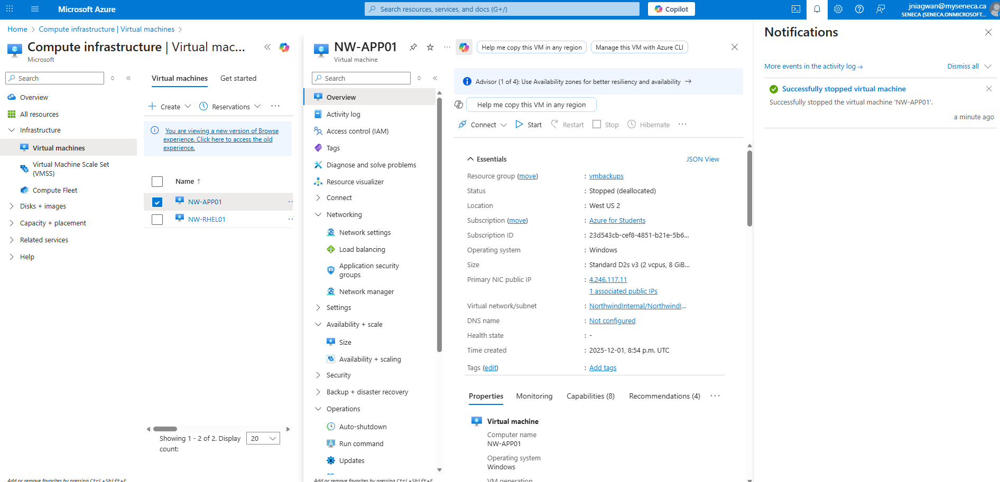
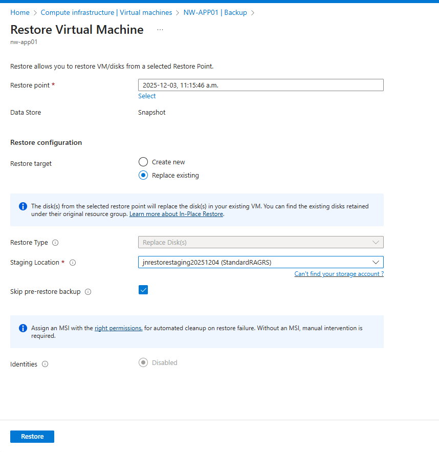
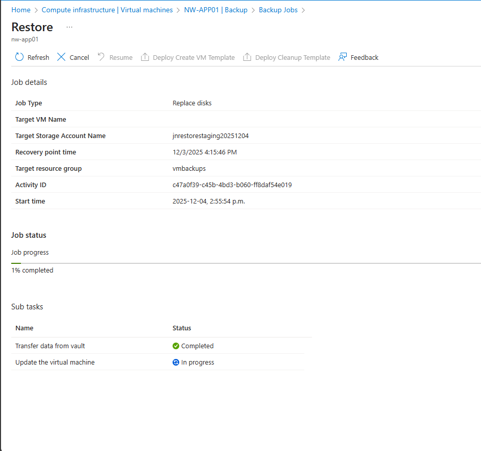
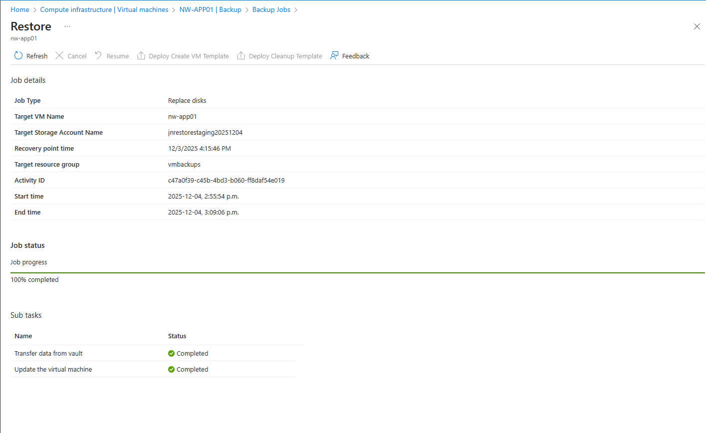

# 🔄 Exercise - Restore Azure Virtual Machine Data    

## 🧩 Scenario  
A few days after backing up a VM, the server developed issues. You’ve been tasked with **restoring the VM disk** and attaching it to the server to recover from the corruption. In this exercise, you learn how to:  

- Restore a VM from backup  
- Use a storage account as a staging location  
- Track the restore process in the Azure Portal  

---

## 📌 1. Create a Storage Account (Staging Location)

> Used to temporarily store the restored disk before attaching it to the VM.

### 🔧 Steps
1. Sign into the **Azure Portal**
2. Search for **Storage accounts**
3. Select **Create**
4. Enter the following settings:

| Setting | Value |
|--------|-------|
| Resource group | `vmbackups` |
| Storage account name | `restorestagingYYYYMMDD` *(replace YYYYMMDD with today’s date)* |
| Region | **West US 2** |

5. Select **Review + Create**
6. Wait for the deployment to complete
  

---

## ⛔ 2. Stop the Virtual Machine Being Restored

> You cannot restore a backup to a running VM. Azure will display an error if it is not stopped.

### 🔧 Steps
1. Go to **Virtual Machines**
2. Select the VM: `NW-APP01`
3. Click **Stop**
4. Confirm with **OK**

`

---

## ♻️ 3. Restore the Virtual Machine

### 🔧 Steps
1. From the VM blade (`NW-APP01`), navigate to:
   - **Capabilities ➝ Backup**
2. Select **Restore VM**
3. Under **Restore Point**, click **Select**
4. Choose the correct restore point  
5. Configure:

| Setting | Value |
|--------|-------|
| Restore Configuration | **Replace existing** |
| Staging Location | Select the storage account created earlier |

6. Click **Restore**

---

## 📊 4. Track the Restore Progress

### 🔧 Steps
1. In the VM Backup page, go to **Alerts and Jobs**
2. Select **View all Jobs**
3. Locate the **Restore Job**
4. Select **View details** to monitor tasks and progress

📌 **Screenshot Placeholder:**  
> _(Insert screenshot showing restore job status)_  

---

## 🎉 Conclusion

You have successfully:

✔ Created a storage staging area  
✔ Stopped the VM prior to restore  
✔ Restored a VM disk using Azure Backup  
✔ Monitored restore progress through Azure Jobs  

> This hands-on exercise demonstrates how Azure Backup protects VM workloads and simplifies disaster recovery.