# 🌐 Implement Network Traffic Management

## 📘 Lab Overview

In this lab, you configure and test:

- **Azure Public Load Balancer (Layer 4)**
- **Azure Application Gateway (Layer 7)**

The goal is to distribute incoming public traffic across multiple virtual machines and route requests based on URL paths for images and videos.

📍 **Region:** East US  
⏱ **Estimated Time:** 50 minutes  

---

## 🎯 Lab Scenario

Your organization hosts a public website. You must:

- Load balance HTTP traffic across multiple VMs
- Serve **images** and **videos** from different backend servers
- Implement both **Azure Load Balancer** and **Azure Application Gateway**

All resources are deployed in the same Azure region.

---

## 🛠 Job Skills Covered

- ARM template deployments
- Azure Load Balancer configuration
- Azure Application Gateway configuration
- Backend pool health validation
- Path-based routing

---

# 🧩 Task 1 – Provision Infrastructure Using a Template

You will deploy:
- 1 Virtual Network
- 1 Network Security Group
- 3 Virtual Machines (one per subnet)

---

### 🔹 Steps

1. Download the lab files:

\Allfiles\Labs\06\

2. Sign in to the Azure Portal:  
👉 https://portal.azure.com

3. Search for **Deploy a custom template**

4. Select **Build your own template in the editor**

5. Click **Load file** and upload:
- `az104-06-vms-template.json`

6. Select **Save**

7. Click **Edit parameters** and upload:
- `az104-06-vms-parameters.json`

8. Use the following settings:

| Setting | Value |
|------|------|
| Subscription | Your Azure subscription |
| Resource group | `az104-rg6` |
| Password | Secure password |

9. Select **Review + create → Create**

⏳ Deployment time: ~5 minutes

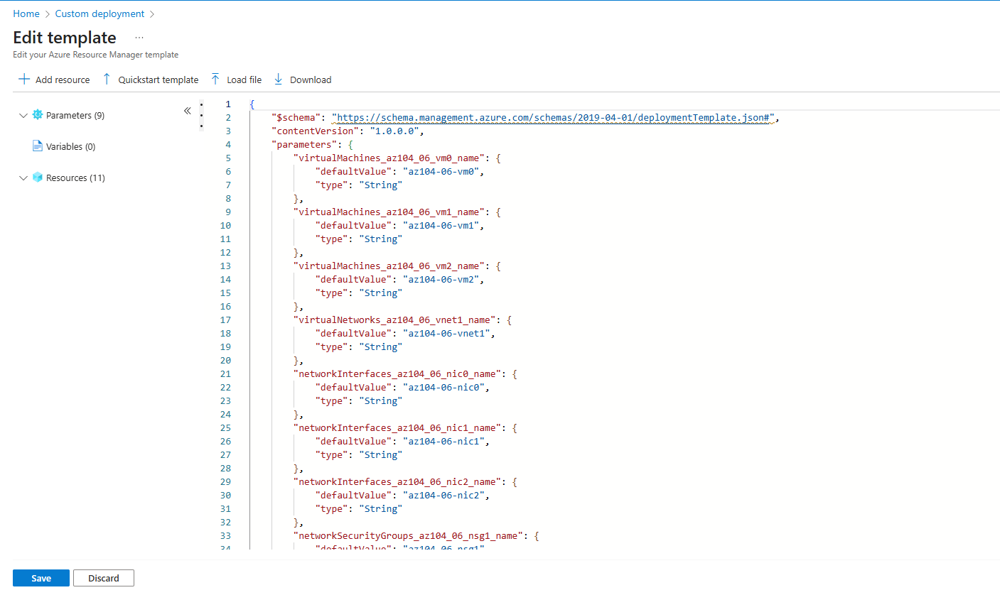
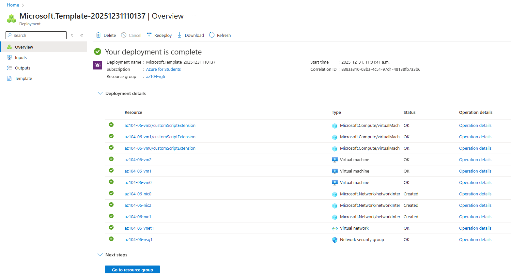

---

# ⚖️ Task 2 – Configure Azure Load Balancer

Azure Load Balancer provides **Layer 4 (TCP)** load balancing across backend VMs.

---

## 🔹 Create the Load Balancer

1. Search for **Load balancers**
2. Click **+ Create**

### Basics

| Setting        | Value      |
| -------------- | ---------- |
| Name           | `az104-lb` |
| SKU            | Standard   |
| Type           | Public     |
| Tier           | Regional   |
| Resource Group | az104-rg6  |

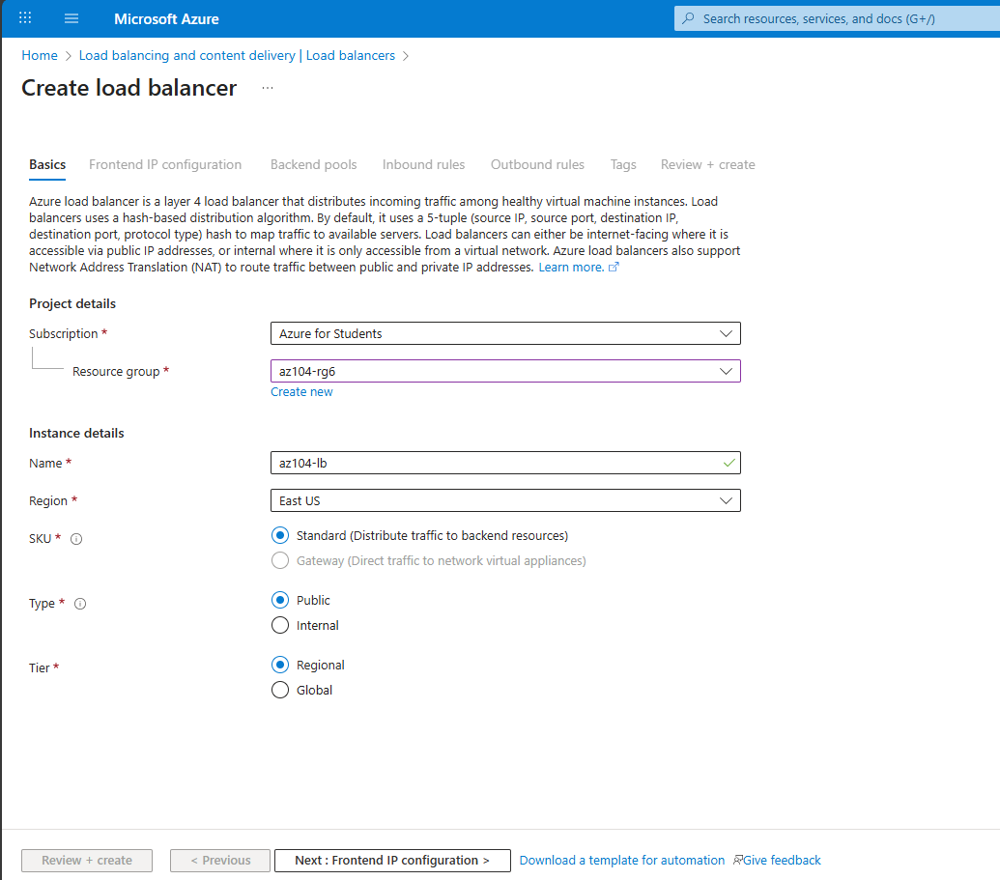

---

## 🔹 Frontend IP Configuration

| Setting       | Value      |
| ------------- | ---------- |
| Name          | `az104-fe` |
| Public IP     | Create new |
| IP Assignment | Static     |

Public IP Name: `az104-lbpip`

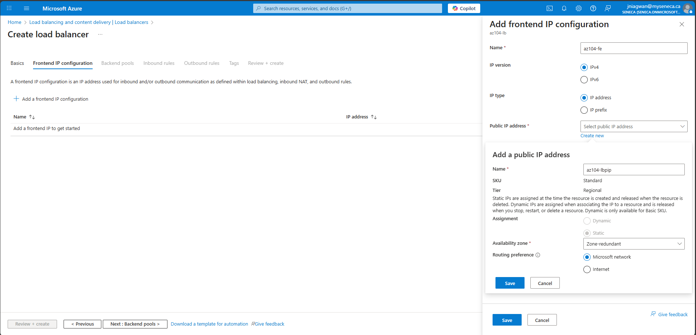

---

## 🔹 Backend Pool Configuration

| Setting | Value                      |
| ------- | -------------------------- |
| Name    | `az104-be`                 |
| VMs     | az104-06-vm0, az104-06-vm1 |

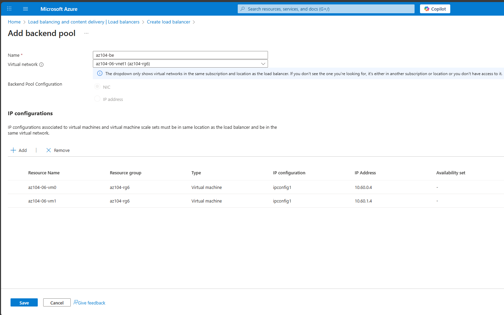

---

## 🔹 Load Balancing Rule

| Setting       | Value          |
| ------------- | -------------- |
| Name          | `az104-lbrule` |
| Protocol      | TCP            |
| Frontend Port | 80             |
| Backend Port  | 80             |
| Health Probe  | TCP 80         |

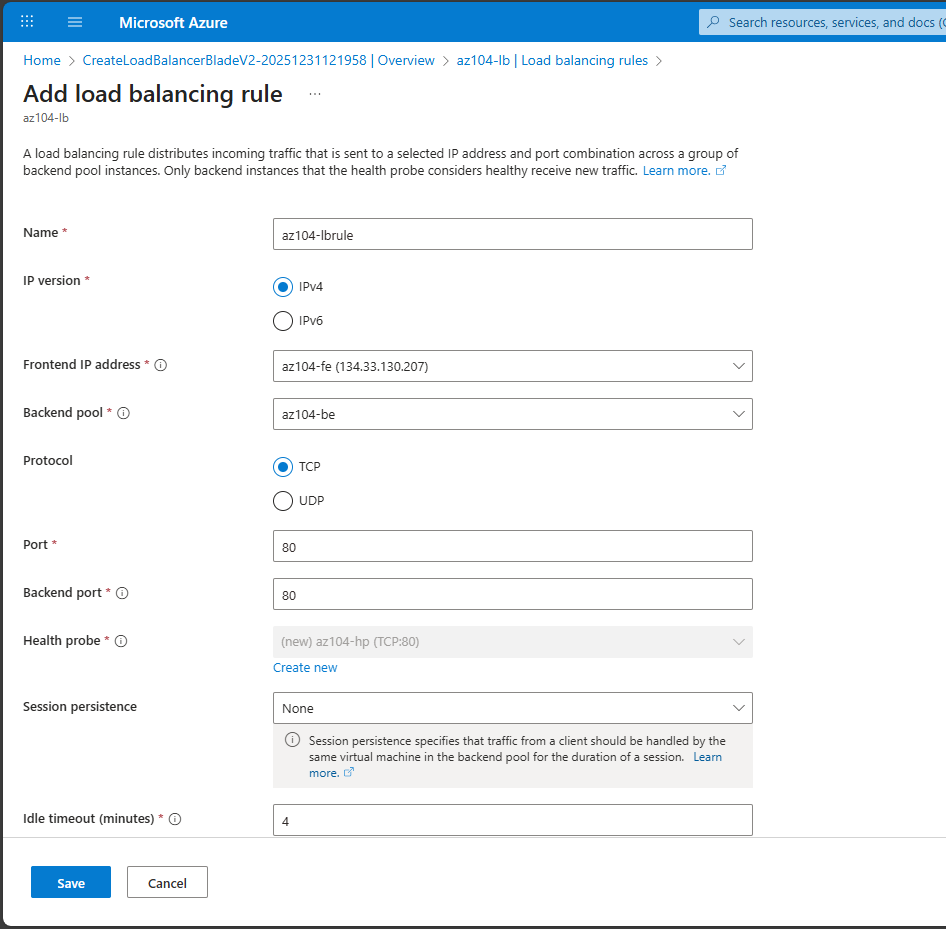

---

## 🔍 Test Load Balancer

1. Copy the **public IP**
2. Open it in a browser
3. Refresh multiple times

✔ You should see:

* `Hello World from az104-06-vm0`
* `Hello World from az104-06-vm1`

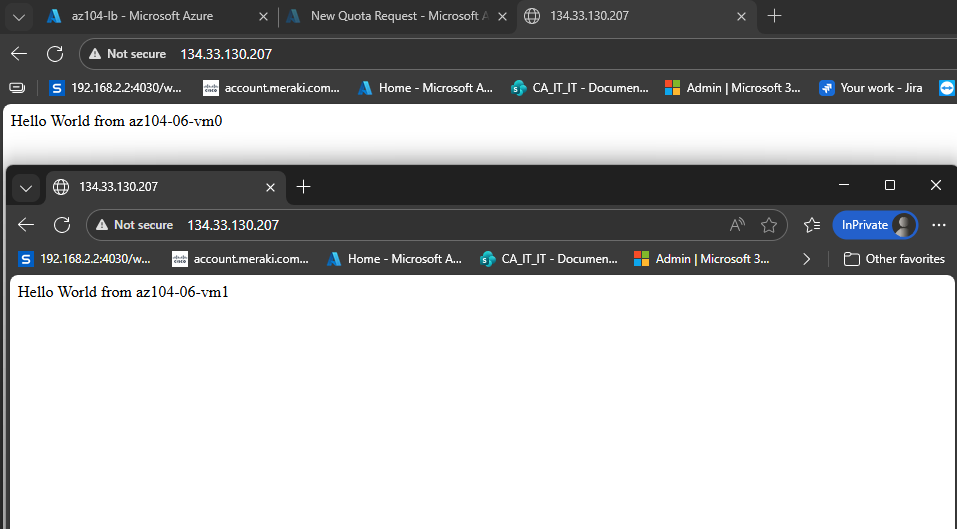

---

# 🚦 Task 3 – Configure Azure Application Gateway

Application Gateway provides **Layer 7 routing**, including **path-based routing**.

---

## 🔹 Create Application Gateway Subnet

| Setting | Value          |
| ------- | -------------- |
| Name    | subnet-appgw   |
| Address | 10.60.3.224/27 |

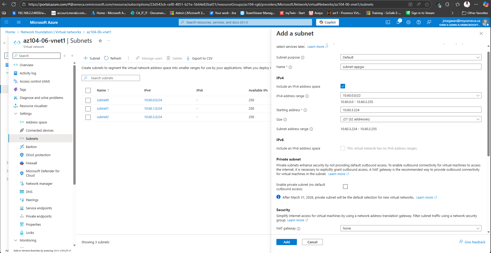

---

## 🔹 Create Application Gateway

### Basics

| Setting         | Value          |
| --------------- | -------------- |
| Name            | az104-appgw    |
| Tier            | Standard V2    |
| Instance Count  | 2              |
| Virtual Network | az104-06-vnet1 |
| Subnet          | subnet-appgw   |

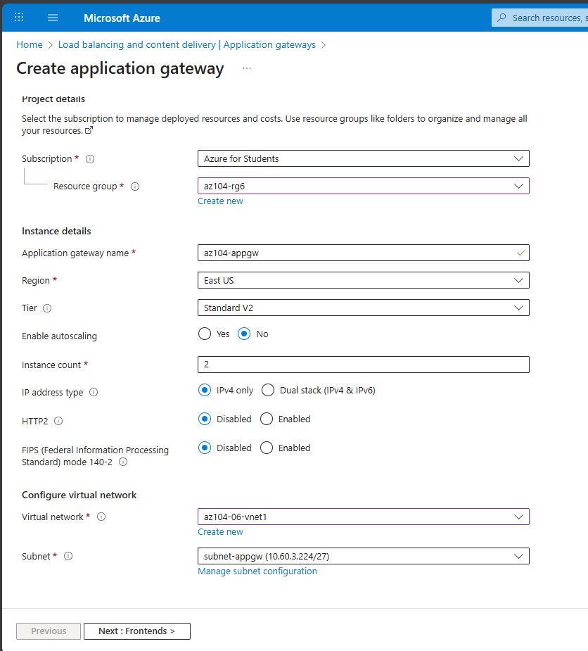

---

## 🔹 Backend Pools

| Backend Pool  | Target |
| ------------- | ------ |
| az104-imagebe | VM1    |
| az104-videobe | VM2    |

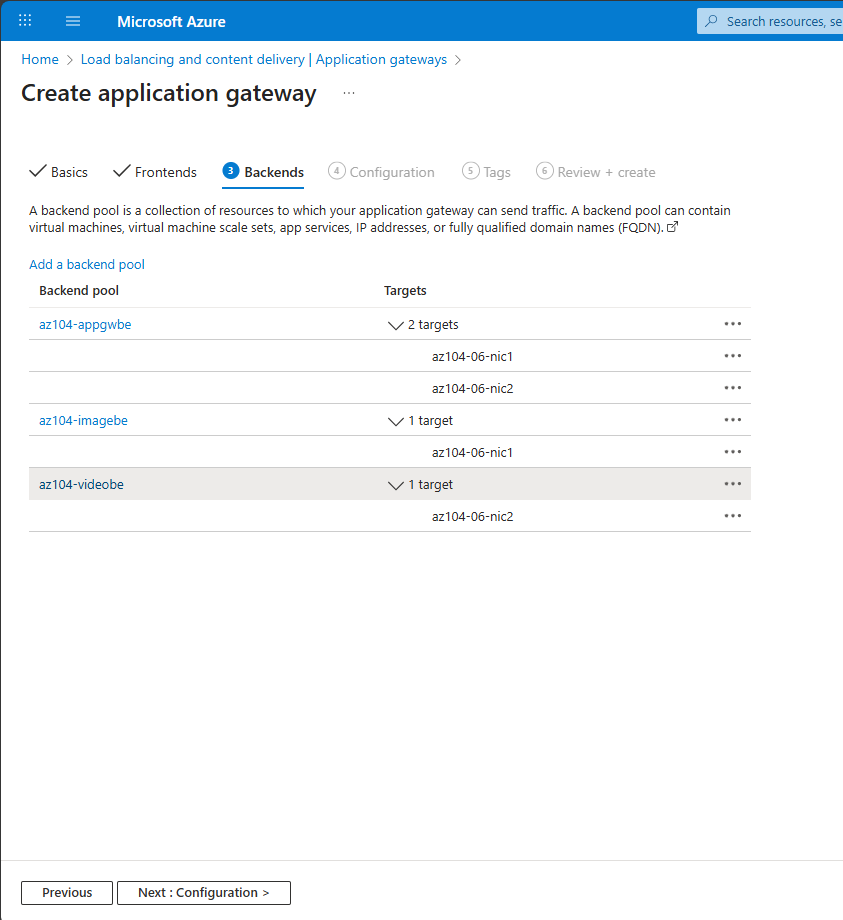

---

## 🔹 Path-Based Routing Rules

| Path       | Backend       |
| ---------- | ------------- |
| `/image/*` | az104-imagebe |
| `/video/*` | az104-videobe |

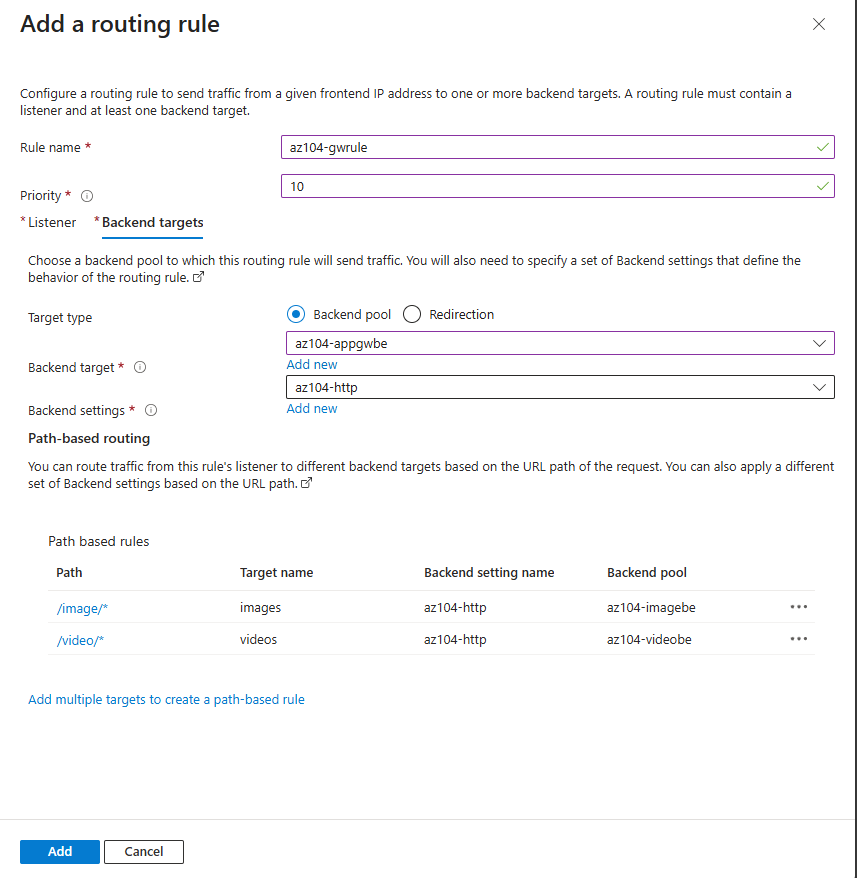

---

## 🔍 Validate Application Gateway

1. Copy the **frontend public IP**
2. Test URLs:

``text
http://<ip>/image/
http://<ip>/video/
``

✔ Traffic should route to the correct backend VM

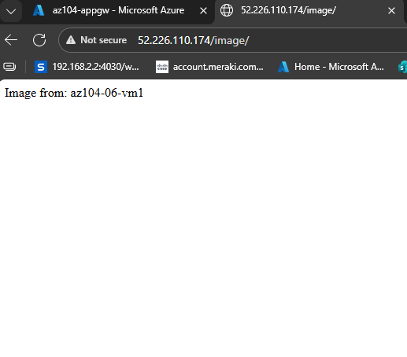
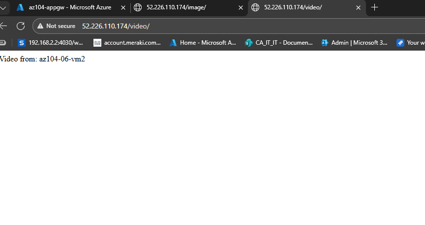

---

## ✅ Lab Complete

You successfully:

✔ Deployed infrastructure using ARM templates 
✔ Configured a public Load Balancer 
✔ Implemented an Application Gateway 
✔ Verified path-based routing 