# 🖥️ Lab 08 – Manage Virtual Machines

## 📘 Lab Introduction

In this lab, you explore **Azure Virtual Machines** and **Virtual Machine Scale Sets (VMSS)**. You compare manual scaling with automated scaling and learn how Azure handles compute, storage, and availability.

---

## 🎯 Lab Scenario

Your organization wants to evaluate Azure virtual machine deployment options. You will:

- Deploy zone-resilient virtual machines
- Scale VM compute and storage
- Deploy and configure a Virtual Machine Scale Set
- Implement autoscaling rules
- (Optional) Create VMs using PowerShell and Azure CLI

---

## 🛠 Job Skills Covered

- Availability Zones
- Vertical scaling (resize)
- Disk performance management
- Virtual Machine Scale Sets
- Autoscaling rules
- PowerShell & CLI VM deployment

---

## 🧩 Task 1 – Deploy Zone-Resilient Virtual Machines

Availability Zones provide **99.99% SLA** when VMs are deployed across at least two zones.


---

### 🔹 Create Virtual Machines

1. Sign in to the Azure portal  
   👉 https://portal.azure.com

2. Search for **Virtual machines**
3. Select **+ Create → Azure virtual machine**

---

### 🔹 Basics Configuration

| Setting | Value |
|------|------|
| Resource group | `az104-rg8` |
| VM names | `az104-vm1`, `az104-vm2` |
| Region | East US |
| Availability options | Availability zone |
| Zones | Zone 1 and Zone 2 |
| Image | Windows Server 2025 Datacenter |
| Size | Standard D2s v3 |
| Username | localadmin |
| Public inbound ports | None |

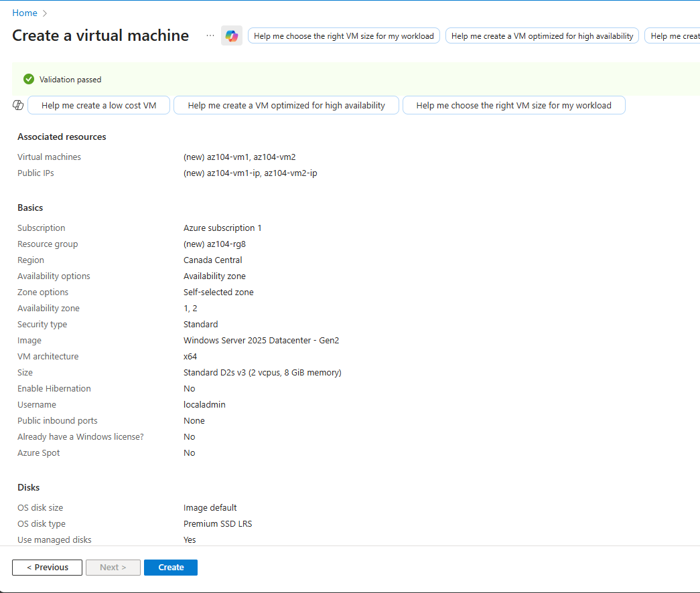

---

### 🔹 Disk Configuration

| Setting        | Value       |
| -------------- | ----------- |
| OS disk        | Premium SSD |
| Delete with VM | Enabled     |
| Ultra Disk     | Disabled    |

---

### 🔹 Networking & Monitoring

* No load balancer
* Delete NIC and public IP on VM delete
* Boot diagnostics: **Disabled**


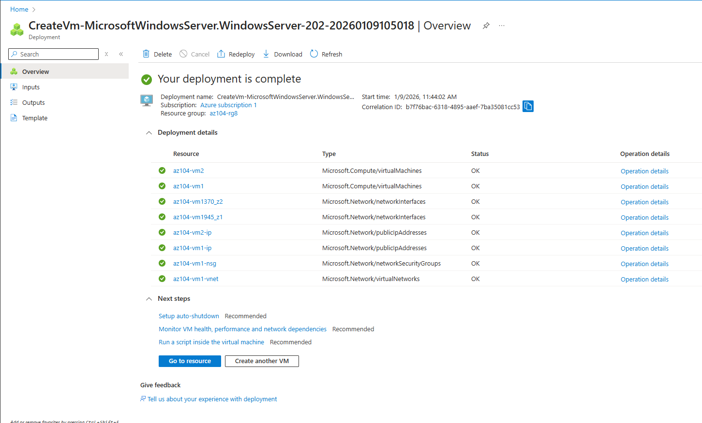

---

## 🧩 Task 2 – Manage Compute and Storage Scaling

---

### 🔹 Resize Virtual Machine (Vertical Scaling)

1. Open **az104-vm1**
2. Navigate to **Availability + scale → Size**
3. Resize to **D2ds_v4**


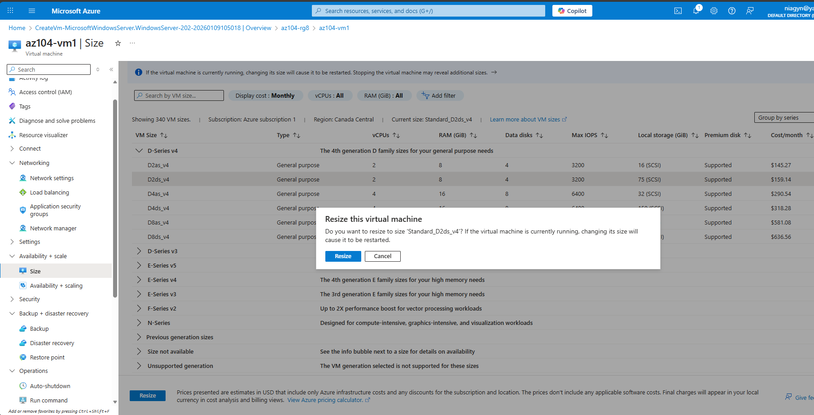

---

### 🔹 Add and Modify Data Disk

1. Create a new disk:

| Setting   | Value        |
| --------- | ------------ |
| Disk name | vm1-disk1    |
| Type      | Standard HDD |
| Size      | 32 GiB       |

2. Detach the disk
3. Change disk type to **Standard SSD**
4. Reattach disk to VM

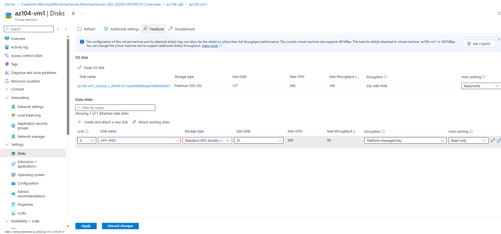
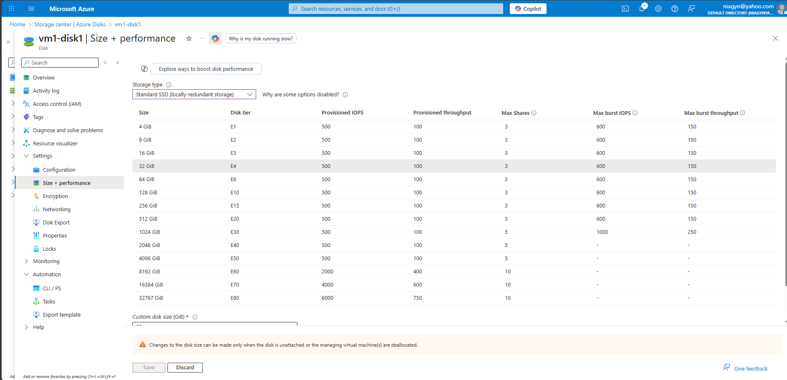
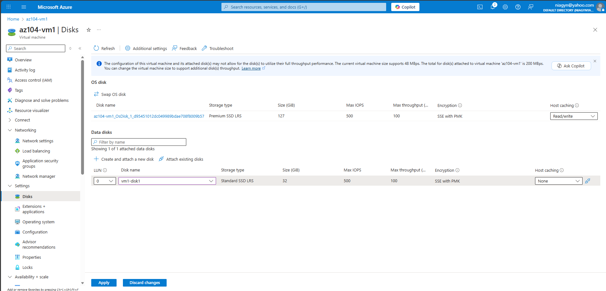

---

## 🧩 Task 3 – Create a Virtual Machine Scale Set (VMSS)

VM Scale Sets enable **horizontal scaling** with reduced administrative overhead.


---

### 🔹 Create VM Scale Set

| Setting        | Value               |
| -------------- | ------------------- |
| Name           | vmss1               |
| Resource group | az104-rg8           |
| Region         | East US             |
| Zones          | 1, 2, 3             |
| Orchestration  | Uniform             |
| Image          | Windows Server 2025 |
| Size           | Standard D2s_v3     |

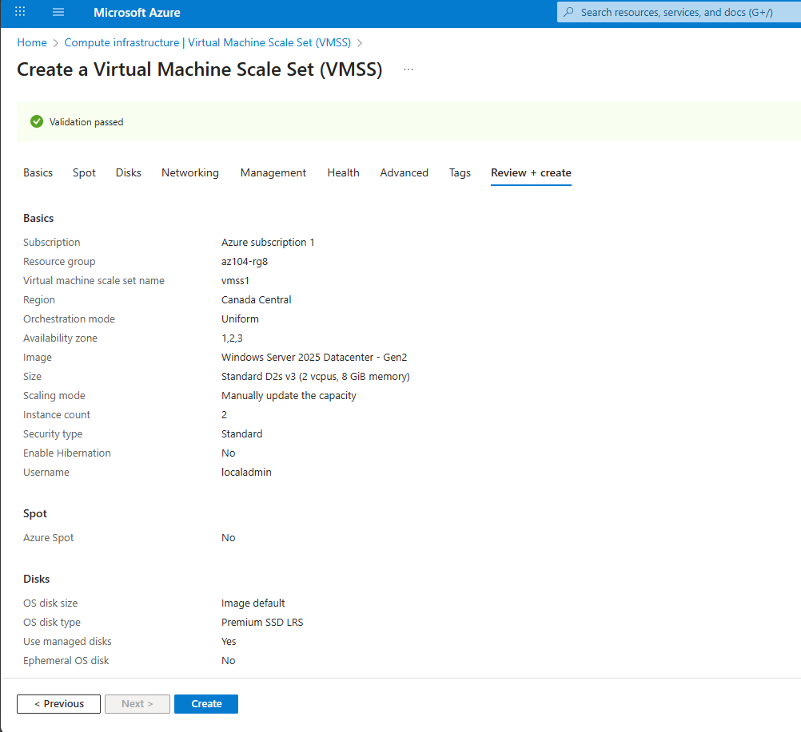

---

### 🔹 Networking Configuration

| Setting         | Value          |
| --------------- | -------------- |
| VNet            | vmss-vnet      |
| Subnet          | subnet0        |
| NSG             | vmss1-nsg      |
| Allowed traffic | HTTP (port 80) |
| Load balancer   | vmss-lb        |

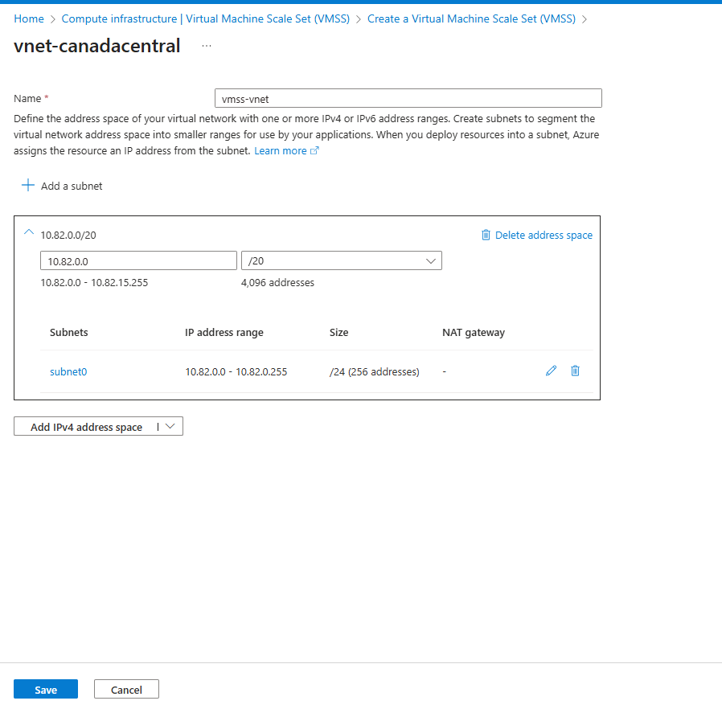
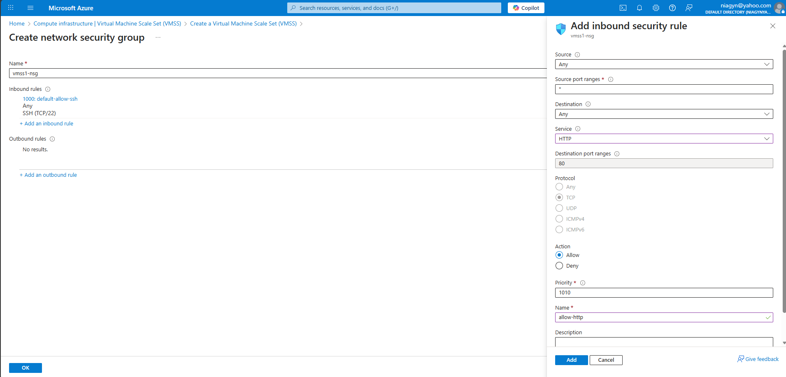
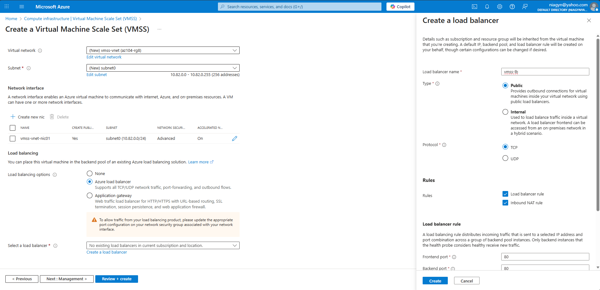
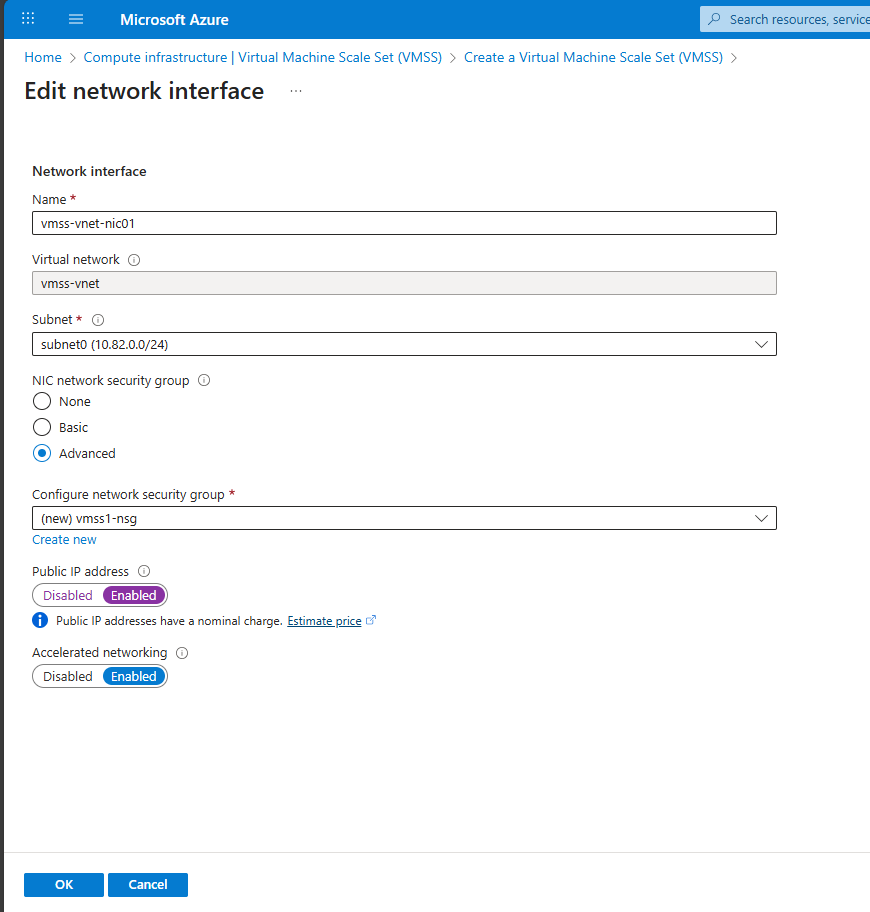

---

## 🧩 Task 4 – Scale Virtual Machine Scale Sets

---

### 🔹 Scale-Out Rule

Scale out when CPU usage is high.

| Setting   | Value           |
| --------- | --------------- |
| Metric    | Percentage CPU  |
| Condition | > 70%           |
| Duration  | 10 minutes      |
| Action    | Increase by 50% |
| Cooldown  | 5 minutes       |

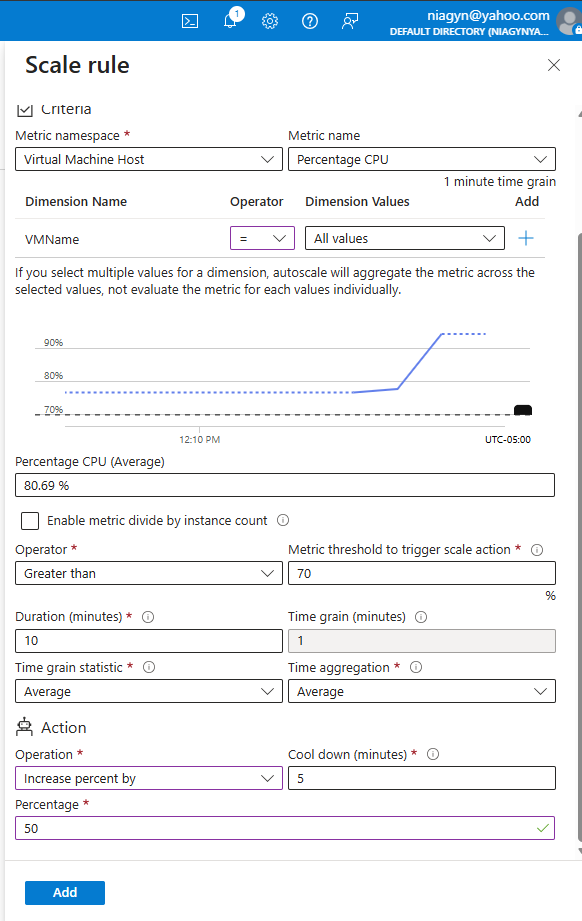

---

### 🔹 Scale-In Rule

Scale in when demand decreases.

| Setting   | Value           |
| --------- | --------------- |
| Condition | < 30%           |
| Action    | Decrease by 50% |

---

### 🔹 Instance Limits

| Setting | Value |
| ------- | ----- |
| Minimum | 2     |
| Maximum | 10    |
| Default | 2     |

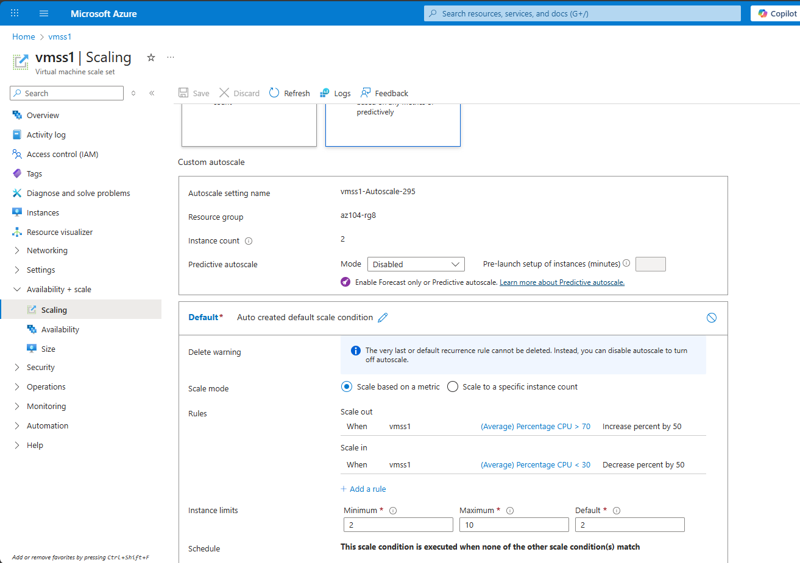

---

## 🧩 Task 5 – Create VM Using PowerShell (Optional)

```powershell
New-AzVm `
 -ResourceGroupName 'az104-rg8' `
 -Name 'myPSVM' `
 -Location 'East US' `
 -Image 'Win2019Datacenter' `
 -Zone '1' `
 -Size 'Standard_D2s_v3' `
 -Credential (Get-Credential)
```

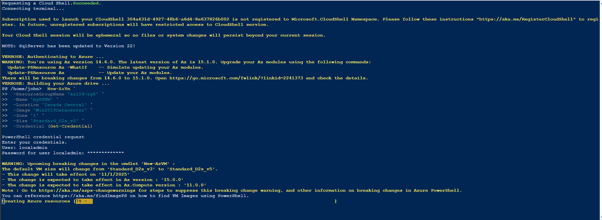
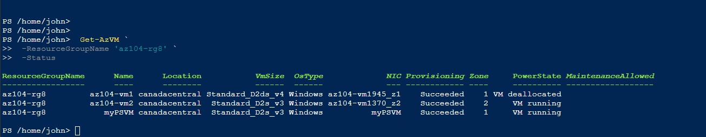

---

## 🧩 Task 6 – Create VM Using Azure CLI (Optional)

```bash
az vm create \
  --name myCLIVM \
  --resource-group az104-rg8 \
  --image Ubuntu2204 \
  --admin-username localadmin \
  --generate-ssh-keys
```

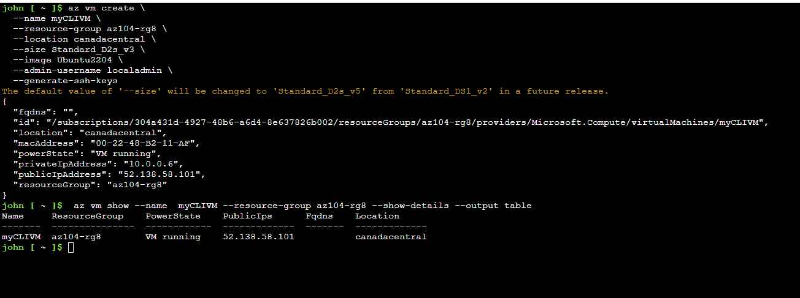

---

## ✅ Lab Complete

You successfully:

✔ Deployed zone-resilient virtual machines
✔ Scaled compute and disk resources
✔ Implemented a Virtual Machine Scale Set
✔ Configured autoscaling rules
✔ Created VMs using PowerShell and CLI