# Lab – Implement Data Protection

## Lab Overview
In this lab, you explore **backup, recovery, and disaster recovery** for Azure Virtual Machines. You create Recovery Services vaults, configure VM-level backups, monitor backup jobs, and enable **Azure Site Recovery (ASR)** for replication across regions.

**Estimated Time:** 50 minutes  
**Primary Regions:** East US, West US

---

## Objectives
By the end of this lab, you will be able to:
- Deploy infrastructure using an ARM template
- Create and configure Recovery Services vaults
- Configure Azure VM backups and retention policies
- Monitor Azure Backup using diagnostics
- Enable and validate Azure Site Recovery replication

---

## Architecture Diagram 


---

## Task 1 – Deploy Infrastructure Using a Template

### Steps
1. Download the lab files from:
```

\Allfiles\Lab10\

```

2. Sign in to the Azure portal:  
https://portal.azure.com

3. Search for **Deploy a custom template** and select **Build your own template in the editor**.

4. Load the template file:
```

az104-10-vms-edge-template.json

```

5. Load the parameters file:
```

az104-10-vms-edge-parameters.json

```

6. Configure deployment settings:

| Setting | Value |
|------|------|
| Subscription | Your Azure subscription |
| Resource group | az104-rg-region1 |
| Region | East US |
| Username | localadmin |
| Password | Complex password |

7. Select **Review + Create** → **Create**.


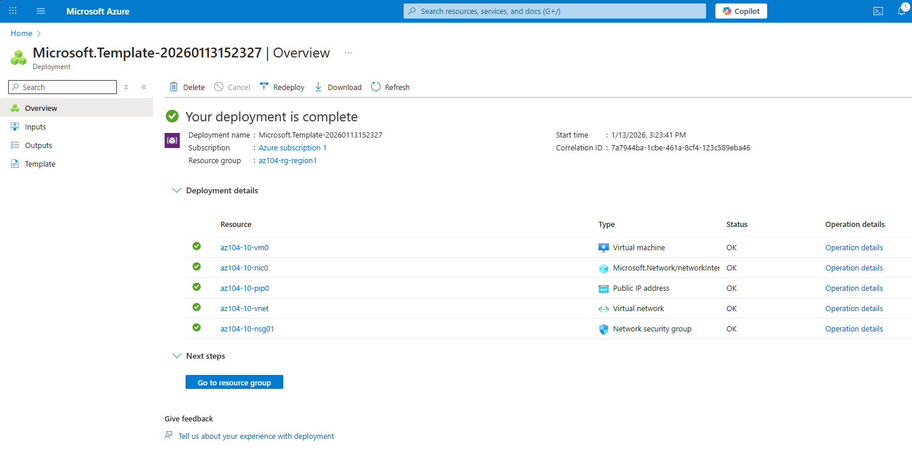

---

## Task 2 – Create and Configure a Recovery Services Vault

### Steps
1. Search for **Recovery Services vaults** → **Create**.

2. Configure the vault:

| Setting | Value |
|------|------|
| Resource group | az104-rg-region1 |
| Vault name | az104-rsv-region1 |
| Region | East US |

3. Select **Review + Create** → **Create**.
  
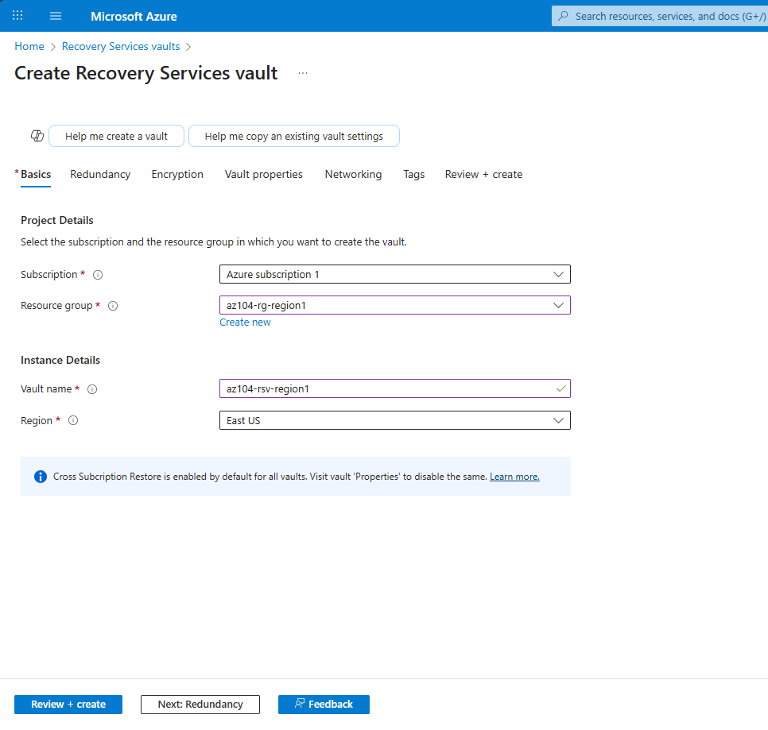

### Backup Configuration
- Storage replication type: **Geo-redundant**
- Soft Delete: **Enabled (14 days)**
  
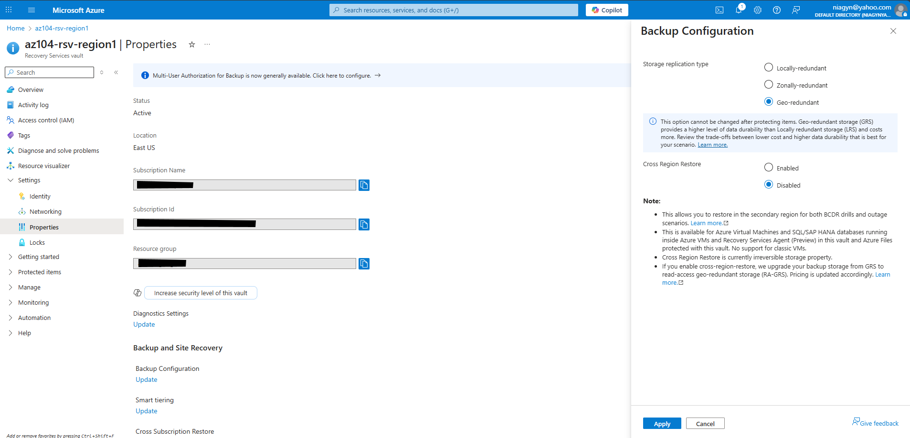

---

## Task 3 – Configure Azure VM-Level Backup

### Steps
1. In the Recovery Services vault, select **Overview** → **+ Backup**.

2. Configure backup goal:

| Setting | Value |
|------|------|
| Workload location | Azure |
| What to back up | Virtual machine |

3. Choose **Standard policy** and create a new policy:

| Setting | Value |
|------|------|
| Policy name | az104-backup |
| Frequency | Daily |
| Time | 12:00 AM |
| Snapshot retention | 2 days |

4. Select VM:
```

az104-10-vm0

```

5. Click **Enable backup**.

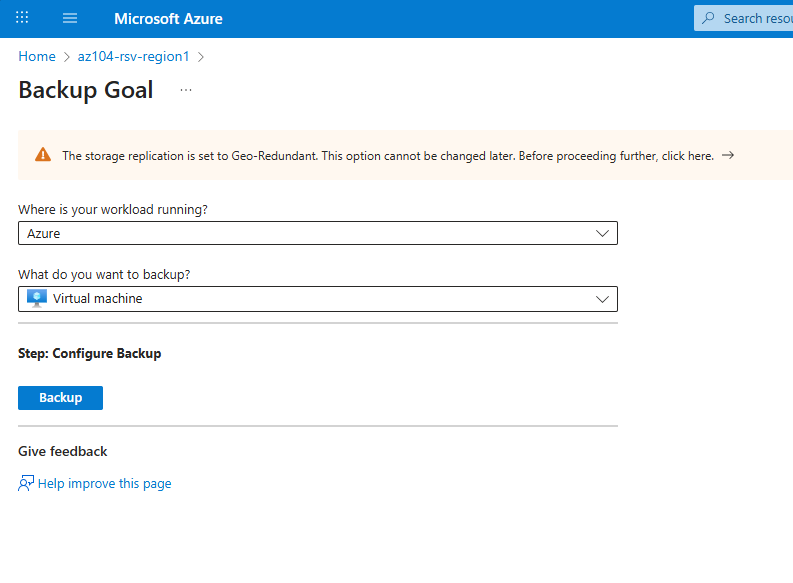
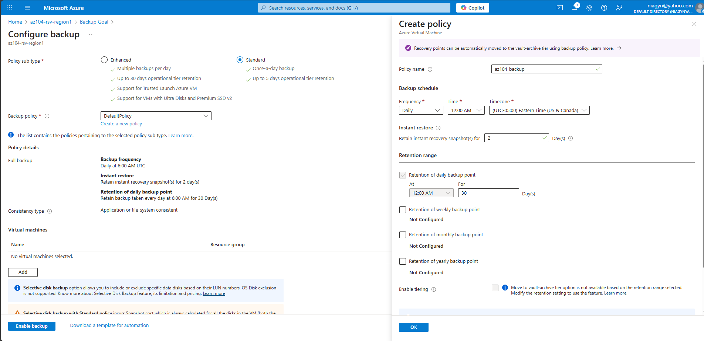
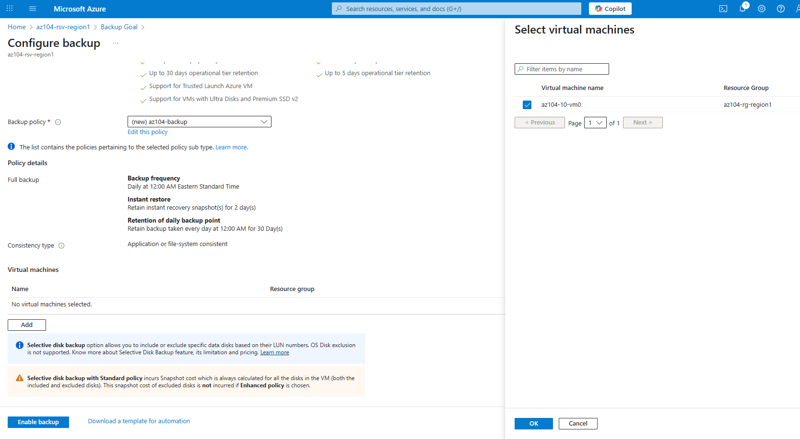

### Run On-Demand Backup
- Select **Backup now**
- Accept default retention
  
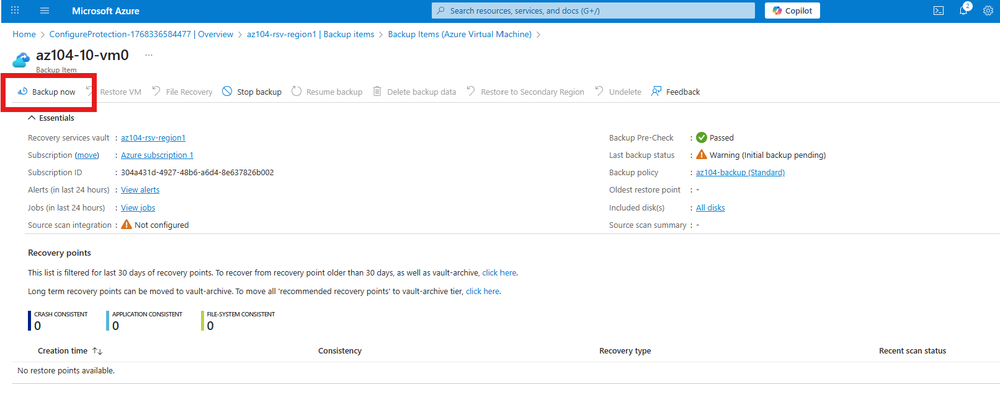
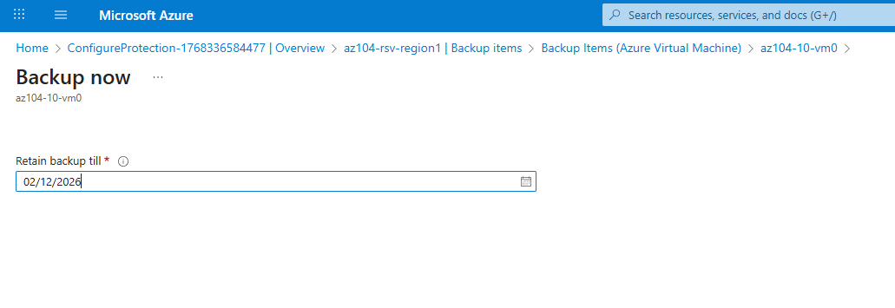

---

## Task 4 – Monitor Azure Backup

### Create a Storage Account
| Setting | Value |
|------|------|
| Resource group | az104-rg-region1 |
| Region | East US |
| Name | Globally unique |

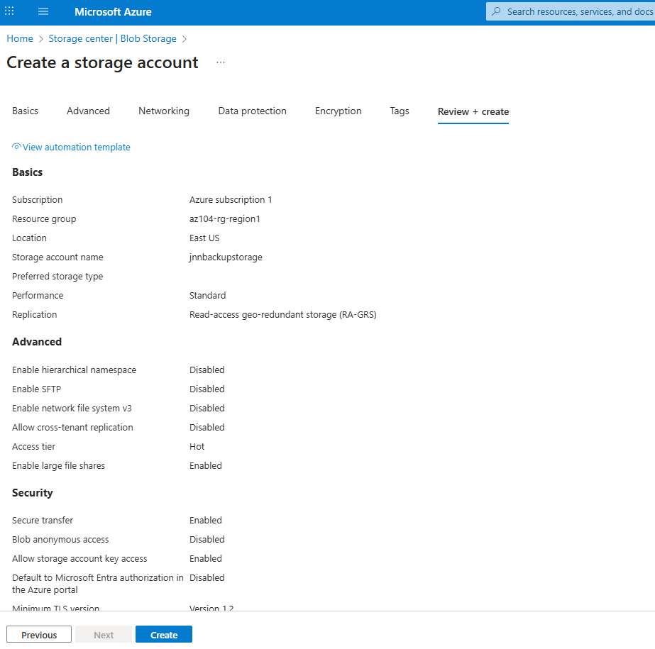

### Configure Diagnostic Settings
1. Go to **Recovery Services vault** → **Diagnostic settings**
2. Add logs and metrics:
- Azure Backup Reporting Data
- Backup Job Data
- Backup Alert Data
- Site Recovery Jobs & Events
3. Archive to the storage account
 
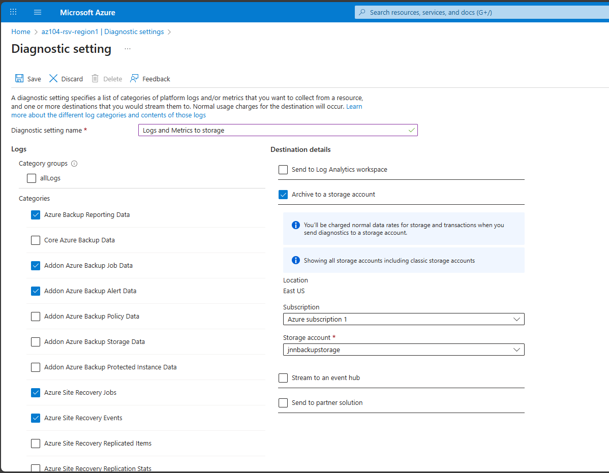

### View Backup Jobs
- Monitoring → **Backup jobs**
- View job details for `az104-10-vm0`

---

## Task 5 – Enable Virtual Machine Replication (Azure Site Recovery)

### Create Secondary Recovery Services Vault
| Setting | Value |
|------|------|
| Resource group | az104-rg-region2 |
| Vault name | az104-rsv-region2 |
| Region | West US |
 
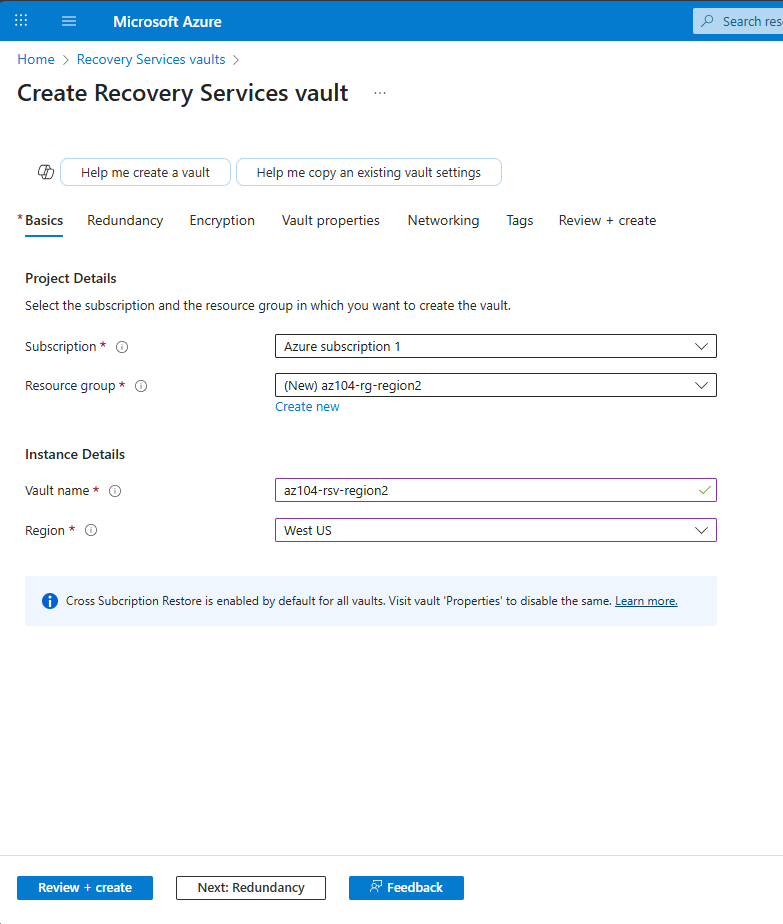

### Enable Replication
1. Navigate to VM: `az104-10-vm0`
2. Select **Disaster recovery**
3. Confirm target region: **West US**
4. Create Automation Account
5. Select **Review + Start replication**
  
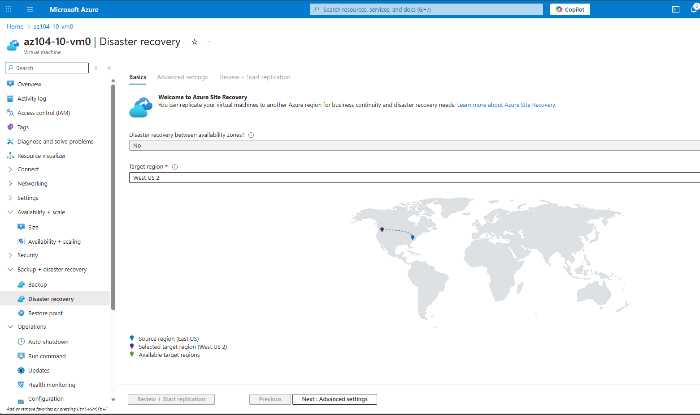
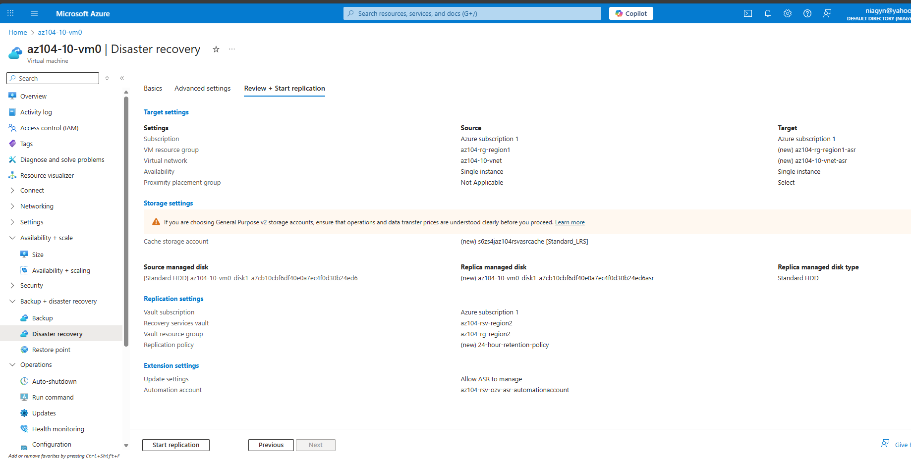
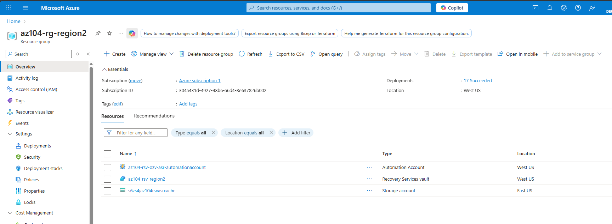

### Validate Replication
- Recovery Services vault → **Replicated items**
- Confirm VM status: **Protected**
 
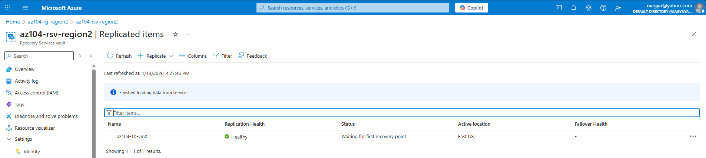

---

## Key Takeaways
- Recovery Services vaults centralize backup and DR
- VM backups are policy-driven and automated
- Azure Site Recovery enables region-to-region protection
- Monitoring and diagnostics are critical for backup visibility

---

## Cleanup (Optional)
To avoid charges, delete:
- Recovery Services vaults
- Virtual machines
- Storage accounts
- Resource groups

---

## Status
✅ **Lab Completed**