# Lab – Implement Monitoring

## Lab Overview
In this lab, you explore **Azure Monitor** and its core capabilities. You deploy infrastructure, configure monitoring for virtual machines, create alerts with action groups, test alerting behavior, suppress alerts during maintenance windows, and query logs using **Log Analytics (KQL)**.

**Estimated Time:** 40 minutes  
**Region:** East US

---

## Objectives
By the end of this lab, you will be able to:
- Deploy infrastructure using an ARM template
- Configure Azure Monitor and VM Insights
- Create and test alert rules
- Configure action group notifications
- Suppress alerts using alert processing rules
- Query logs using Azure Monitor Logs (KQL)

---

## Architecture Diagram


---

## Task 1 – Deploy Infrastructure Using a Template

### Steps
1. Download the lab template:
```

\Allfiles\Labs\11\az104-11-vm-template.json

```

2. Sign in to the Azure portal:  
https://portal.azure.com

3. Search for **Deploy a custom template** → **Build your own template in the editor**.

4. Select **Load file** and upload:
```

az104-11-vm-template.json

```

5. Select **Save**.

6. Complete deployment settings:

| Setting | Value |
|------|------|
| Subscription | Your Azure subscription |
| Resource group | az104-rg11 |
| Region | East US |
| Username | localadmin |
| Password | Complex password |

7. Select **Review + Create** → **Create**.
  
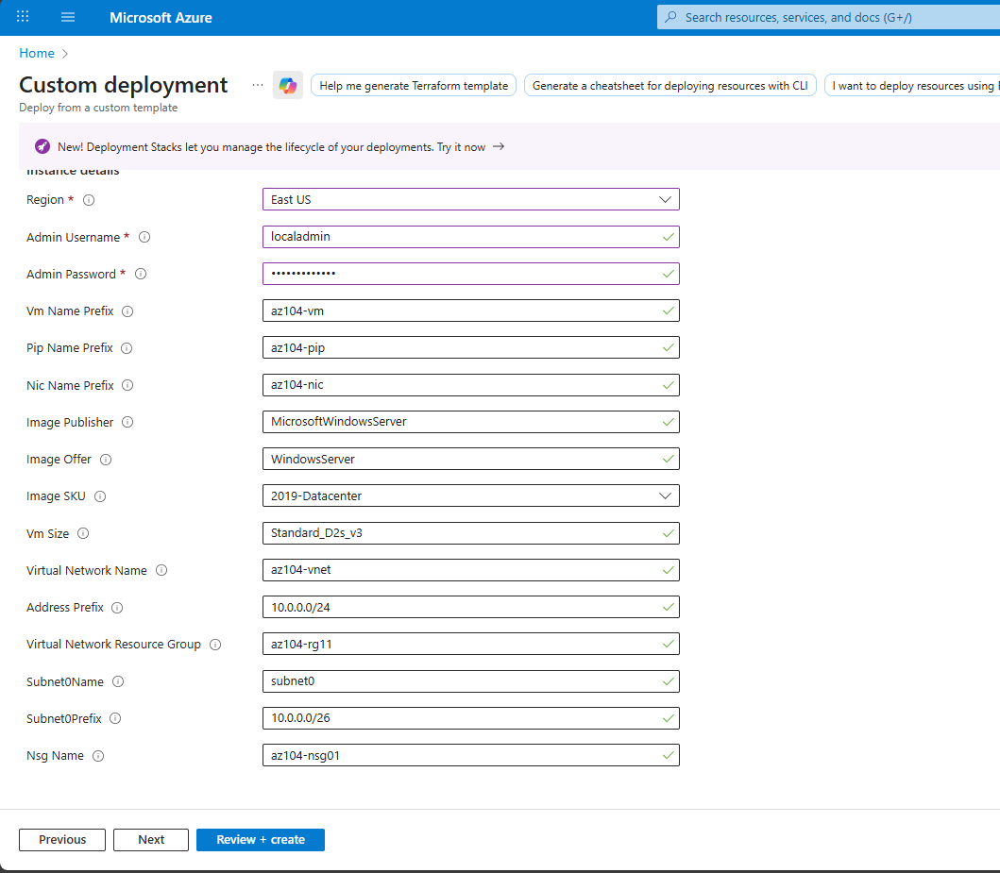
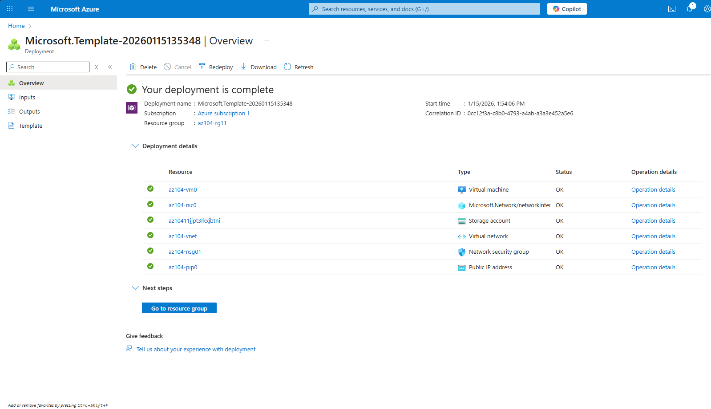

8. After deployment completes, select **Go to resource group** and review the deployed VM and VNet.

---

## Configure Azure Monitor for Virtual Machines

1. In the Azure portal, search for and select **Monitor**.
2. Review available monitoring features.
3. Select **View** under **VM Insights** → **Configure Insights**.
4. Select **Enable** next to your virtual machine.
5. Accept defaults → **Review + enable** → **Enable**.
 
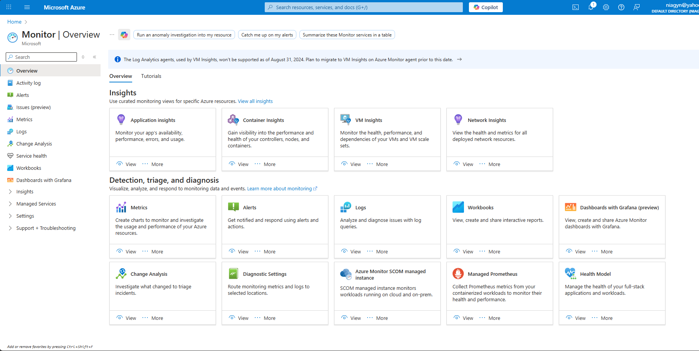
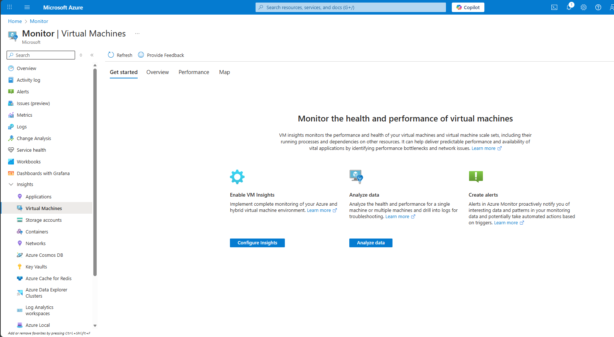
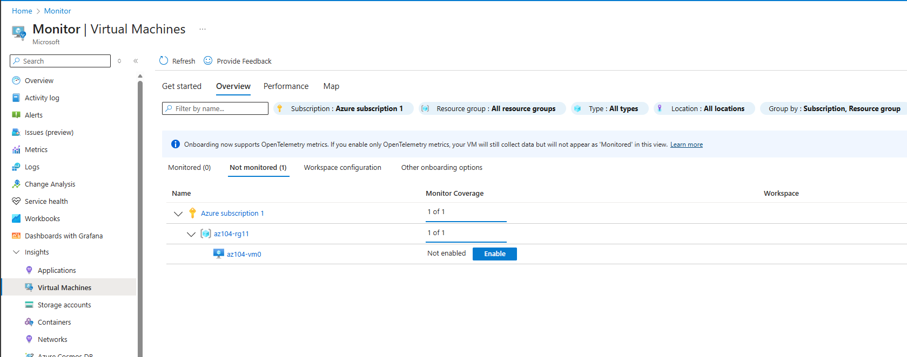
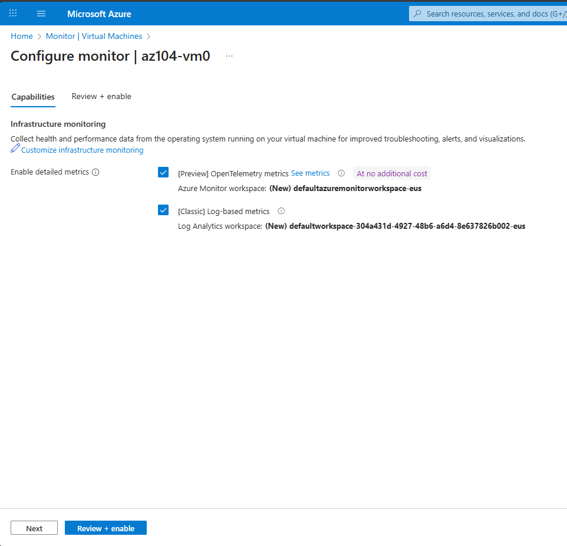
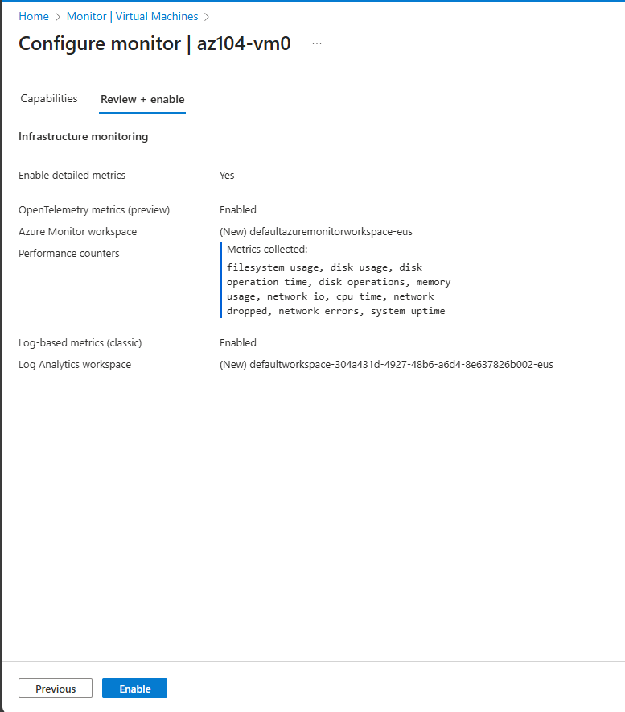

> ⚠️ VM agent installation may take several minutes.

---

## Task 2 – Create an Alert

### Create Alert Rule
1. In **Monitor**, select **Alerts** → **Create** → **Alert rule**.
2. Select your **Subscription** → **Apply**.
3. Under **Condition**, select **See all signals**.
4. Search for and select:
```

Delete Virtual Machine (Virtual Machines)

```
5. Select **Apply**.
6. Leave default Event level and Status selections.

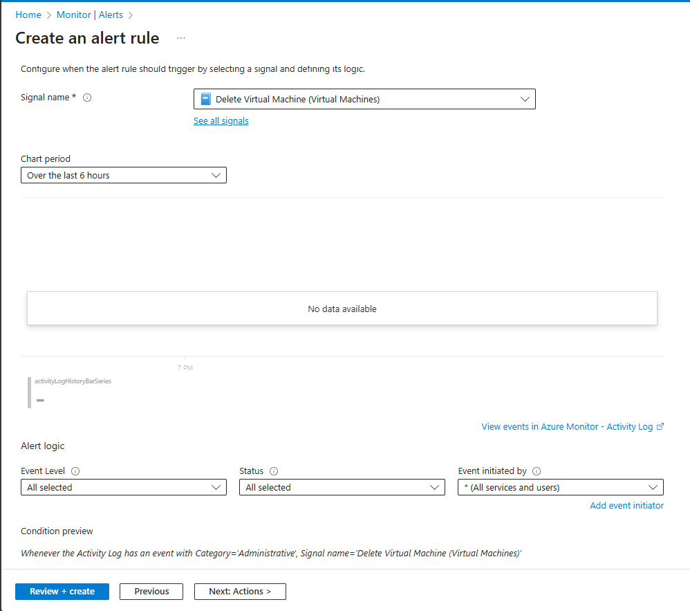

---

## Task 3 – Configure Action Group Notifications

### Create Action Group
1. In the **Actions** tab, select **Use action groups** → **Create action group**.

| Setting | Value |
|------|------|
| Resource group | az104-rg11 |
| Region | Global |
| Action group name | Alert the operations team |
| Display name | AlertOpsTeam |

2. Under **Notifications**:
- Type: Email/SMS/Push/Voice
- Name: VM was deleted
- Email: Your email address
 
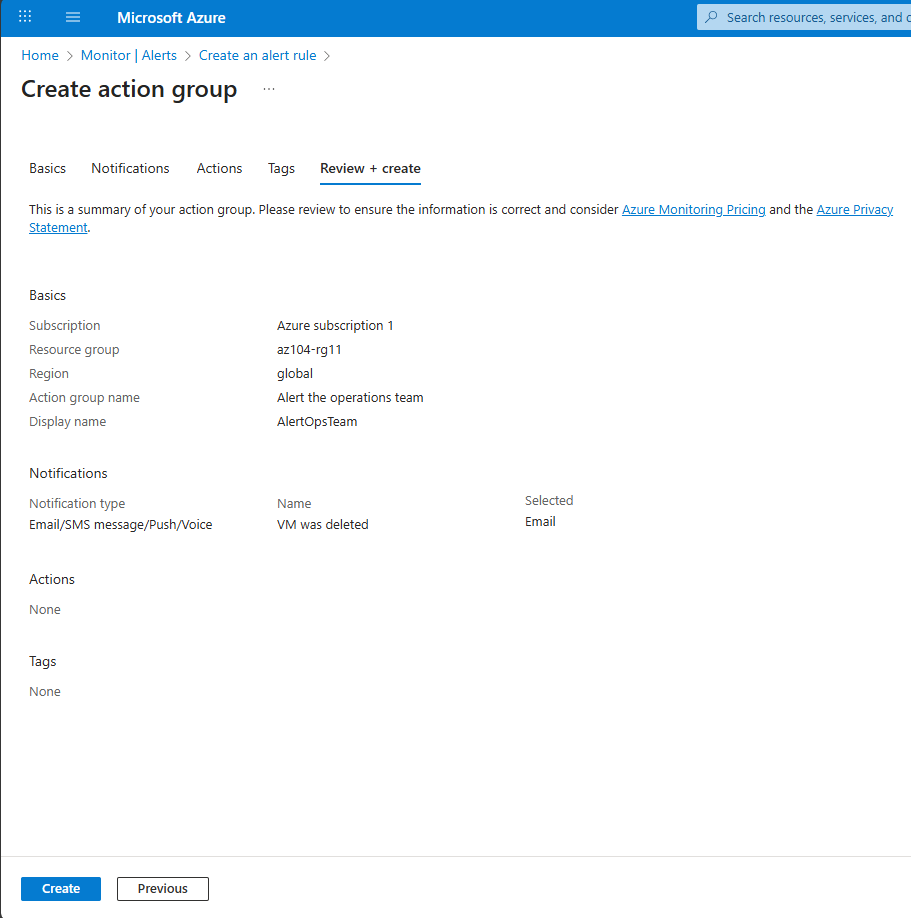

3. Select **Review + create** → **Create**.

### Finalize Alert Rule
| Setting | Value |
|------|------|
| Alert rule name | VM was deleted |
| Description | A VM in your resource group was deleted |

4. Select **Review + create** → **Create**.
 
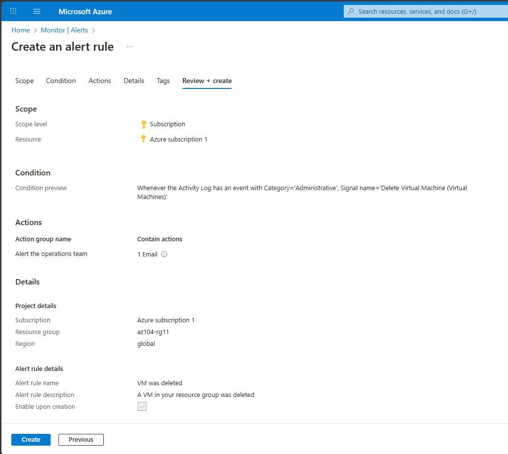

---

## Task 4 – Trigger and Validate the Alert

### Trigger Alert
1. Navigate to **Virtual machines**.
2. Select **az104-vm0**.
3. Select **Delete** → **Apply force delete** → **Delete**.

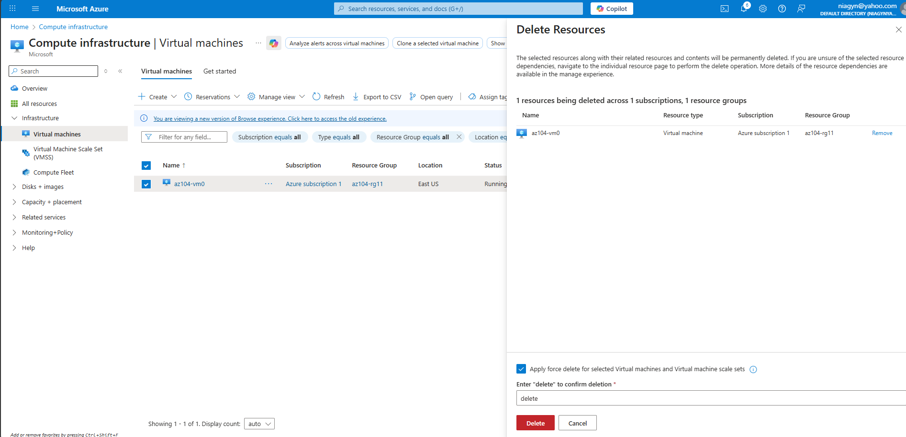

4. Wait for deletion to complete.

### Validate Alert
- Check your email for notification from:
```

[azure-noreply@microsoft.com](mailto:azure-noreply@microsoft.com)

```
  
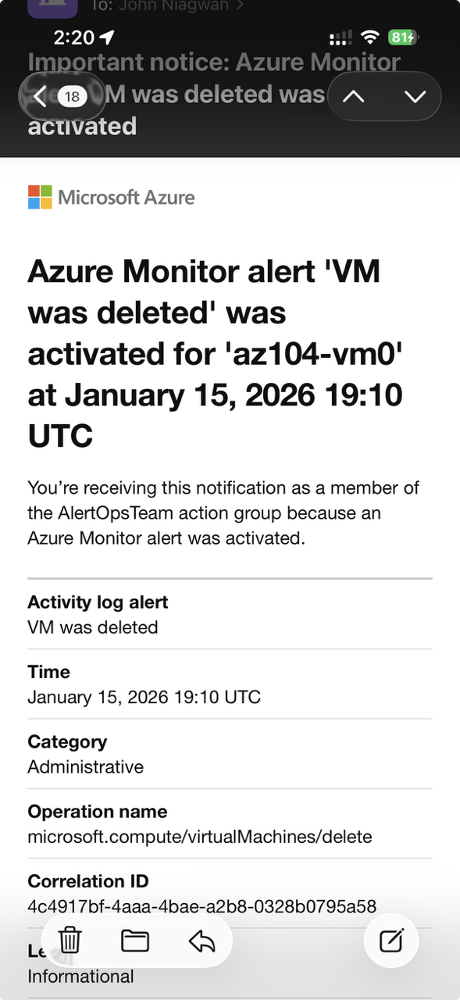

5. In **Monitor** → **Alerts**, review generated alerts.
6. Select an alert to view details.
  
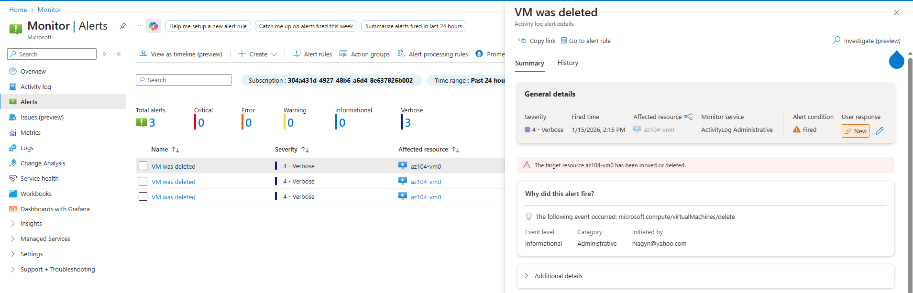

---

## Task 5 – Configure Alert Processing Rule

### Suppress Alerts During Maintenance
1. In **Monitor** → **Alerts**, select **Alert processing rules** → **Create**.
2. Select your **Subscription** → **Apply**.
3. Select **Suppress notifications**.

### Scheduling
| Setting | Value |
|------|------|
| Apply rule | At a specific time |
| Start | Today at 10:00 PM |
| End | Tomorrow at 7:00 AM |
| Time zone | Local timezone |

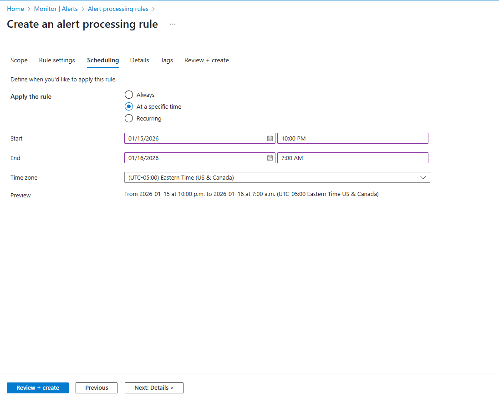

### Rule Details
| Setting | Value |
|------|------|
| Resource group | az104-rg11 |
| Rule name | Planned Maintenance |
| Description | Suppress notifications during planned maintenance |

4. Select **Review + create** → **Create**.
  
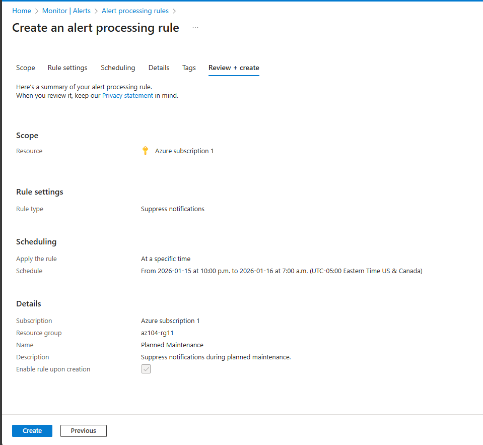

---

## Task 6 – Use Azure Monitor Log Queries

1. In the Azure portal, select **Monitor** → **Logs**.
2. Select your **Subscription** as scope → **Apply**.
3. Open **Queries** → **Virtual machines**.

### Run Built-In Query
- Run **Count heartbeats** query.
  
[Screenshot](./screenshots/lab11-heartbeat-query1.png)
[Screenshot](./screenshots/lab11-heartbeat-query2.png)

### Custom KQL Query
Switch to **KQL mode** and run:

```kql
InsightsMetrics
| where TimeGenerated > ago(1h)
| where Name == "UtilizationPercentage"
| summarize avg(Val) by bin(TimeGenerated, 5m), Computer
| render timechart
```

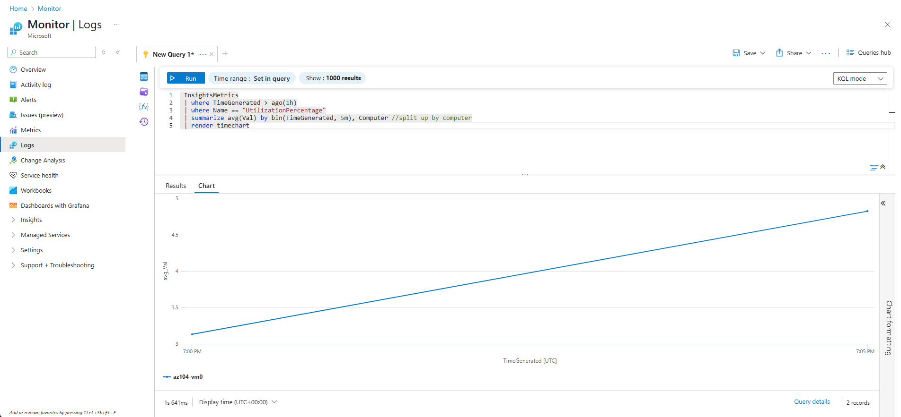

> Note: Data may be limited if the VM was deleted quickly.

---

## Key Takeaways

* Azure Monitor centralizes metrics, logs, and alerts
* Action groups enable automated notifications
* Alert processing rules help suppress noise
* KQL provides powerful insights into resource telemetry

---

## Status

✅ **Lab Completed**