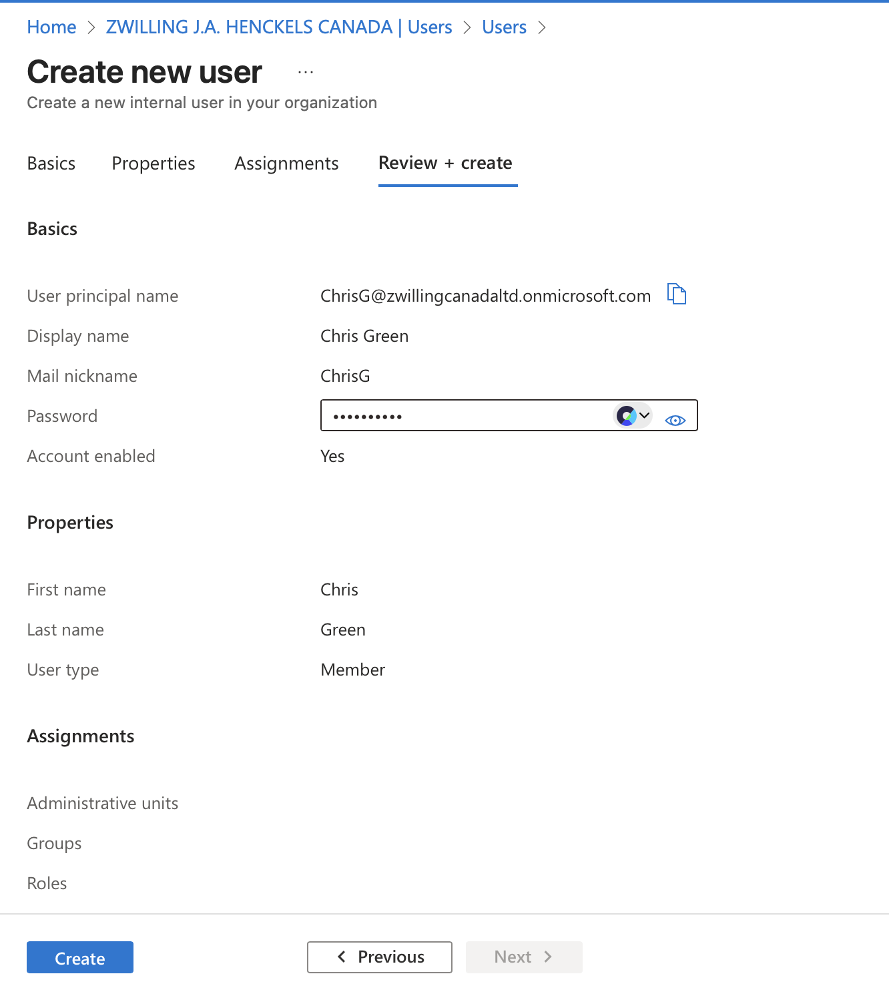
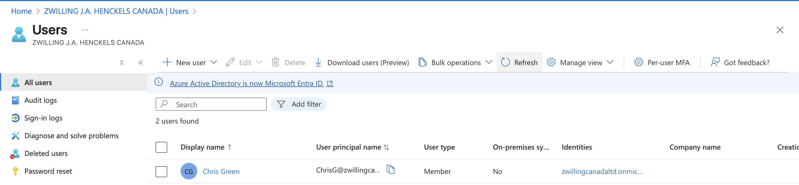
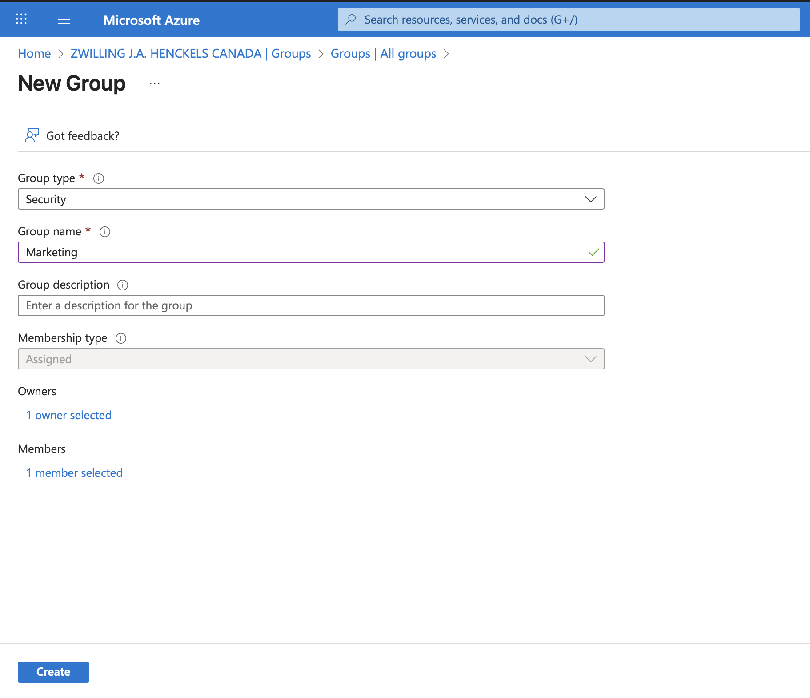
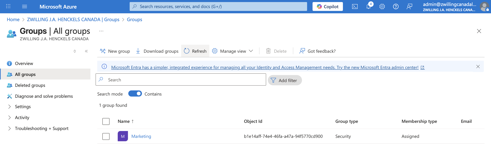
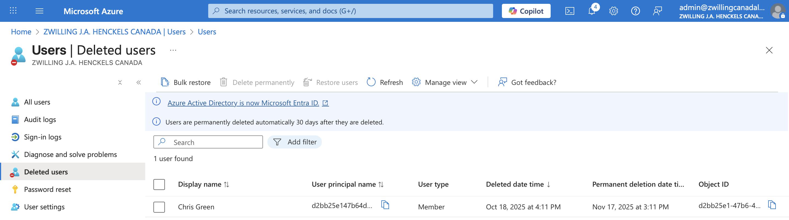

# Exercise: Entra ID Users and Groups

---

## 🧭 Overview

In this exercise, I worked with **Microsoft Entra ID (formerly Azure AD)** to manage users ang groups  
The goal was to create a new user and organize them within a group for efficient identity and access management.

---

## 🧰 Prerequisites

- Access to a **Microsoft Entra tenant** (trial or existing).  
- **User Administrator** or higher privileges.  
- Optional: A Microsoft 365 license available to assign.

---

## 🧑‍💼 Step 1: Create a New User in Microsoft Entra ID

1. In the **Microsoft Entra admin center**, navigate to **Identity → Users → All users**.  
2. Select **+ New user → Create new user**.  
3. Enter the following details:

   | Setting | Value |
   |----------|--------|
   | **User principal name** | `ChrisG` |
   | **Name** | Chris Green |
   | **First name** | Chris |
   | **Last name** | Green |
   | **Password** | *(create a unique password)* |

4. Click **Create**.  
5. Verify that **Chris Green** now appears in the **All users** list.

---

### 🖼️ Screenshot: All Users List Showing Chris Green

---

## 👥 Step 2: Create a Security Group in Microsoft Entra ID

1. Navigate to **Identity → Groups → All groups**.  
2. Select **+ New group**.  
3. Use the following configuration:

   | Setting | Value |
   |----------|--------|
   | **Group type** | Security |
   | **Group name** | Marketing |
   | **Membership type** | Assigned |
   | **Owners** | *(Your administrator account)* |
   | **Members** | Chris Green |

4. Click **Create**.  
5. Confirm that the group **Marketing** is now listed under **All groups**.

---

### 🖼️ Screenshot: Marketing Group Creation Screen

---

## ♻️ Step 3: Restore or Remove a Deleted User

- When a user is deleted in Microsoft Entra ID, their account is **soft-deleted** for 30 days.  
- During this period, you can **restore** the user and all their properties.  
- After 30 days, the account is **permanently deleted** and cannot be recovered.

To view or restore users:
1. In the **Microsoft Entra admin center**, navigate to **Identity → Users → Deleted users**.  
2. Select a user to **Restore** or **Permanently delete**.

⚠️ **Important:** Permanently deleted users cannot be restored.

---

### 🖼️ Screenshot: Deleted Users Recovery Screen

---

## 🧠 Key Takeaways

- Group-based licensing in **Microsoft Entra ID** simplifies management for large organizations.  
- Assigning licenses to groups ensures that all members automatically receive the necessary access.  
- Soft-delete functionality allows administrators to safely restore users within a 30-day window.  
- Effective identity governance helps maintain compliance and reduce administrative overhead.

---

## 🏁 Completion

✅ **Exercise Completed:** Create user and groups  
🏅 **Achievement:** Demonstrated ability to manage users, groups, and licenses within Microsoft Entra ID and Microsoft 365.