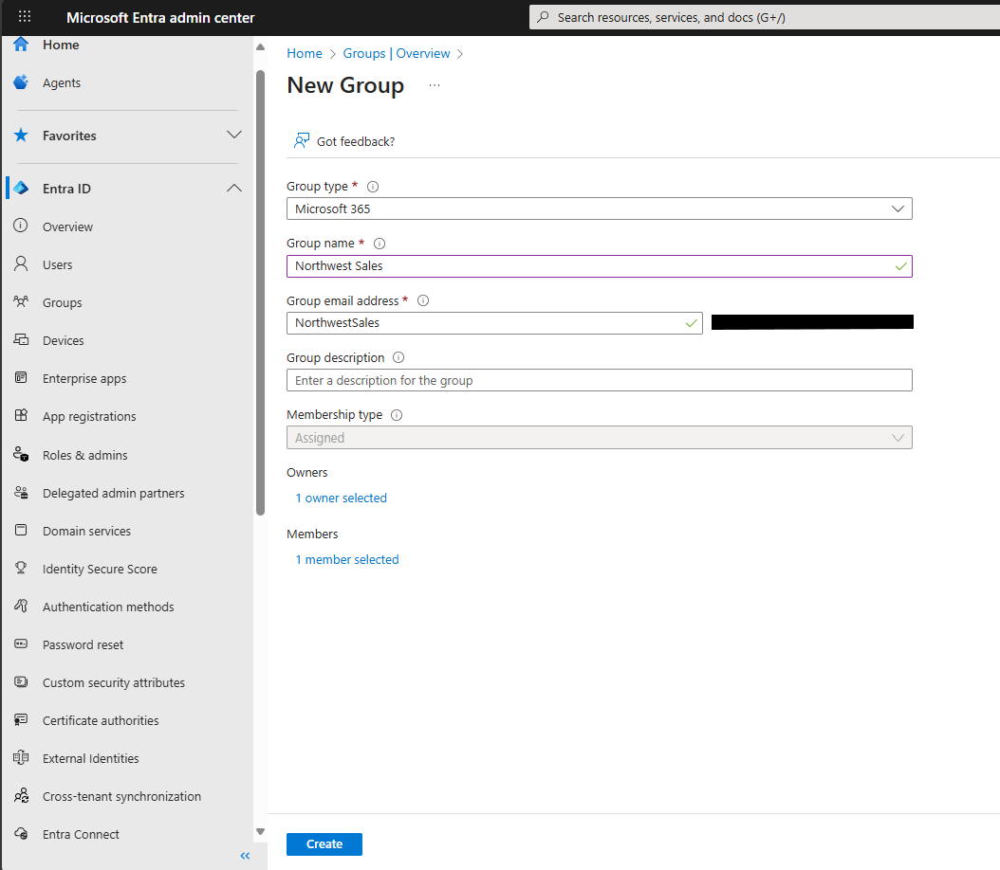
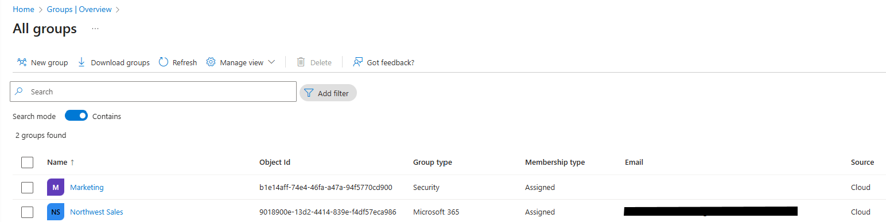

# Exercise: Add Groups in Microsoft Entra ID

---

## 🧭 Overview

In this exercise, I created a **Microsoft 365 Group** in **Microsoft Entra ID (formerly Azure Active Directory)**.  
Groups are essential for simplifying user management, access control, and license assignment in Microsoft 365 and Azure environments.

---

## 🧰 Prerequisites

- Access to a **Microsoft Entra tenant** (trial or existing).  
- **User Administrator** or higher privileges.  
- At least one user account to assign as a group member.

---

## 🧑‍💼 Step 1: Create a Microsoft 365 Group

1. Browse to the **Microsoft Entra admin center**.  
2. Navigate to: **Identity → Groups → All groups**  
3. On the menu bar, select **+ New group**.  
4. Fill in the following group details:

   | Setting | Value |
   |----------|--------|
   | **Group type** | Microsoft 365 |
   | **Group name** | Northwest Sales |
   | **Membership type** | Assigned |
   | **Owners** | Assign your own administrator account |
   | **Members** | Assign at least one member to this group |

5. Click **Create** to finalize the group creation.

---

### 🖼️ Screenshot: New Group Creation Page  

---

## 🔍 Step 2: Verify Group Creation

1. Return to **All groups** under the **Groups** section.  
2. Refresh the list a few times if necessary.  
3. Confirm that the group **Northwest Sales** appears in the list.

---

### 🖼️ Screenshot: All Groups List with “Northwest Sales”  

---

## 🧠 Key Takeaways

- **Microsoft Entra ID** allows for centralized group management for both Microsoft 365 and Azure services.  
- Groups simplify **role assignment**, **license distribution**, and **access control**.  
- The **Assigned** membership type allows direct, manual user control for smaller teams.  
- Newly created groups may take a few moments to appear; refreshing the list updates the view.

---

## 🏁 Completion

✅ **Exercise Completed:** Add Groups in Microsoft Entra ID  
🏅 **Achievement:** Demonstrated the ability to create and manage Microsoft 365 groups in Microsoft Entra ID.