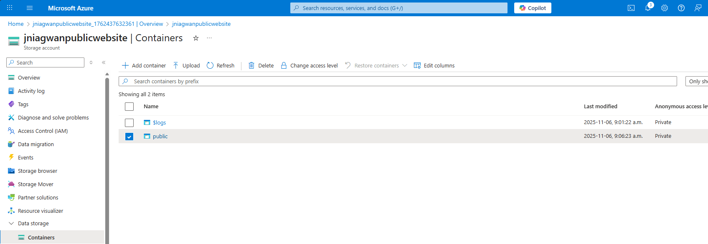
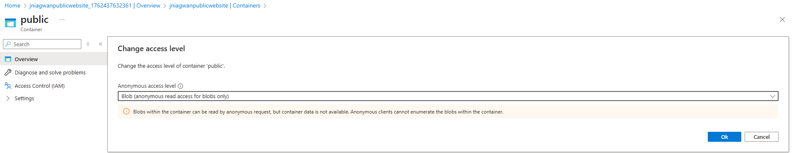
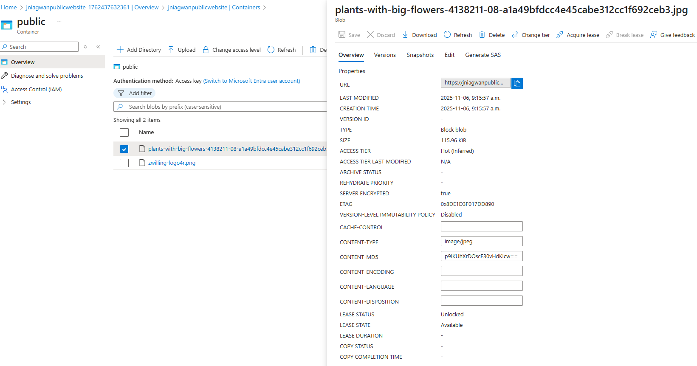
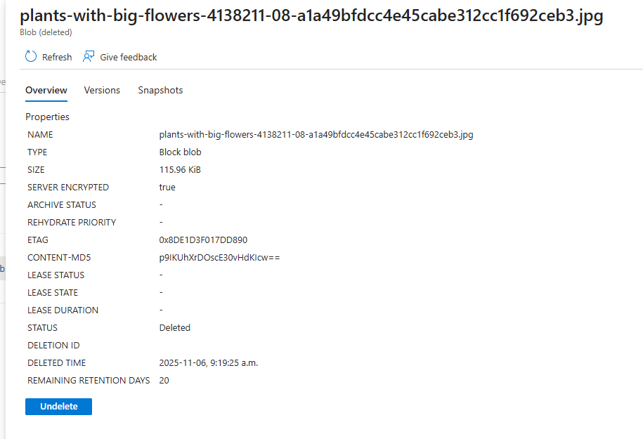
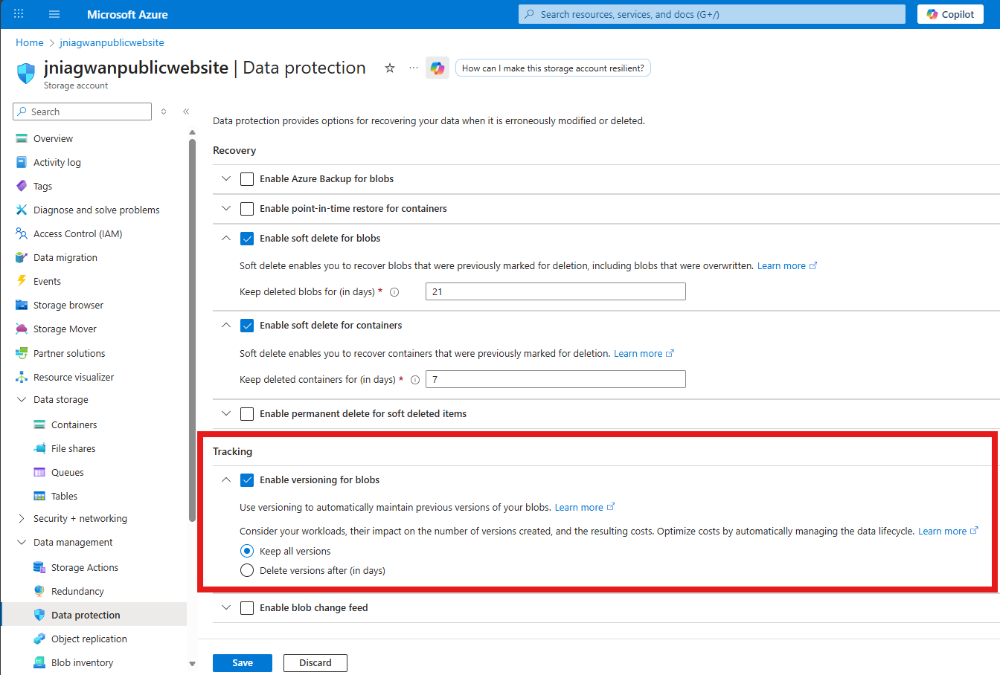

# Exercise: Configure Azure Blob Storage for a Global Public Website

---

## 🌍 Scenario

The company website delivers **product images, videos, marketing materials, and customer success stories** to customers worldwide.  
To ensure excellent user experience, the content must load with **low latency** and be **highly available**.  
Additionally, the company needs to **track document versions** and **restore deleted files** when necessary.

---

## 🧱 Architecture Diagram

A simple setup using:
- **One Azure Storage Account** (with geo-redundancy)
- **One Blob Container** (public access enabled)

---

## 🎯 Objectives

By completing this lab, the following goals were achieved:

1. Create a **highly available storage account**.  
2. Enable **anonymous public access** for website content.  
3. Create a **blob storage container** for hosting documents.  
4. Configure **soft delete** for easy recovery.  
5. Enable **blob versioning** to track and restore document changes.

---

## 🧰 Prerequisites

- Access to an **Azure subscription** (trial or existing).  
- **Contributor** or **Owner** role to create and configure resources.  
- Familiarity with **Microsoft Entra ID** and **Azure Portal**.  

---

## ⚙️ Step 1: Create a Storage Account with High Availability

1. In the Azure Portal, search for **Storage accounts** and select **+ Create**.  
2. Create a new **Resource Group** (e.g., `rg-publicwebsite`).  
3. Set **Storage account name:** `publicwebsite<unique-id>`.  
4. Leave all other settings as default and select **Review + Create → Create**.  
5. Once deployment completes, select **Go to resource**.

### Enable Read-Access Geo-Redundant Storage (RA-GRS)

1. Navigate to **Data Management → Redundancy**.  
2. Select **Read-access geo-redundant storage (RA-GRS)**.  
3. Review the **primary** and **secondary** location details.

---

## 🔓 Step 2: Enable Anonymous Public Access

1. In the storage account, go to **Settings → Configuration**.  
2. Set **Allow blob anonymous access** to **Enabled**.  
3. Select **Save**.

---

## 📦 Step 3: Create a Blob Container for Website Documents

1. In the storage account, select **Data Storage → Containers**.  
2. Choose **+ Container**, and name it **public**.  
3. Select **Create**.  
4. Once created, open the container → **Change access level**.  
5. Set **Public access level** to **Blob (anonymous read access for blobs only)**.  
6. Select **OK**.

---

## 🧪 Step 4: Upload and Test File Access

1. In the **public** container, select **Upload**.  
2. Choose a small image or text file and click **Upload**.  
3. Once uploaded, open the file and **copy its URL**.  
4. Paste the URL in a new browser tab to confirm **public access**.  

If the file is an image, it will display directly. Otherwise, it will download automatically.

---

## 🗑️ Step 5: Configure Soft Delete (Retention: 21 Days)

1. Go to the **Overview** blade of the storage account.  
2. In the **Blob service** section, select **Data protection**.  
3. Enable **Soft delete for blobs**.  
4. Set **Retention (days)** to **21**.  
5. Select **Save**.

🖼️ **_Screenshot Placeholder: Soft Delete Settings_**

### 🔄 Test File Recovery

1. Delete the uploaded blob from your container.  
2. Toggle **Show deleted blobs** on the container view.  
3. Select the deleted file → **Undelete**.  
4. Refresh the page to confirm the blob has been restored.

---

## 🕒 Step 6: Enable Blob Versioning

1. In the **Blob service** section, select **Data protection** again.  
2. Enable **Blob versioning**.  
3. Save the configuration.

### 🧩 Test Blob Versioning

1. Upload a new version of the same file (same name).  
2. Observe that a **previous version** is listed in **Show deleted blobs** view.  
3. Restore a previous version to verify functionality.

---

## 💡 Key Takeaways

- **Azure Blob Storage** provides scalable, cost-effective storage for unstructured data such as images, videos, and documents.  
- **RA-GRS redundancy** ensures high availability and disaster recovery readiness.  
- **Soft delete** and **versioning** safeguard critical business files from accidental loss.  
- **Anonymous public access** enables fast, login-free access to public web content globally.

---

## 🏁 Completion Summary

✅ **Exercise Completed:** Configure Azure Blob Storage for a Global Public Website  
🏅 **Skills Demonstrated:**  
- High-availability storage configuration  
- Blob container access management  
- Soft delete and versioning  
- Public content delivery