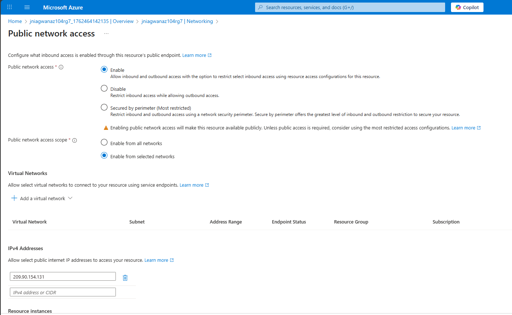
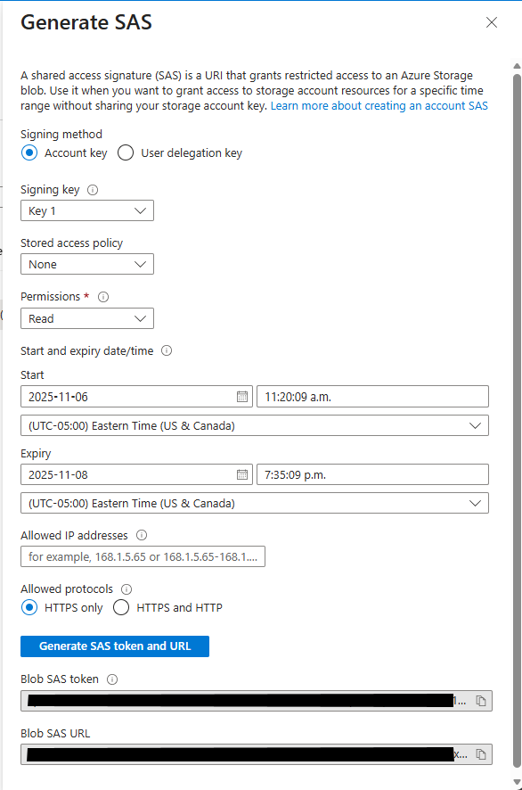
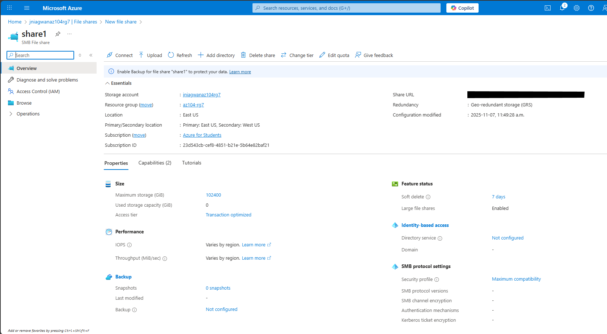

# 🧪 Lab – Manage Azure Storage

---

## 🧭 Lab Introduction

In this lab, you will:

- Create and configure **Azure Storage accounts** for blobs and file shares  
- Secure and manage **blob containers**  
- Use **Storage Browser** to configure and secure **Azure File shares**  

> 💡 This lab uses the **East US** region by default but can be adapted for other regions.

---

## 🏢 Scenario

Your organization currently stores data on-premises.  
Most of these files are **infrequently accessed**, and you want to **reduce storage costs** by using Azure’s lower-priced storage tiers.

You will also explore:
- Storage **network access**, **authentication**, **authorization**, and **replication**
- The suitability of **Azure Files** as a replacement for on-premises file shares

---

## 🧱 Architecture Diagram

This lab includes the following major tasks:

1. Create and configure a storage account  
2. Create and secure blob storage  
3. Create and secure Azure file storage  


---

## 🎓 Job Skills

- Configure and secure Azure Storage Accounts  
- Manage blob containers and immutable policies  
- Configure Azure File shares  
- Restrict access with networking and service endpoints  
- Automate lifecycle management  

---

## 🧩 Task 1: Create and Configure a Storage Account

1. Sign in to [Azure Portal](https://portal.azure.com)  
2. Search for **Storage accounts** → **+ Create**  
3. Configure as follows:

| Setting | Value |
|----------|--------|
| **Resource group** | `az104-rg7` (create new) |
| **Storage account name** | Unique 3–24 character name |
| **Region** | East US |
| **Performance** | Standard |
| **Redundancy** | Geo-redundant storage (GRS) |
| **Read-access to secondary region** | ✅ Enabled |
| **Public network access** | Disabled initially |

4. Review **Advanced**, **Data Protection**, and **Encryption** tabs (keep defaults).  
5. Click **Review + Create → Create**, then **Go to Resource** once deployment completes.  
6. Under **Security + networking → Networking**, confirm that **Public network access is Disabled**.


---

### 🔐 Enable Limited Public Network Access

1. Change **Public network access** to **Enabled from selected networks**.  
2. Add your **client IPv4 address**.  
3. Save changes.



---

### ♻️ Configure Lifecycle Management

1. Navigate to **Data management → Lifecycle management → Add a rule**.  
2. Name the rule: `Movetocool`.  
3. Condition:  
   - If **base blobs** were last modified more than **30 days ago**,  
     → **Move to cool storage**.  
4. Save the rule.


---

## 🗂️ Task 2: Create and Configure Secure Blob Storage

### Create a Private Blob Container

1. In your storage account, navigate to **Data storage → Containers → + Container**.  
2. Set:  
   - **Name:** `data`  
   - **Public access level:** Private  
3. Select **Create**.


---

### Add an Immutable (Time-Based) Retention Policy

1. Open the new container → Select **Access policy (⋯)**.  
2. Under **Immutable blob storage**, select **Add policy**:  
   - **Policy type:** Time-based retention  
   - **Retention period:** 180 days  
3. Save your policy.


---

### Upload a File

1. Select your `data` container → **Upload**.  
2. Expand **Advanced** and configure:  
   - **Blob type:** Block blob  
   - **Block size:** 4 MiB  
   - **Access tier:** Hot  
   - **Upload to folder:** `securitytest`  
3. Click **Upload**.


4. Confirm the file uploaded successfully.  
5. Copy the **file URL** (under **Settings → Properties**).  
6. Test access in an **InPrivate** window — expect **ResourceNotFound or PublicAccessNotPermitted** (private access enforced).

---

### Generate a Shared Access Signature (SAS)

1. Select your uploaded file → **Generate SAS**.  
2. Configure:  
   - **Signing key:** Key 1  
   - **Permissions:** Read  
   - **Start date:** Yesterday  
   - **Expiry date:** Tomorrow  
3. Click **Generate SAS token and URL**.  
4. Copy the **Blob SAS URL** and test in a new InPrivate browser — file should open.



---

## 📁 Task 3: Create and Configure Azure File Storage

### Create a File Share

1. In your storage account → **Data storage → File shares → + File share**.  
2. Configure:  
   - **Name:** `share1`  
   - **Access tier:** Transaction optimized  
   - **Backup:** Disabled  
3. Click **Review + create → Create**.



---

### Use Storage Browser to Upload Files

1. Open **Storage browser → File shares → share1**.  
2. (Optional) Create folders using **+ Add directory**.  
3. Select **Upload** and add a file of your choice.  
4. Verify upload success.


---

### Restrict Network Access to the Storage Account

1. Create a **Virtual Network** named `vnet1`:
   - Resource group: `az104-rg7`
   - Region: East US
2. Add a **Service endpoint**:
   - **Service:** Microsoft.Storage  
   - **Subnet:** default  
3. Save changes.


4. Return to your **Storage Account → Networking**:  
   - Add existing virtual network: `vnet1`  
   - Remove your client IP address  
   - Save


### Test Access Restriction

1. Refresh **Storage browser**.  
2. Attempt to access blob or file content.  
3. You should see a **“Not authorized to perform this operation”** message.


---

## 🧹 Cleanup Resources

To prevent unnecessary charges, delete the lab resources:

- In the portal:  
  1. Select your **resource group (`az104-rg7`)**  
  2. Click **Delete resource group**

- Using PowerShell:
  ```powershell
  Remove-AzResourceGroup -Name az104-rg7
```

* Using CLI:

  ```bash
  az group delete --name az104-rg7
  ```


---

## 📘 Learn More with Self-Paced Training

* [Create an Azure Storage Account](https://learn.microsoft.com/en-us/azure/storage/common/storage-account-create)
* [Manage the Azure Blob Storage Lifecycle](https://learn.microsoft.com/en-us/azure/storage/blobs/storage-lifecycle-management-concepts)

---

## 🏁 Key Takeaways

* **Azure Storage Accounts** provide a unified namespace for blobs, files, queues, and tables.
* **Redundancy models** (LRS, ZRS, GRS) ensure durability and availability.
* **Blob Storage** is ideal for unstructured data (images, videos, etc.).
* **File Storage** supports shared access and structured data organization.
* **Immutable storage** enforces write-once, read-many (WORM) compliance for data protection.