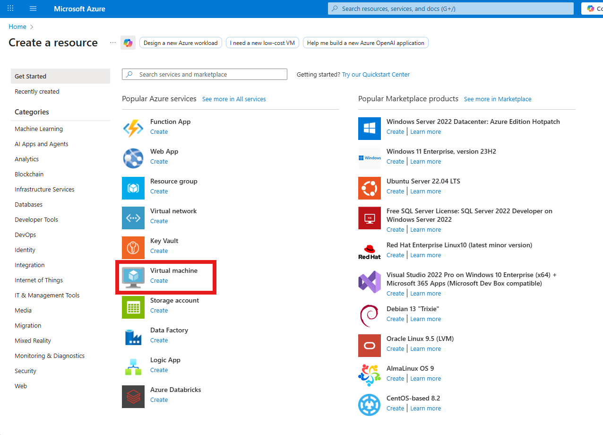
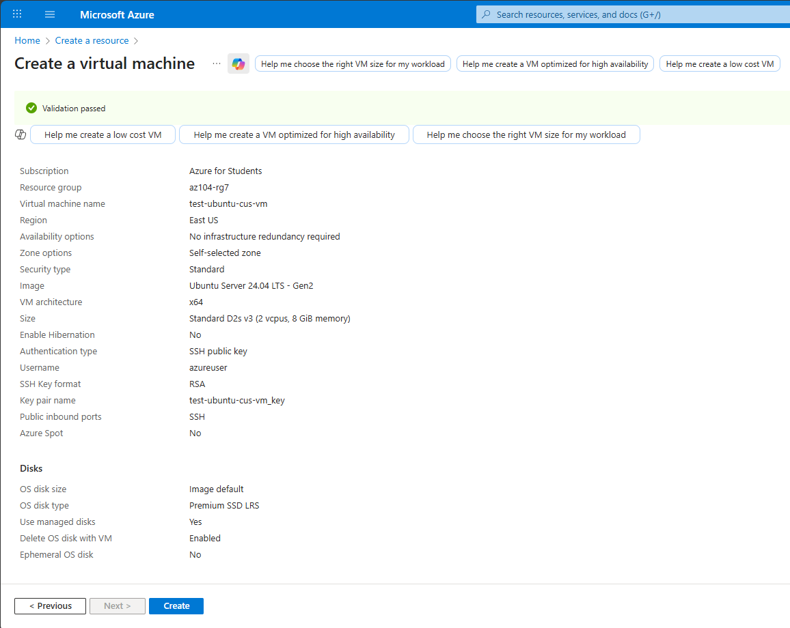
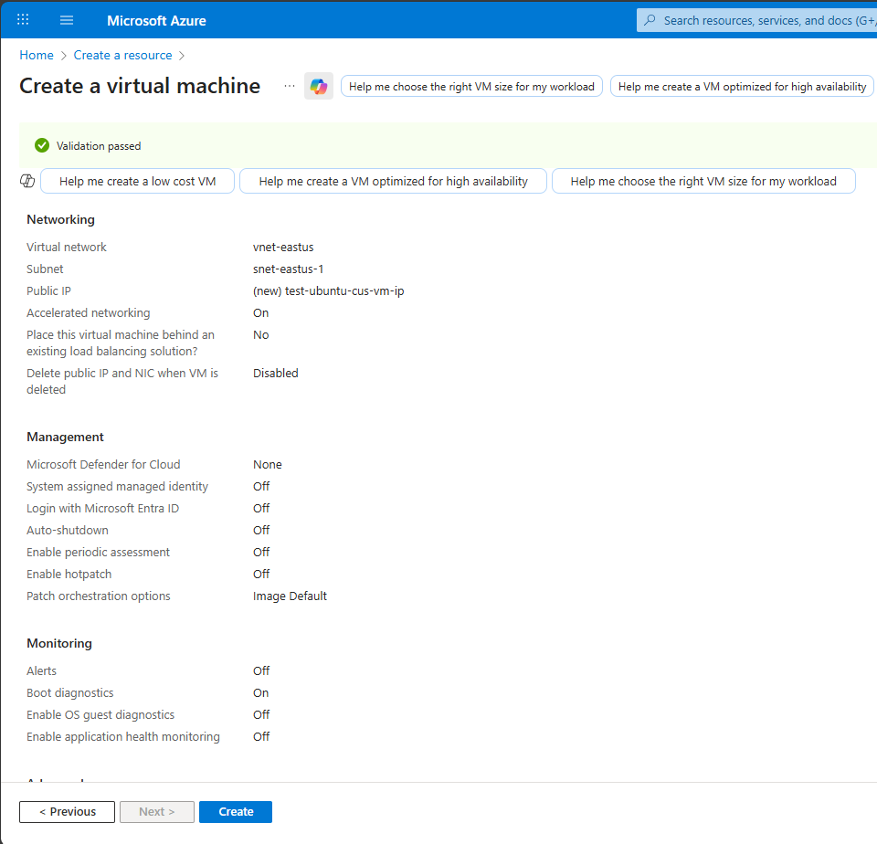

# Lab - Create an Azure VM with the Azure Portal

## Lab Introduction

In this lab, you'll create a **Virtual Machine (VM)** running an Ubuntu web server in Azure.  
While this is a simplified example, it demonstrates how easy it is to provision a VM using the Azure portal.  
Later modules will go into more detail on the various configuration options available.

---

## Prerequisites

- An active **Azure subscription**
- Access to the **Azure portal** at [https://portal.azure.com](https://portal.azure.com)

---

## Lab Scenario

You want to deploy a web server running on Ubuntu. In this exercise, you’ll create a VM using the Azure portal, configure SSH access, and review the deployment details. This lab focuses on understanding the deployment flow and basic configuration.

---

## Task: Create an Azure Virtual Machine

### Step 1: Sign in to the Azure Portal

1. Navigate to [https://portal.azure.com](https://portal.azure.com).
2. On the **Azure Home** page, under **Azure services**, select **Create a resource**.

> 🖼️ *Screenshot: Azure Home → Create a resource page*


---

### Step 2: Select the Virtual Machine Service

1. In the **Create a resource** pane, under **Popular services**, select **Virtual Machine**.  
2. The **Create virtual machine** pane will open.

> 🖼️ *Screenshot: Create a resource → Virtual Machine option*


---

### Step 3: Configure Basic VM Settings

On the **Basics** tab, enter the following values:

| **Setting** | **Value** |
|--------------|-----------|
| **Subscription** | Select your subscription |
| **Resource group** | `myResourceGroupName` |
| **Virtual machine name** | `test-ubuntu-cus-vm` |
| **Region** | Select a geographical location close to you |
| **Availability options** | No infrastructure redundancy required |
| **Security type** | Standard |
| **Image** | Ubuntu Server 24.04 LTS - Gen2 |
| **VM architecture** | x64 |
| **Run with Azure Spot discount** | Unchecked |
| **Size** | Standard D2s V3 |
| **Authentication type** | SSH public key |
| **Username** | Enter a username |
| **SSH public key source** | Generate a new key pair |
| **Key pair name** | `test-ubuntu-cus-vm_key` |
| **Public inbound ports** | Allow selected ports |
| **Select inbound ports** | SSH (22) |


---

### Step 4: Review and Create

1. Explore the other tabs to review available options such as **Disks**, **Networking**, and **Management**.  
2. When ready, select **Review + create**.
3. Azure will validate your configuration settings.  
4. Once validation passes, select **Create**.

> 🖼️ *Screenshot: Review + create validation summary*



---

### Step 5: Generate and Download SSH Keys

1. When prompted, select **Download private key and create resource**.  
2. Save the key file (`.pem`) in a secure location.

---

### Step 6: Monitor Deployment

1. You can monitor the deployment from:
   - The **Deployment details** pane, or
   - The **Notifications** pane (top-right bell icon).

> 🖼️ *Screenshot: Notifications icon and deployment progress*


2. When the deployment completes, you’ll see a confirmation message.

---

### Step 7: Review the Virtual Machine Overview

1. Select **Go to resource** to open your new VM.  
2. On the **Overview** page, note the **Public IP address** and **SSH details**.

> 🖼️ *Screenshot: VM Overview page showing Public IP address*

---

### Step 8: Connect to Your VM

Use the downloaded private key to connect via SSH from your terminal or an SSH client.

```bash
ssh -i ~/Downloads/test-ubuntu-cus-vm_key.pem username@<Public-IP-Address>
```
