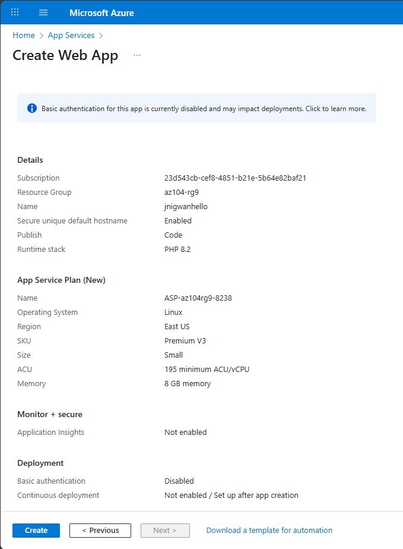
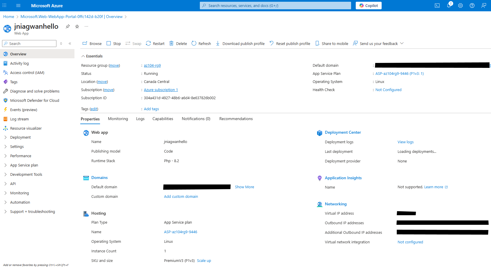
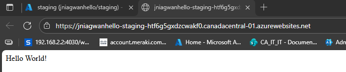
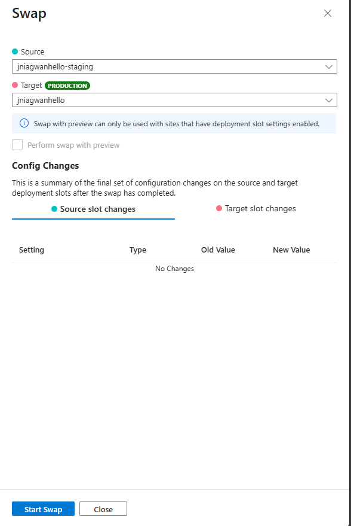
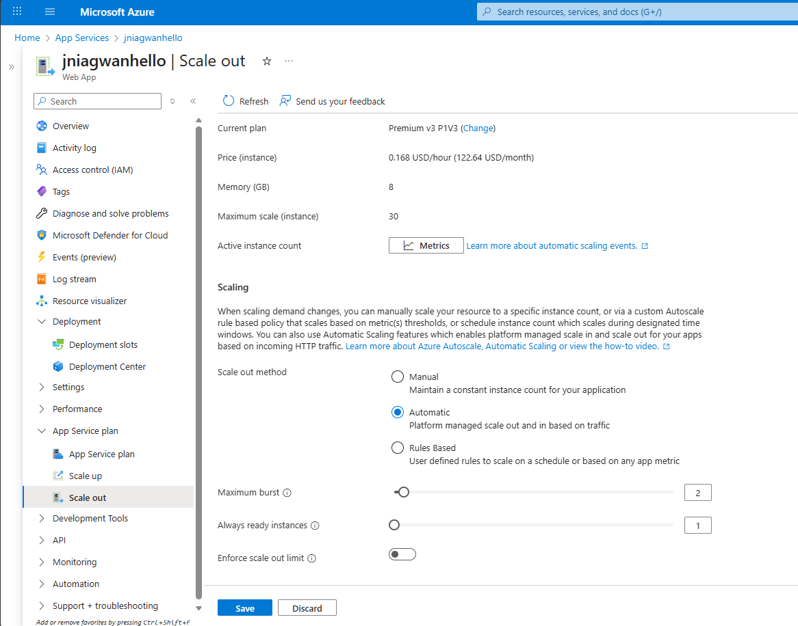
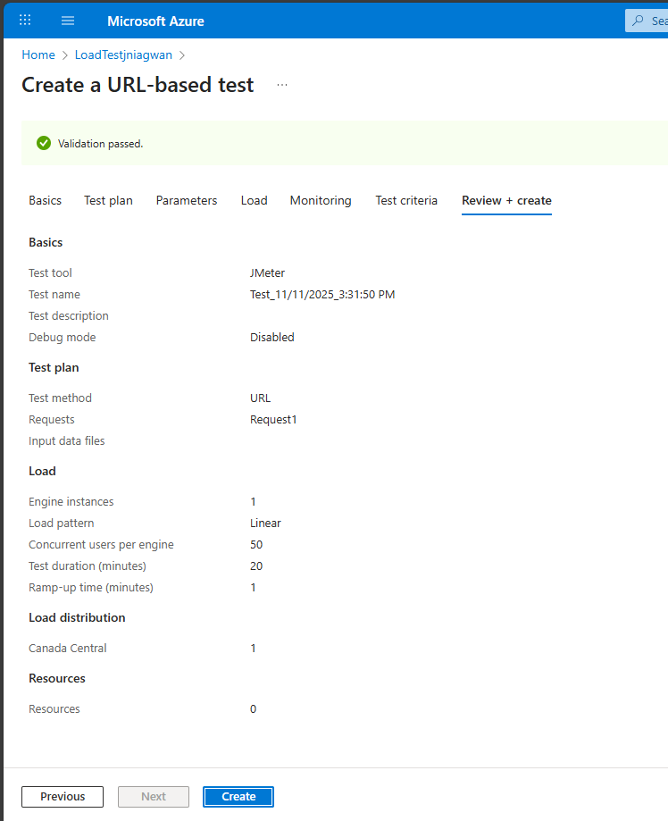
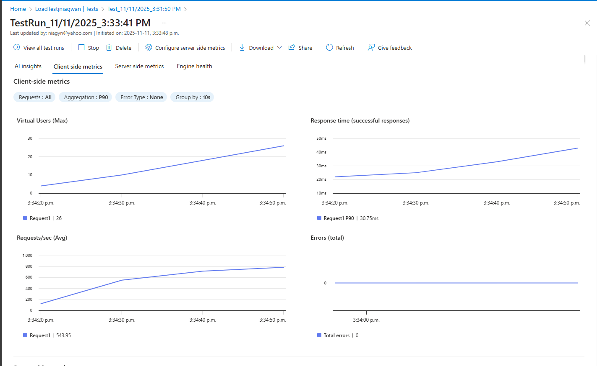

# Lab 09a - Implement Web Apps

## 🧭 Lab Introduction

In this lab, you'll learn how to create and manage **Azure Web Apps**.  
You’ll configure a web app to display a *Hello World* application hosted on an external GitHub repository, set up a **staging slot**, perform a **slot swap** with production, and configure **autoscaling** to handle varying levels of demand.

> **Estimated time:** 20 minutes  
> **Region used in steps:** East US (You may choose another region.)

---

## 🧩 Lab Scenario

Your organization is exploring **Azure Web Apps** for hosting company websites.  
Currently, the sites are hosted on-premises using **Windows servers** with the **PHP runtime stack**, but the hardware is nearing end-of-life.  
To avoid the cost of replacing servers, your team will migrate to Azure App Services, taking advantage of its scalability and flexibility.

---

## 🏗️ Architecture Diagram

---

## 🧠 Job Skills Learned

- Create and configure an Azure Web App  
- Create and configure a deployment slot  
- Configure continuous deployment from GitHub  
- Swap staging and production slots  
- Configure and test autoscaling  

---

## ⚙️ Task 1: Create and Configure an Azure Web App

In this task, you’ll create an **Azure Web App** using **Azure App Services** — a PaaS solution for hosting web applications.

### Steps:

1. Sign in to the [Azure portal](https://portal.azure.com).  
2. Search for **App Services** and select it.  
3. Select **+ Create** → **Web App**.  

4. On the **Basics** tab, enter the following values:

| **Setting** | **Value** |
|--------------|-----------|
| **Subscription** | Your Azure subscription |
| **Resource group** | `az104-rg9` *(Create new if necessary)* |
| **Web app name** | Any globally unique name |
| **Publish** | Code |
| **Runtime stack** | PHP 8.2 |
| **Operating system** | Linux |
| **Region** | East US |
| **Pricing plan** | Premium V3 (P1V3) |
| **Zone redundancy** | Default |

5. Select **Review + create**, then **Create**.  
   Wait for deployment to complete, then select **Go to resource**.

---

## 🔄 Task 2: Create and Configure a Deployment Slot

Deployment slots allow you to test new versions of your app before releasing them to production.

### Steps:

1. In your Web App resource, select the **Default domain** link to view the default page in a new browser tab.  
   Close the tab afterward.

---

## 🔧 Task 3: Configure Web App Deployment Settings

Next, you’ll connect the staging slot to an external GitHub repository to automatically deploy a sample app.

### Steps:

1. In the **staging slot**, select **Deployment Center** → **Settings**.  
2. Under **Source**, choose **External Git**.  
3. Configure the following fields:

| **Setting** | **Value** |
|--------------|-----------|
| **Repository** | `https://github.com/Azure-Samples/php-docs-hello-world` |
| **Branch** | master |

4. Select **Save**.  
5. From the staging slot’s **Overview**, click the **Default domain** link.  
6. Verify that the page displays **“Hello World”**.

*Note: Deployment may take up to a minute. Refresh the page if needed.*

---

## 🔁 Task 4: Swap Deployment Slots

Once the staging slot is verified, swap it with the production slot.

### Steps:

1. Navigate back to the **Deployment slots** blade.  
2. Select **Swap**.  
3. Review the default swap configuration and click **Start Swap**.  
4. Wait for the notification confirming the swap has completed.

5. Go to your **Production Web App** (App Services → your app).  
6. On the **Overview** blade, select the **Default domain** link to view the production website.  
7. Confirm that it now displays the **Hello World** page.

📋 *Copy the Default domain URL — you’ll need it for load testing in the next task.*

---

## 📈 Task 5: Configure and Test Autoscaling of the Azure Web App

Autoscaling helps maintain performance by adjusting resources based on load.

### Steps:

1. In the **App Service plan** section (production slot), select **Scale out (App Service plan)**.  
2. Under **Scaling**, choose **Automatic**.  
   - Note the **Rules Based** option for custom metric-based scaling.  
3. Set **Maximum burst** to `2`.  
4. Click **Save**.

5. In the left menu, select **Diagnose and solve problems**.  
6. Under **Load Test your App**, select **Create Load Test**.  
7. Choose **+ Create**, enter a unique name, then select **Review + create → Create**.  
8. When deployment completes, select **Go to resource**.

9. From **Overview**, choose **Create by adding HTTP requests → Add request**.  
10. In the **URL** field, paste your production app’s Default domain URL (starting with `https://`).  
11. Click **Add**, then **Review + create → Create**.

12. Monitor the test to view live metrics, including:
   - Virtual users
   - Response time
   - Requests per second  

13. Click **Stop** to end the test.

---

## 🧹 Cleanup Resources

To avoid unnecessary charges:

- In the **Azure portal**, navigate to **Resource groups**.  
- Select `az104-rg9`.  
- Click **Delete resource group**, type the group name, and confirm deletion.

---

## 🧾 Key Takeaways

- **Azure App Services** provides a scalable PaaS solution for web applications.  
- **Deployment slots** enable safe testing before production release.  
- **Continuous deployment** integrates with GitHub and other CI/CD sources.  
- **Slot swapping** simplifies moving tested code to production with minimal downtime.  
- **Autoscaling** ensures your app performs efficiently under varying workloads.  

---

## 📸 Screenshot Summary

| **Step** | **Screenshot Description** |
|-----------|-----------------------------|
| Task 1 | Create Web App page |
| Task 1 | Deployment succeeded |
| Task 2 | Default web app page |
| Task 2 | Deployment slots list |
| Task 3 | Hello World app on staging |
| Task 4 | Swap operation success |
| Task 4 | Production app Hello World |
| Task 5 | Autoscale configuration |
| Task 5 | Load test metrics |

---

**Author:** *John Niagwan*  
**Lab Duration:** *~20 minutes*  
**Azure Certification Alignment:** *AZ-104 – Manage and Implement Azure Web Apps*