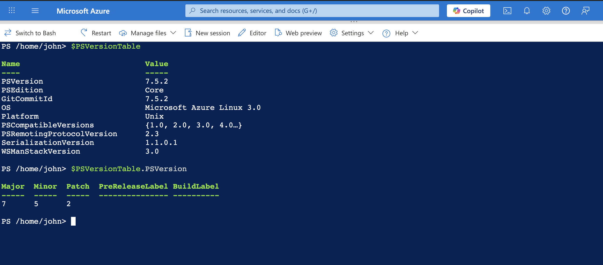
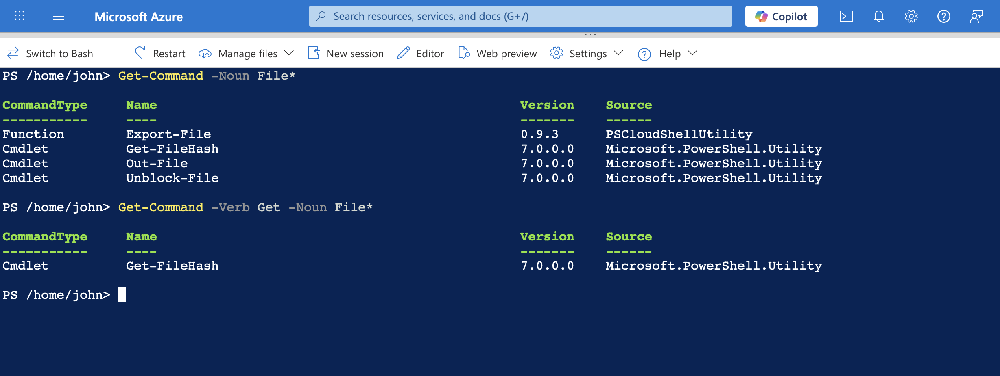

# Exercise - Run Your First PowerShell Commands & Locate Commands 

---

## 🧠 Overview

These exercises introduce the fundamentals of using **PowerShell** within **Azure Cloud Shell**.  
You’ll learn how to verify your PowerShell environment, retrieve version details, and use built-in cmdlets to locate and explore commands.

Both exercises focus on building a strong foundation in PowerShell command syntax, output interpretation, and cmdlet discovery.

---

## 🧩 Exercise 1: Run Your First PowerShell Commands

### 🎯 Objective
Run and understand basic PowerShell commands in Azure Cloud Shell.

### 🪄 Steps

1. **Launch Azure Cloud Shell**
   - Access via the [Azure Portal](https://portal.azure.com) or directly at [shell.azure.com](https://shell.azure.com).
   - Select **PowerShell** mode and confirm.

2. **Check PowerShell Version**
   ```powershell
   $PSVersionTable

Output Example:

Name                           Value
----                           -----
PSVersion                      7.3.6
PSEdition                      Core
Platform                       Unix
...

3.	**Display Specific Version Information**

$PSVersionTable.PSVersion

Output Example:

Major  Minor  Patch
-----  -----  -----
7      3      6



### 🧠 Key Learning
	•	$PSVersionTable returns an object, not just plain text.
	•	You can access specific properties using the dot (.) operator.
	•	PowerShell provides structured, easily parsable output that’s ideal for automation.

⸻

## 🧩 Exercise 2: Locate Commands

### 🎯 Objective

Use PowerShell’s Get-Command cmdlet to find and filter available commands efficiently.

🪄 Steps
	1.	Search for Cmdlets Related to Files

Get-Command -Noun File*

Sample Output:

CommandType     Name              Version    Source
-----------     ----              -------    ------
Cmdlet          Get-FileHash      7.0.0.0    Microsoft.PowerShell.Utility
Cmdlet          Out-File          7.0.0.0    Microsoft.PowerShell.Utility
Cmdlet          Unblock-File      7.0.0.0    Microsoft.PowerShell.Utility


	2.	Refine Search by Verb

Get-Command -Verb Get -Noun File*

Sample Output:

CommandType     Name              Version    Source
-----------     ----              -------    ------
Cmdlet          Get-FileHash      7.0.0.0    Microsoft.PowerShell.Utility



### 🧠 Key Learning
	•	Use -Noun and -Verb parameters to filter cmdlets effectively.
	•	Cmdlet names in PowerShell follow the Verb-Noun convention.
	•	This helps identify purpose and function quickly, improving productivity.

⸻

### ⚡ Summary

Skill Learned	Description
PowerShell Basics	Run and interpret commands in Cloud Shell
Object Access	Retrieve specific properties from command output
Cmdlet Discovery	Locate commands using Get-Command and filters
Command Syntax	Understand Verb-Noun naming conventions


⸻

### 💡 Reflection

These exercises emphasize the discoverability and flexibility of PowerShell — two qualities that make it invaluable for Azure administrators.
By mastering the basics, you build a strong foundation for automating Azure management tasks in later modules such as AZ-104 (Azure Administrator Associate).

⸻

Author: [Your Name]
Certification Path: Microsoft Certified: Azure Fundamentals → Azure Administrator Associate
Module: PowerShell Basics in Azure Cloud Shell

---

Would you like me to format this with **badges**, like “🧩 AZ-104 Exercise” or a **GitHub-style project card layout** (great for a professional portfolio repo)?