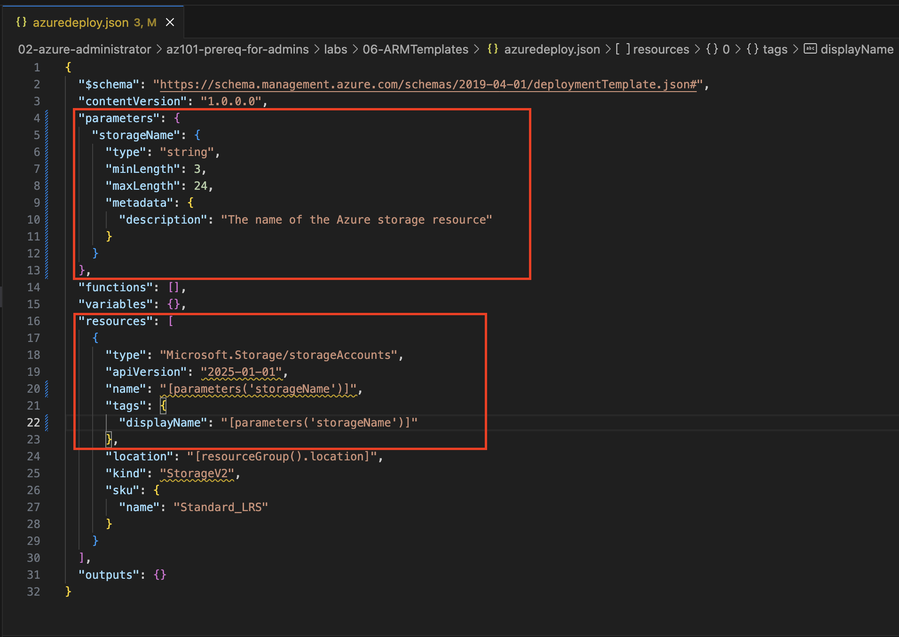
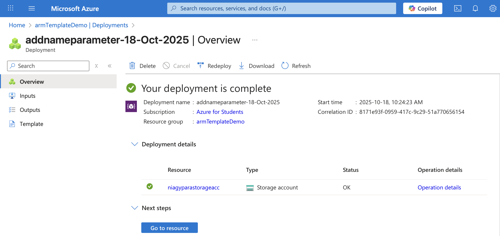
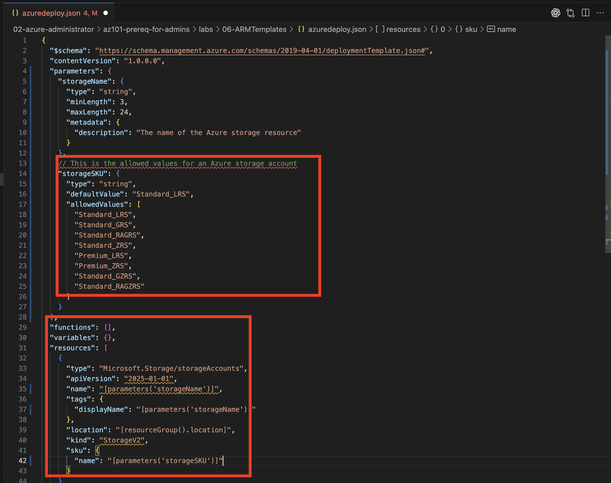
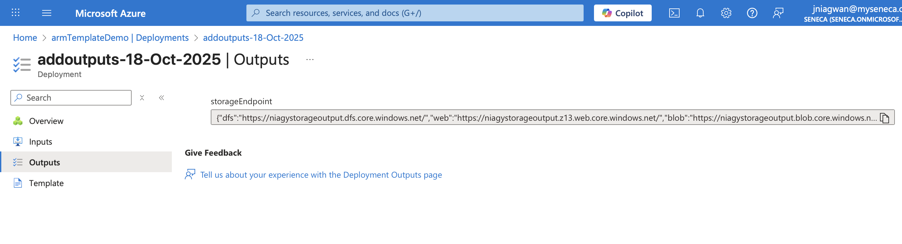
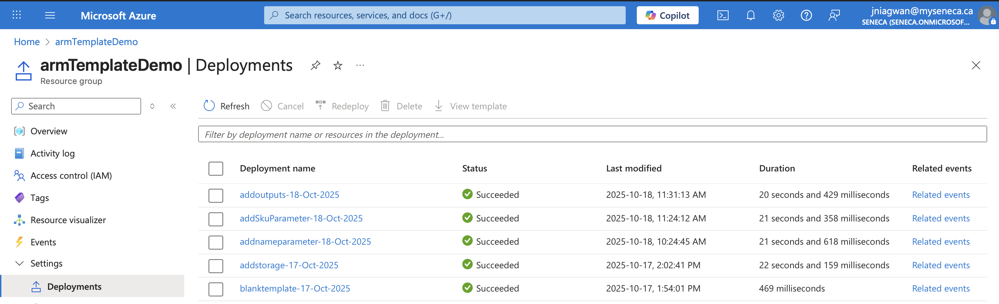

# Exercise: Add Parameters and Outputs to an Azure Resource Manager (ARM) Template

---

## 🧭 Overview

In this exercise, I enhanced an existing Azure Resource Manager (ARM) template by introducing **parameters** and **outputs** to make the deployment process more flexible and reusable.  

I used **Visual Studio Code** and the **Azure CLI** to deploy and validate the template updates within a resource group.

---

## 🎯 Learning Objectives

- Add parameters to ARM templates for runtime customization.  
- Use `allowedValues` to restrict parameter inputs.  
- Add outputs to templates to return useful deployment information.  
- Deploy and validate ARM templates using the Azure CLI.

---

## 🧱 Step 1: Create Parameters for the ARM Template

Added a parameter named `storageName` to dynamically define the Azure Storage Account name at deployment time.

json
"parameters": {
  "storageName": {
    "type": "string",
    "minLength": 3,
    "maxLength": 24,
    "metadata": {
      "description": "The name of the Azure storage resource"
    }
  }
}

This parameter was then used in the resource block for both the name and tags.displayName properties.

✅ Result: Template became reusable for any unique storage account name.

⸻

🖼️ Screenshot: Parameterized ARM Template in VS Code



⸻

## ⚙️ Step 2: Deploy the Parameterized Template

Deployed the updated template with a unique storage name:

templateFile="azuredeploy.json"
today=$(date +"%d-%b-%Y")
DeploymentName="addnameparameter-"$today

az deployment group create \
  --name $DeploymentName \
  --template-file $templateFile \
  --parameters storageName={your-unique-name}

✅ Result: Deployment succeeded and created/updated the specified storage account.

⸻

🖼️ Screenshot: Successful Deployment Output



⸻

## 🧩 Step 3: Add a Parameter with Allowed Values

Added another parameter storageSKU to control which SKUs can be selected during deployment:

"storageSKU": {
  "type": "string",
  "defaultValue": "Standard_LRS",
  "allowedValues": [
    "Standard_LRS",
    "Standard_GRS",
    "Standard_RAGRS",
    "Standard_ZRS",
    "Premium_LRS",
    "Premium_ZRS",
    "Standard_GZRS",
    "Standard_RAGZRS"
  ]
}

Updated the sku section:

"sku": {
  "name": "[parameters('storageSKU')]"
}

✅ Result: Only approved SKUs can be used during deployment, reducing misconfiguration risk.

⸻

🖼️ Screenshot: Allowed Values Validation Error



⸻

## 📤 Step 4: Add Outputs to the Template

Added an output to return the primary endpoints of the deployed storage account:

"outputs": {
  "storageEndpoint": {
    "type": "object",
    "value": "[reference(parameters('storageName')).primaryEndpoints]"
  }
}

✅ Result: Outputs now display the storage account’s endpoint URLs after deployment.

⸻

🖼️ Screenshot: Deployment Output Showing Storage Endpoints



⸻

## 🧾 Final Template

Complete version of the final azuredeploy.json file:
```json
{
  "$schema": "https://schema.management.azure.com/schemas/2019-04-01/deploymentTemplate.json#",
  "contentVersion": "1.0.0.0",
  "parameters": {
    "storageName": {
      "type": "string",
      "minLength": 3,
      "maxLength": 24,
      "metadata": {
        "description": "The name of the Azure storage resource"
      }
    },
    "storageSKU": {
      "type": "string",
      "defaultValue": "Standard_LRS",
      "allowedValues": [
        "Standard_LRS",
        "Standard_GRS",
        "Standard_RAGRS",
        "Standard_ZRS",
        "Premium_LRS",
        "Premium_ZRS",
        "Standard_GZRS",
        "Standard_RAGZRS"
      ]
    }
  },
  "resources": [
    {
      "type": "Microsoft.Storage/storageAccounts",
      "apiVersion": "2025-01-01",
      "name": "[parameters('storageName')]",
      "tags": {
        "displayName": "[parameters('storageName')]"
      },
      "location": "[resourceGroup().location]",
      "kind": "StorageV2",
      "sku": {
        "name": "[parameters('storageSKU')]"
      }
    }
  ],
  "outputs": {
    "storageEndpoint": {
      "type": "object",
      "value": "[reference(parameters('storageName')).primaryEndpoints]"
    }
  }
}```
```

⸻

## 🚀 Deployment Commands

To deploy successfully:

az deployment group create \
  --name addOutputs-$(date +"%d-%b-%Y") \
  --template-file azuredeploy.json \
  --parameters storageSKU=Standard_LRS storageName={your-unique-name}

To test validation failure:

az deployment group create \
  --name invalidSkuTest \
  --template-file azuredeploy.json \
  --parameters storageSKU=Basic storageName={your-unique-name}


⸻

## 🧠 Key Takeaways
	•	Parameters increase template flexibility and reusability.
	•	Allowed Values improve governance and reduce misconfigurations.
	•	Outputs make templates more informative and integrate well with automation workflows.
	•	ARM Templates provide a consistent, declarative infrastructure-as-code model for Azure.

⸻

🖼️ Screenshot: Final Deployment Summary in Azure Portal



⸻

## 🏁 Completion

✅ Exercise Completed: Add Parameters and Outputs to an ARM Template

🏅 Achievement: Strengthened understanding of ARM template design, validation, and deployment.

---