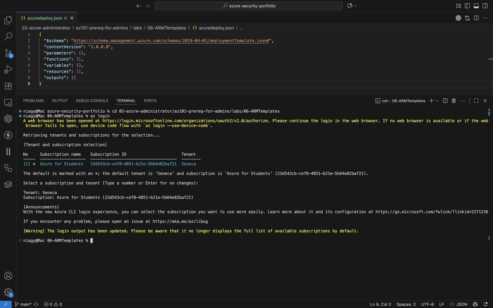
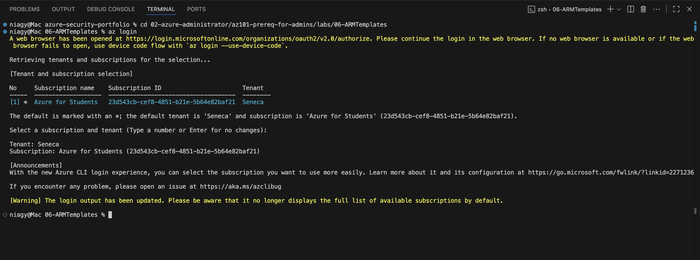
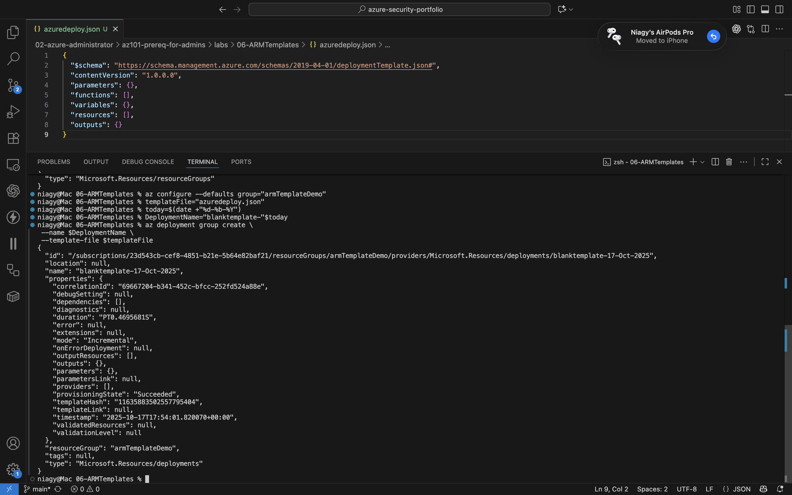
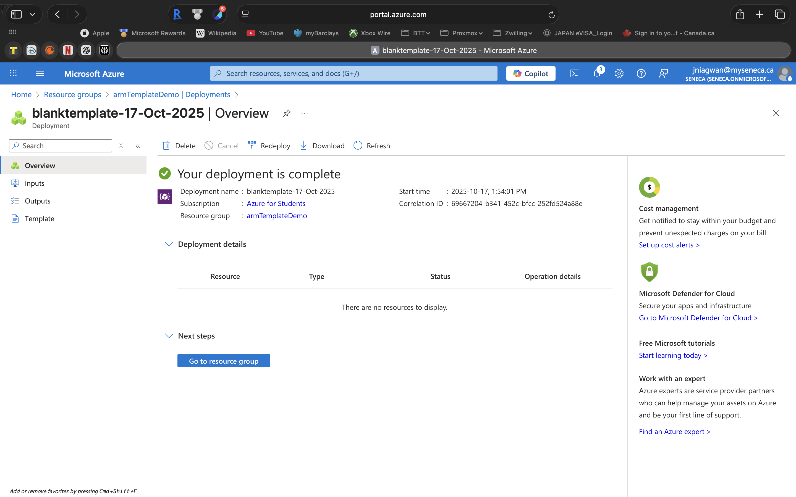
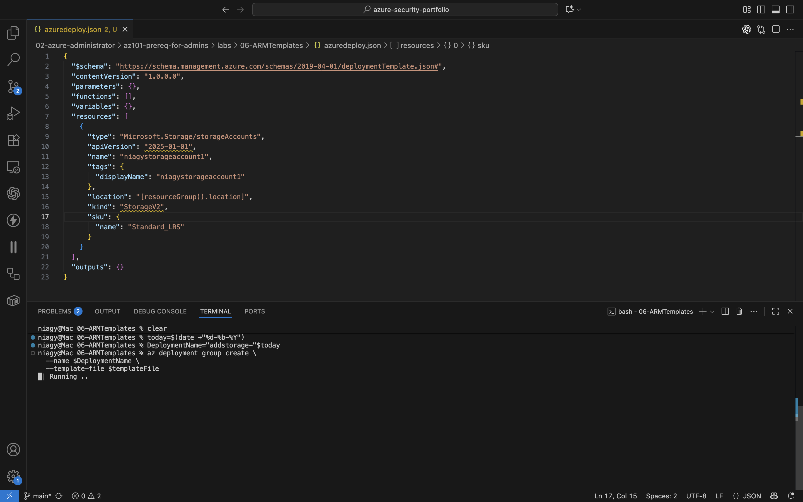
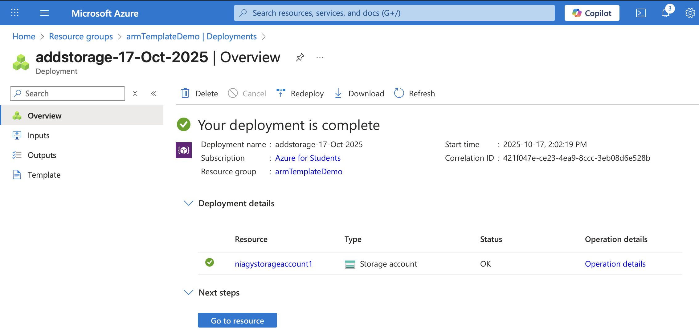

# Exercise - Create and Deploy an Azure Resource Manager (ARM) Template  

---

## 🧠 Overview

This exercise demonstrates how to create, deploy, and update an **Azure Resource Manager (ARM) template**.  

You'll learn to:
- Create a blank ARM template in **Visual Studio Code**.
- Deploy the template to Azure using the **Azure CLI**.
- Add resources to the template (like a Storage Account).
- Track and verify deployments in the Azure Portal.

ARM templates are JSON-based files that allow you to define infrastructure as code, providing consistent and repeatable deployments.

---

## 🧩 Steps

### 1️⃣ Choose Your Azure Shell
- Open Visual Studio Code.
- Open a terminal and ensure you are using **bash**.

---

### 2️⃣ Create a Blank ARM Template
- Create a new file: `azuredeploy.json`.
- Paste the following code:

```json
{
  "$schema": "https://schema.management.azure.com/schemas/2019-04-01/deploymentTemplate.json#",
  "contentVersion": "1.0.0.0",
  "parameters": {},
  "functions": [],
  "variables": {},
  "resources": [],
  "outputs": {}
}
```
	•	Save the file (Ctrl+S).



⸻

### 3️⃣ Sign in to Azure

az login

	•	A browser window will open. Sign in to your account.
	•	List of subscriptions will display in the terminal.



⸻

### 4️⃣ Create and Set Default Resource Group

az group create --name <resource-group-name> --location <location>
az configure --defaults group="<resource-group-name>"

	•	Replace <resource-group-name> with a unique name.
	•	Replace <location> with your preferred Azure region (e.g., eastus).

⸻

### 5️⃣ Deploy the Blank Template

templateFile="azuredeploy.json"
today=$(date +"%d-%b-%Y")
DeploymentName="blanktemplate-"$today

az deployment group create \
 --name $DeploymentName \
 --template-file $templateFile

	•	Go to Azure Portal > Resource Groups > Your Resource Group.
	•	Verify the deployment shows 1 Succeeded.



⸻

### 6️⃣ Add a Resource to the Template
	•	Update azuredeploy.json to include a Storage Account:

{
  "$schema": "https://schema.management.azure.com/schemas/2019-04-01/deploymentTemplate.json#",
  "contentVersion": "1.0.0.0",
  "parameters": {},
  "functions": [],
  "variables": {},
  "resources": [
    {
      "type": "Microsoft.Storage/storageAccounts",
      "apiVersion": "2025-01-01",
      "name": "niagystorageaccount1",
      "tags": {
        "displayName": "niagystorageaccount1"
      },
      "location": "[resourceGroup().location]",
      "kind": "StorageV2",
      "sku": {
        "name": "Standard_LRS"
      }
    }
  ],
  "outputs": {}
}

	•	Update name and displayName to a globally unique value (e.g., learnexercise12321).



⸻

### 7️⃣ Deploy the Updated Template

templateFile="azuredeploy.json"
today=$(date +"%d-%b-%Y")
DeploymentName="addstorage-"$today

az deployment group create \
  --name $DeploymentName \
  --template-file $templateFile

	•	After deployment, go to Azure Portal > Resource Group.
	•	Verify 2 Succeeded deployments.
	•	Click addstorage to see the newly deployed storage account.



⸻

### ⚡ Key Takeaways
	•	ARM templates enable infrastructure as code in Azure.
	•	Using Azure CLI simplifies template deployment and management.
	•	Resources can be added, updated, and tracked using the Azure Portal.
	•	Deployment names and resource names must be unique.


⸻

Author: John Niagwan

Certification Path: Microsoft Certified: Azure Fundamentals → Azure Administrator Associate

Module: ARM Templates & Deployment