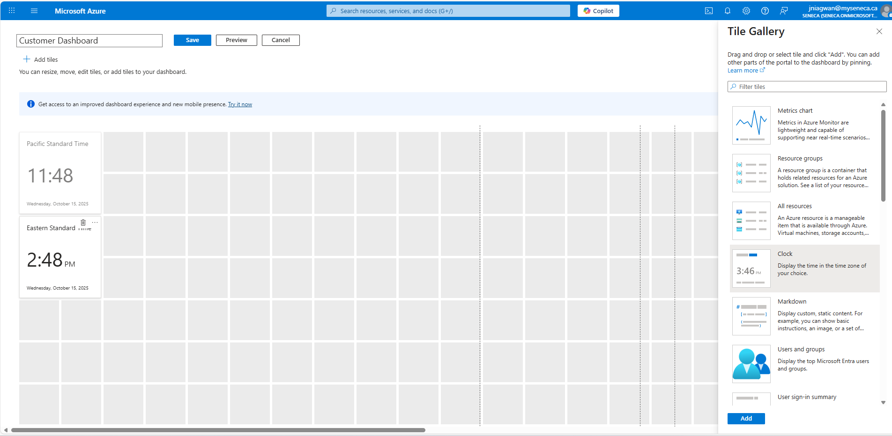
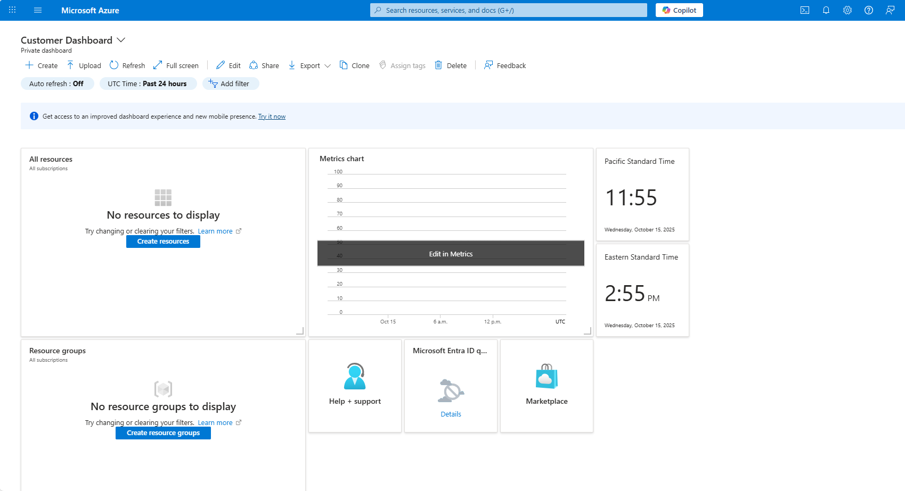
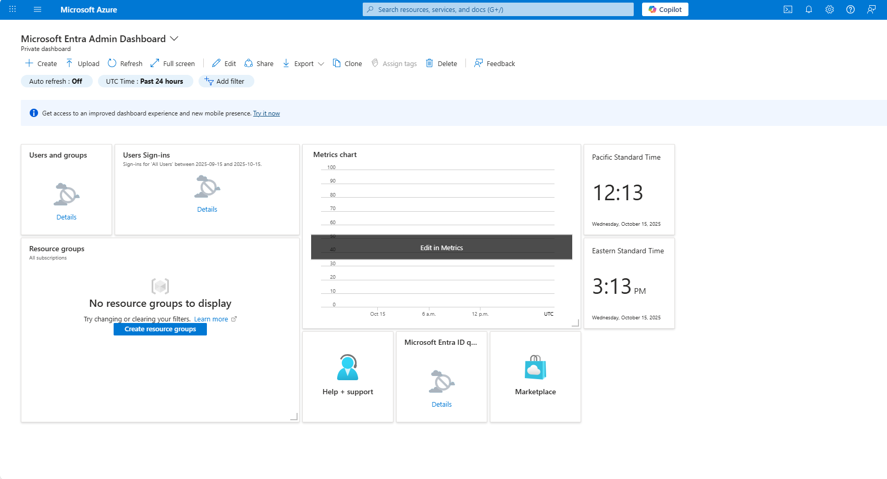
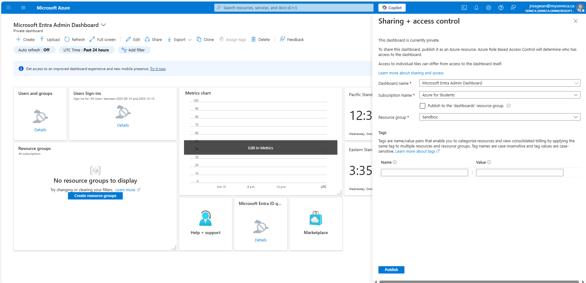
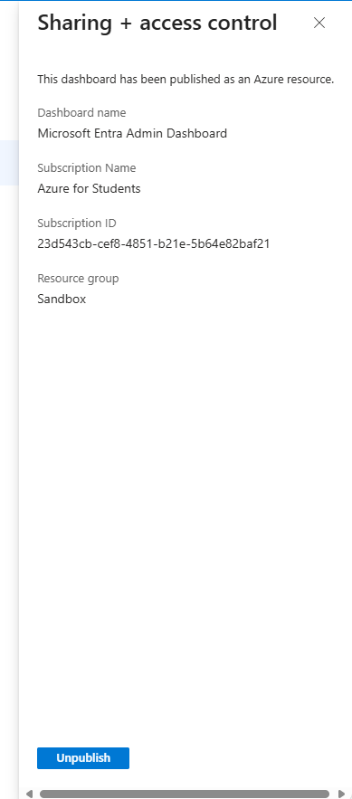
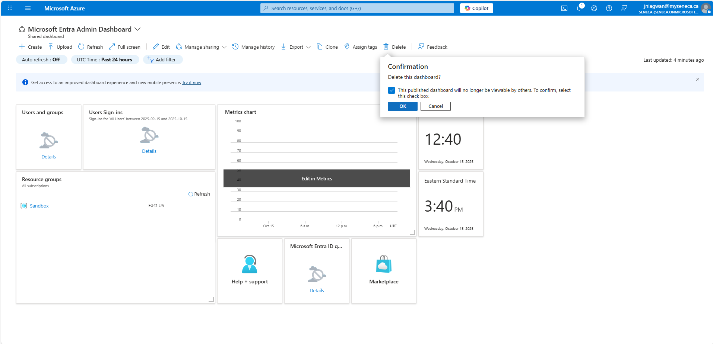
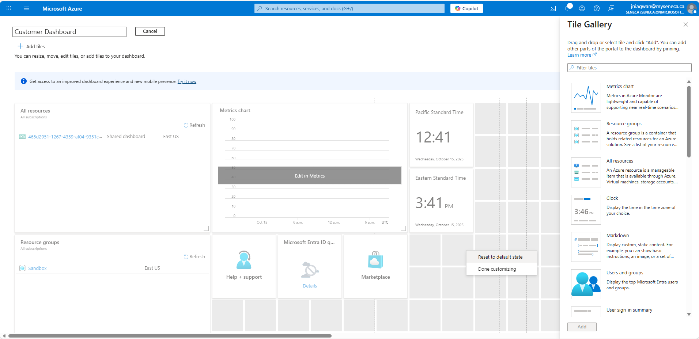
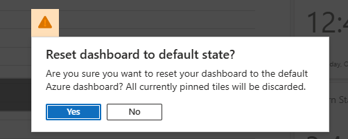

# 🖥️ Azure Dashboard Exercise – Customize the Dashboard

This project demonstrates my hands-on experience creating, customizing, cloning, sharing, deleting, and resetting dashboards in the **Azure Portal**. Dashboards are a flexible tool for monitoring Azure services and sharing key information across teams.

---

## 🎯 Objectives

- Create a custom dashboard in the Azure portal
- Add and configure tiles (Clock, Metrics, All Resources, Resource Groups, Help + Support, etc.)
- Resize and reposition tiles for optimal layout
- Clone dashboards for different roles or customers
- Share dashboards with other users
- Delete and reset dashboards to default state

---

## 🛠️ Steps Completed

### 1. Create a Custom Dashboard
- Open the Azure portal → Show portal menu → Dashboard → Create → Custom
- Rename dashboard to **Customer Dashboard**

  
### 2. Add and Configure Clock Tiles
- Added two Clock tiles:
  - **Clock 1:** Pacific Time (UTC-08:00), 24-hour format
  - **Clock 2:** Eastern Time (UTC-05:00), 24-hour format
- Tiles were previewed, edited, and saved

### 3. Add and Resize Tiles
- Added the following tiles and adjusted sizes:
  - **All Resources:** resized to 6 x 4
  - **Resource Groups:** placed under All Resources
  - **Metrics chart:** to the right of All Resources
  - **Additional tiles:** Help + Support, Microsoft Entra Quick Tasks, Marketplace
- Saved dashboard as **Customer Dashboard**

### 4. Clone a Dashboard
- Cloned **Customer Dashboard** → renamed **Microsoft Entra Admin Dashboard**
- Removed Resource Groups tile
- Added:
  - Users and Groups
  - User Sign-in Summary
- Saved changes

### 5. Share a Dashboard
- Demonstrated sharing workflow:
  - Share → select resource group → Publish
- Note: Sandbox sharing unavailable; workflow documented

### 6. Delete a Dashboard
- Selected **Microsoft Entra Admin Dashboard** → Delete → Confirmed deletion

### 7. Reset a Dashboard
- Selected **Customer Dashboard** → Edit → Reset to default state → Confirm → Save

---

## 💡 Learnings

- Dashboards provide a **role-based view** for Azure resources
- Custom tiles improve **monitoring efficiency** for team members
- Cloning and sharing dashboards facilitates **consistency across users**
- Resetting dashboards allows for easy **reversion to default** while experimenting

---

## 🔗 Resources

- [Microsoft Learn: Customize the Azure Dashboard](https://learn.microsoft.com/en-us/training/modules/customize-dashboard/)
- [Azure Portal documentation](https://learn.microsoft.com/en-us/azure/azure-portal/)

---

This project demonstrates practical knowledge of Azure portal dashboards, which can improve team collaboration, monitoring, and resource management in an enterprise environment.